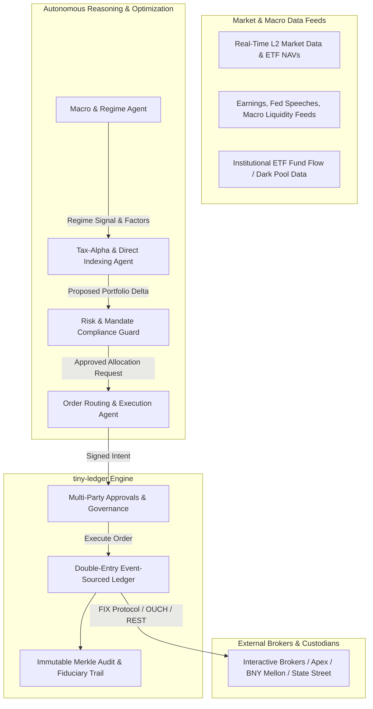
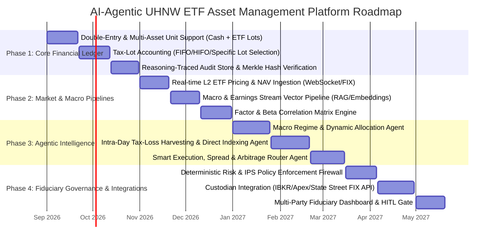

# Strategic Architecture & Implementation Roadmap: AI-Agentic UHNW Asset Management Platform

This document specifies the target architecture, multi-agent intelligence tier, and engineering roadmap to scale `tiny-ledger` into an **AI-Agentic Ultra-High-Net-Worth (UHNW) ETF Asset Management System** designed to maximize after-tax compound returns, factor alpha, and operational efficiency.

---

## 1. Architectural Topology

---

## 2. Multi-Agent Intelligence Hierarchy

1. **Macro & Regime Factor Agent (Asset Allocation Brain)**:
   - Detects macroeconomic regime transitions (Expansion, Stagflation, Contraction).
   - Dynamically balances exposures across Momentum, Value, Quality, and Low Volatility ETF factors.
2. **Direct Indexing & Tax-Alpha Harvesting Agent (Alpha Maximizer)**:
   - Continuously harvests intra-day capital losses across wash-sale-compliant ETF substitute sets (e.g. `VOO` $\leftrightarrow$ `SCHX` $\leftrightarrow$ `IVV`).
   - Implements customized tracking-error overlays to offset concentrated founder/equity positions.
3. **Risk & Fiduciary Compliance Guard (Deterministic Safety)**:
   - Strictly enforces Investment Policy Statement (IPS) rules, VaR ceilings, and liquidity mandates.
   - Operates as deterministic code (veto gate) before orders hit execution rails.
4. **Smart Execution & Slippage Minimization Agent**:
   - Analyzes underlying ETF component depth, iNAV premiums/discounts, and spreads.
   - Routes orders via TWAP, Market-on-Close (MOC), or Direct RFQ with Authorized Participants (APs).

---

## 3. Implementation Roadmap

---

## 4. Phased Engineering Deliverables

### Phase 1: Multi-Asset Financial Ledger & Tax-Lot Accounting
- Double-entry multi-asset ledger engine (units, currency, precision).
- Tax-lot tracking with cost-basis and wash-sale identification (`FIFO`, `HIFO`, `Specific Lot`).
- Cryptographically chained audit trail embedding AI agent reason trace IDs.

### Phase 2: Market Data, NAVs & Factor Vector Pipeline
- Low-latency pricing, iNAV, and creation/redemption arbitrage feeds.
- Time-series and vector RAG ingestion for economic data, central bank transcripts, and ETF flows.
- Real-time factor and beta correlation matrix calculator.

### Phase 3: Specialized Multi-Agent Intelligence Tier
- Autonomous multi-agent coordination for macro regime shifts and dynamic factor weighting.
- Real-time tax-loss harvesting engine generating wash-sale-compliant swap proposals.
- Execution algorithm routing orders to minimize market impact and tracking error.

### Phase 4: Fiduciary Guardrails & Institutional Custodian Rails
- Hard deterministic IPS policy validation gate.
- Custodian FIX/REST integrations (Interactive Brokers, Apex Clearing, BNY Mellon, State Street).
- Human-in-the-Loop (HITL) authorization portal and fiduciary reporting suite.
