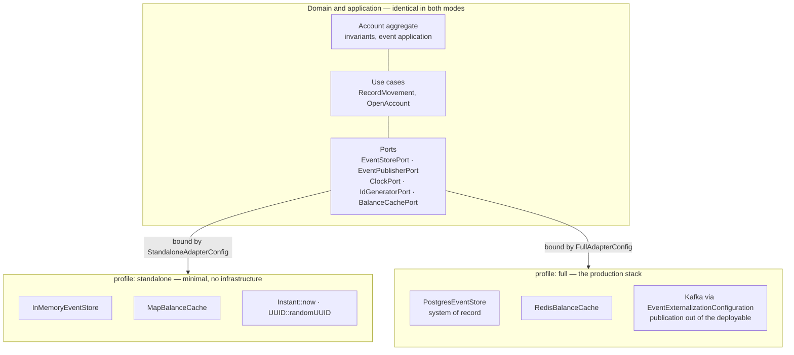
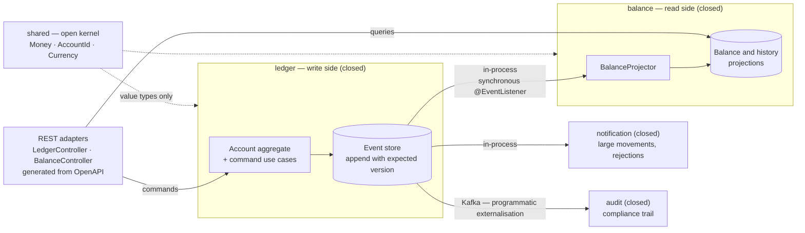
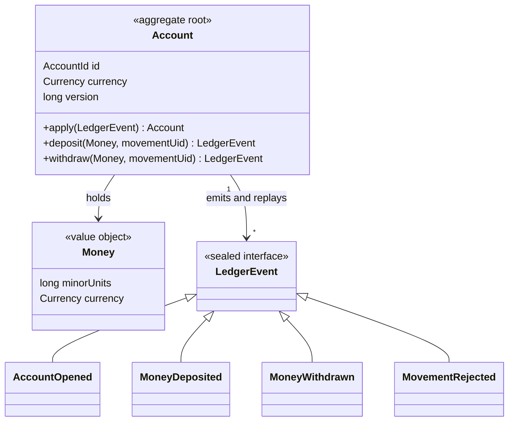

# Architecture

Three pictures of the same system, from the outside in. Each one exists to answer a question that
prose answers badly.

The diagrams are derived from [`spec.md`](spec.md), not from the code — this is spec-driven work, so
the specification is the source of truth and the implementation is checked against it. Where a
diagram and the code disagree, that is a drift alarm, not a documentation bug.

---

## 1. Two run modes, one codebase

**The question: why are there two ways to run this, and which one is "the real one"?**

Both are. The minimal run and the full production stack execute *the same compiled domain
and application code*. Only the adapters differ, and they are selected by Spring profile in a single
composition root (§4.5).

**Why it matters.** A JDK is the only prerequisite for `standalone` — no database, no broker, no
container. That satisfies the original constraint honestly rather than by exception. `full` then
demonstrates what the same domain looks like under production concerns, without forking the code that
holds the money.

**The test of the claim:** if a core-API behaviour differs between the two modes, an adapter is at
fault. There is a test for exactly that (§9.2b).

---

## 2. Modules and the flow of events

**The question: what talks to what, and how are the boundaries actually enforced?**

Four business modules over one open kernel, verified at build time by
`ApplicationModules.of(TinyLedgerApplication.class).verify()`. Closed modules communicate **only** by
domain events — there are no direct service calls between them.

**Two decisions worth reading twice.**

**`balance` is separate from `ledger`.** This is the CQRS boundary made structural. The read side
subscribes to events and serves its own queries; it never calls the write side, and the write side
does not know it exists. Deleting `balance` would break reads and leave writes working — which is the
test of whether the split is real rather than decorative.

**Two transports, one job each.** Inside the deployable, Spring Modulith's event publication registry
carries events transactionally — the publication row commits with the event append, and incomplete
publications retry on restart. Kafka carries events *out* of the deployable to `audit`, which is the
consumer that must not share a database. Using Kafka between modules in one process would buy a
network hop and a lost transaction boundary in exchange for nothing.

`audit`'s Kafka consumer is therefore also the seam along which it would be extracted into its own
service, if it ever needed to be.

---

## 3. The domain

**The question: what is the model, and where do the invariants live?**

**Money is `long` minor units with a currency, never a `double` and never a bare number.** Floating
point cannot represent most decimal amounts exactly, and a ledger that is occasionally out by a
fraction of a penny is a ledger nobody can reconcile.

**Balance is a projection, never a field.** It is recomputed by applying events and is never
assigned. That is the one idea worth keeping from a real ledger, and here it costs almost nothing.

**Four invariants live inside the aggregate and nowhere else:**

1. A withdrawal may not take the balance below zero.
2. Movement amounts are strictly positive and in the account's currency.
3. Every applied event increments `version` by exactly one — that version is the optimistic
   concurrency token.
4. Balance is recomputed only by applying events.

**Rejections are events too.** `MovementRejected` is recorded rather than thrown away, because in a
financial system a refused movement is an audit-relevant fact, not an absence of one.

`ClockPort` and `IdGeneratorPort` exist so that event application is a pure function. With
`Instant.now()` and `UUID.randomUUID()` called inside the domain, tests must either sleep or assert
loosely; injected, they assert exact values.

---

## Still to come

Two sequence diagrams are still not drawn:

- **The write path** — validation, ownership check, global movement-UID lookup, optimistic append,
  outbox publication.
- **The refused withdrawal** — the failure path through to the problem-detail response.

**The reason originally given here has expired, and saying so is the point.** This section read
"they describe runtime behaviour rather than structure and would document intentions rather than
facts… they land once the corresponding code does". The code landed — both paths are built, tested
and exercised end to end by CI stage 9 — so a diagram of either would now document facts, and the
deferral has quietly become an omission. It is recorded as one here rather than left wearing the
older, better-sounding justification. Until they are drawn, `spec.md` §4.1 (write path) and §6.5
(the refusal and its problem detail) are the prose versions, and they are current.
