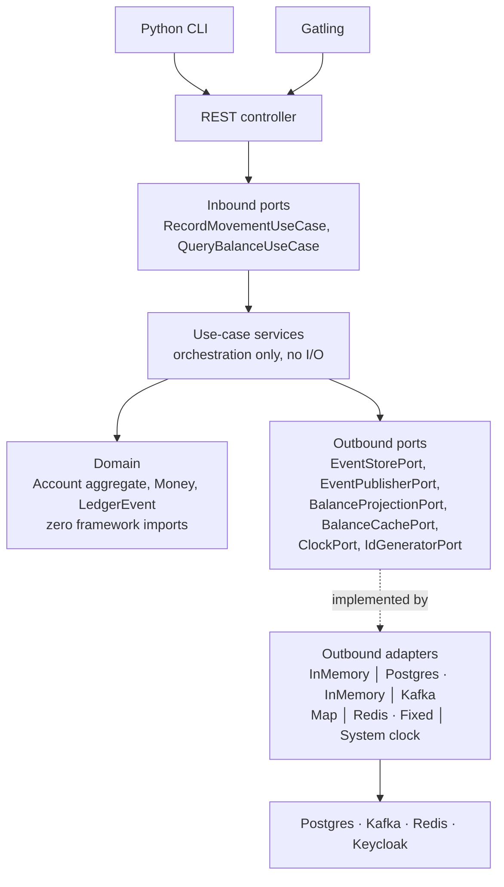

# Tiny Ledger — Technical Specification

**Author:** Flávio Oliva
**Version:** 3.3
**Status:** Contract for implementation
**Supersedes:** Event-Sourced Banking Ledger PoC V2

---

## 1. Purpose and dual delivery

An event-sourced banking ledger — single-entry per account, double-entry transfers recorded as the
next increment (§13) — built as a modular monolith and delivered
production-ready: containerised, observable, secured, rate-limited, cached, and tested at every
level from unit to load.

The origin is Teya's *"Build a tiny ledger"* take-home. That brief asks for three features in a few
hours with in-memory storage and explicitly excludes auth, monitoring and atomic operations. This
specification deliberately goes far beyond it, so the repository ships **two run modes from one
codebase**:

| Mode | Command | What runs | Purpose |
|---|---|---|---|
| **`standalone`** (default) | `./mvnw spring-boot:run` | In-memory event store, in-memory cache, no auth, no broker. Binds `127.0.0.1` only; the startup banner prints `AUTH DISABLED (standalone)`. **JDK 25** is the only prerequisite. | The brief's runtime in one command: clone, run, curl the APIs. The scope beyond the brief is a recorded, deliberate choice (`agentic-workflow.md` §6) — an accepted submission risk, not claimed compliance. |
| **`full`** | `docker compose up` | PostgreSQL, Kafka, Redis, Keycloak, OTel Collector, Prometheus, Grafana, Tempo, Loki. | The production-shaped system. |

Both modes run the **same domain code and the same core ledger API** — the two auditor operations
are `full`-only (§7), a declared profile-gated exclusion from parity, not an adapter difference.
Everything else differs only in which adapters are active — the point of the hexagonal boundaries
in §4. The default mode is the submittable artefact; the full mode is the depth story for the
follow-up conversation.

**Fail-closed guard:** `standalone` being the default must never become a fail-open path. If
full-mode configuration is present while the `standalone` profile is active — an OAuth2
`issuer-uri`, a JDBC datasource — startup **fails**, naming the conflict. Losing a profile flag in
a real deployment degrades to a refusal, never to an unauthenticated ledger.

**Design rule that follows from this:** no infrastructure concern may leak into the domain. If a
domain class imports Kafka, Redis, JPA or Spring Security, the design has failed and the
architecture tests in §9.2 fail the build.

---

## 1.5 Stack and conventions

Versions are governed by **`dr-jskill`'s `versions.json`**, not chosen ad hoc.

| Component | Version | Note |
|---|---|---|
| Java | **25** (LTS, Corretto) | Records, sealed interfaces, pattern matching and virtual threads are all load-bearing below |
| Spring Boot | **4.1.0** (Spring Framework 7.0) | `ProblemDetail`, Modulith integration and `@ServiceConnection` come free |
| Spring Modulith | Boot-4 line | Module verification, event publication registry, `@Externalized` (§4.3) |
| PostgreSQL | **18** | Event store + projections |
| Hibernate | **7.4** | Outbound persistence adapter only |
| Testcontainers | **2.0.5** | Integration and e2e |
| Maven wrapper | 3.8+ | `./mvnw` — a JDK is the only prerequisite |

**Jackson 3** ships with Boot 4; annotation imports differ from Jackson 2 and the DTO layer must be
written against it from the start rather than migrated.

### Conventions adopted from `dr-jskill`

`dr-jskill` (jdubois, Apache-2.0) is vendored at `.claude/skills/dr-jskill`. It is the JHipster
author's opinionated Spring Boot baseline; adopting it means the boring decisions are already made
and internally consistent.

**Adopted as-is:**

- **Bump `versions.json` first**, then propagate. Never edit a version directly in `pom.xml`.
- **`.properties`, not YAML.** `@ConfigurationProperties` for type safety.
- **`.env` is the single local secret store — never read, never printed.** Only `.env.sample`, with
  placeholder values, is displayed or committed.
- **A startup banner printing access URLs** once the app is ready.
- Testing: Mockito for unit, `@WebMvcTest` at the web-slice level (§9.4 — not §9.1's
  zero-Spring-context unit level), Testcontainers with **`@ServiceConnection`** for integration,
  Given-When-Then with AssertJ.
- Docker asset set: standard, AOT, native and CRaC variants; devcontainer; `.editorconfig`;
  `.gitattributes`.
- **Ask before running git commands.** The human reviews before anything is committed.

**Deliberately overridden — the package layout (ADR-003).** `dr-jskill` mandates a flat, layer-first
structure — `config/`, `controller/`, `service/`, `repository/`, `domain/` — with the explicit rule
that *"the service layer is only included if it adds value… for simple CRUD applications, the
controller can directly call the repository."*

That rule is right, and it identifies precisely why it does not apply here. This is not a CRUD
application: there is no repository for a controller to call, because the write model is an event
stream behind `EventStorePort` and the read model is a projection owned by a different module. A flat
`controller/service/repository` layout cannot express a Modulith boundary, and collapsing the service
layer would put orchestration into a controller, which §4 forbids.

So the layout is §3.1's — module-first, hexagonal layers within. Everything else from `dr-jskill`
stands. This is recorded as an ADR because departing from an adopted convention must never look like
an accident.

---

## 2. Domain

### 2.1 Ubiquitous language

| Term | Meaning |
|---|---|
| **Account** | The aggregate root. Owns a stream of ledger events and enforces every monetary invariant. |
| **Money** | Value object: signed amount in **minor units** (`long`) plus `Currency`. Never a `double`. |
| **Movement** | A single recorded change of funds — a deposit or a withdrawal. |
| **LedgerEntry** | The immutable, persisted record of a movement, carrying the resulting balance. |
| **Balance** | A *projection* of the event stream. Never an independently writable field. |
| **Stream version** | Monotonic sequence number per account; the optimistic-concurrency token. |

### 2.2 Aggregate: `Account`

Invariants, enforced inside the aggregate and nowhere else:

1. A withdrawal may not take the balance below zero (no overdraft in this PoC).
2. Movement amounts are strictly positive and in the account's currency.
3. Every applied event increments `version` by exactly one.
4. Balance is recomputed only by applying events, never assigned.

### 2.3 Domain events

Immutable Java `record`s, versioned by schema:

| Event | Emitted when |
|---|---|
| `AccountOpened` | Account created. Carries the initial `currency`, the **`owner`** (caller principal) and the account **`name`** — ownership and naming are facts of the stream, not sidecar state. |
| `MoneyDeposited` | Funds credited. |
| `MoneyWithdrawn` | Funds debited after invariant checks pass. |
| `MovementRejected` | A command failed a business invariant. Recorded, not thrown away — rejections are audit-relevant. |

Events are the write model's source of truth. Nothing else is.

### 2.4 Commands

`OpenAccount`, `Deposit`, `Withdraw`. Every command carries the **caller principal** (the JWT
subject; a fixed local principal in `standalone`) — authorisation is a use-case concern (§6.4), and
a use case cannot check what it never receives. `Deposit` and `Withdraw` also carry a
**client-generated movement UID** — at once the idempotency key and the movement's permanent
identity (§6.3) — and an optional free-text `reference` that travels to the feed item (§7).

---

## 3. Module structure (Spring Modulith)

One deployable, one Maven module, package-per-application-module under
`com.flaviooliva.ledger`. Boundaries are verified at build time by
`ApplicationModules.of(LedgerApplication.class).verify()`.

**Four application modules, one open kernel, one non-module platform package.**

An earlier draft of this spec listed seven modules, including `security`, `ratelimit` and
`observability`. That was wrong. A Spring Modulith application module is a **business capability**;
those three are technical aspects applied uniformly to every module, and promoting them to modules
inflates the count while saying nothing about the domain. They now live in `platform`, which is
excluded from the module graph.

| # | Module | Type | Responsibility | May depend on |
|---|---|---|---|---|
| — | `shared` | **open kernel** | `Money`, `AccountId`, `Currency`. Value semantics only, no behaviour, no growth. | — |
| 1 | `ledger` | closed | **Write side.** The `Account` aggregate, commands, domain events, event store port, command use cases, write API. | `shared` |
| 2 | `balance` | closed | **Read side.** Balance and history projections, their own query API. Subscribes to `ledger` events. | `shared`, `ledger::events` |
| 3 | `audit` | closed | Compliance trail, retention, auditor-facing API. Subscribes to all events. | `shared`, `ledger::events` |
| 4 | `notification` | closed | Signals **large movements** (single movement ≥ a configurable threshold, default 10 000.00) and every `MovementRejected`, as structured log entries. Earns its place as a subscriber with business rules of its own — not a second proof of `balance`'s mechanism. | `shared`, `ledger::events` |
| — | `platform` | not a module | Security, rate limiting, observability. Filters and technical `@Configuration` only — no domain logic. | — |
| — | `config` | not a module | The composition root (§4.5) — the only place adapters are constructed. | — |

**Why `account` is not a fifth module.** Account lifecycle and money movement look like separate
capabilities, but the `Account` *is* the aggregate that owns the event stream — splitting them puts a
consistency boundary through the middle of a single transactional invariant. Opening an account emits
`AccountOpened` onto the same stream as every movement. One aggregate, one module.

**Why `balance` is separate from `ledger`.** This is the CQRS boundary made structural — see §4.0.
The read side subscribes to events and serves its own queries; it never calls into the write side,
and the write side does not know it exists. Deleting `balance` would break reads and leave writes
working, which is the test of whether the split is real.

`shared` is an **open** module so value objects can cross boundaries without ceremony. It is capped
at value types deliberately: a shared kernel that accumulates behaviour becomes the coupling it was
meant to prevent, and an ArchUnit rule keeps services and repositories out of it.

Cross-module communication is **domain events only** — no direct service calls between closed
modules. Each module exposes a `package-info.java` declaring its named interface; internals live in
sub-packages that Modulith enforces as private.

### 3.1 Reconciling Modulith with hexagonal layering

Spring Modulith organises **feature-first** (a package per bounded context). Hexagonal architecture
organises **layer-first** (domain / application / adapters). These are orthogonal, and the
combination is: *module at the top level, layers inside each module.*

```
com.flaviooliva.ledger
├── shared/                              ← open module: Money, AccountId, Currency
├── ledger/                              ← closed module — the write side
│   ├── package-info.java                ← @ApplicationModule, allowedDependencies
│   ├── domain/                          ← zero framework imports. Enforced by ArchUnit.
│   │   ├── Account.java                 ← aggregate root
│   │   ├── LedgerEvent.java             ← sealed interface + record variants
│   │   └── policy/OverdraftPolicy.java
│   ├── application/
│   │   ├── port/in/                     ← inbound ports — commands, plus the §4.4 strong read; other queries live in `balance`
│   │   │   ├── OpenAccountUseCase.java
│   │   │   └── RecordMovementUseCase.java
│   │   ├── port/out/                    ← outbound ports (capabilities the app needs)
│   │   │   ├── EventStorePort.java
│   │   │   ├── EventPublisherPort.java
│   │   │   ├── ClockPort.java
│   │   │   └── IdGeneratorPort.java
│   │   └── usecase/                     ← plain classes; orchestration only
│   │       ├── RecordMovementService.java
│   │       └── OpenAccountService.java
│   └── adapter/
│       ├── in/web/LedgerController.java     ← implements the generated OpenAPI interface
│       └── out/
│           ├── inmemory/InMemoryEventStore.java
│           ├── postgres/PostgresEventStore.java
│           └── spring/SpringEventPublisher.java  ← EventPublisherPort, both modes; Kafka is `@Externalized`, no adapter (§4.3)
├── balance/                             ← closed module — the read side; the other half of CQRS
│   ├── application/
│   │   ├── port/in/                     ← queries only
│   │   │   ├── QueryBalanceUseCase.java
│   │   │   ├── QueryHistoryUseCase.java
│   │   │   └── QueryAccountsUseCase.java
│   │   ├── port/out/
│   │   │   ├── BalanceProjectionPort.java   ← never touches the aggregate (§4.0)
│   │   │   └── BalanceCachePort.java
│   │   └── projection/BalanceProjector.java ← plain class; applies events via the ports
│   └── adapter/
│       ├── in/events/LedgerEventsListener.java  ← @ApplicationModuleListener — the inbound adapter driving the projector
│       ├── in/web/BalanceController.java    ← read-side API, same generated OpenAPI interface
│       └── out/
│           ├── inmemory/… · postgres/…      ← projection store per run mode
│           └── redis/RedisBalanceCache.java
├── audit/                               ← closed module — consumes via Kafka, deliberately (§4.3)
│   ├── application/                     ← RecordAuditEntryUseCase, QueryAuditTrailUseCase, AuditTrailStorePort
│   └── adapter/
│       ├── in/kafka/AuditEventConsumer.java ← the Kafka consumer — the module→service extraction seam
│       └── in/web/AuditController.java      ← auditor-facing API (`ledger:auditor`, §6.4)
├── notification/                        ← closed module — threshold/rejection rules, log-entry adapter (§3)
├── platform/                            ← not a module — security, rate limiting, observability (§3)
└── config/                              ← composition root (§4.5)
```

**Ports model capabilities, not technologies.** `EventStorePort` exposes
`append(streamId, expectedVersion, events)`, `read(streamId)` and `findByMovementUid(movementUid)`
— §6.3's global lookup is part of the port's contract — and nothing in those signatures reveals
whether the implementation is a `ConcurrentHashMap` or Postgres, which is precisely what makes §1's
two run modes possible.

`ClockPort` and `IdGeneratorPort` exist because an event-sourced aggregate stamps every event with a
timestamp and an identity. If those come from `Instant.now()` and `UUID.randomUUID()` inside the
domain, the domain is no longer deterministic and its tests must either sleep or assert loosely.
Injected, event application is a pure function and the unit tests in §9.1 assert exact values.

---

## 4. Architecture: hexagonal, event-sourced, CQRS

### 4.0 Where CQRS sits relative to ports and adapters

**Question asked during design:** should CQRS go *in front of* the ports and adapters?

**Answer: no — CQRS is not a layer, it is a split, and it is expressed *as* the port structure.**
The two patterns act on different axes and compose rather than stack:

| | Axis | Question it answers |
|---|---|---|
| **Hexagonal** | inside ↔ outside | What may depend on what? |
| **CQRS** | write ↔ read | Which model serves this request? |

Putting a command bus or mediator in front of the adapters — a `CommandDispatcher` that resolves
handlers from a registry — is the usual way this goes wrong. It buys a runtime lookup in exchange for
compile-time wiring, readable stack traces, and IDE navigation. In a modular monolith with a
composition root (§4.5), there is nothing left for it to do: dispatch is a constructor argument.

CQRS instead appears in three places, all structural:

1. **Two families of inbound ports.** `RecordMovementUseCase` and `OpenAccountUseCase` are commands;
   `QueryBalanceUseCase` and `QueryHistoryUseCase` are queries. Different interfaces, different
   transaction semantics, different failure modes.
2. **Two families of outbound ports.** Writes go through `EventStorePort` and its optimistic
   concurrency check. Reads go through `BalanceProjectionPort` and never touch the aggregate — a query
   that rehydrates an aggregate has silently abandoned CQRS. The single exception is deliberate and
   write-side-owned: the `consistency=strong` escape hatch (§4.4) is served by `ledger` itself,
   never by the read module.
3. **Two modules.** `ledger` (write) and `balance` (read), coupled only by domain events (§3).

So the layering is: **adapter → inbound port (command *or* query) → use case → domain and outbound
ports.** CQRS chooses *which* path; hexagonal governs the direction of every arrow on both paths.
Neither wraps the other.

The read side owning its own controller follows directly. `GET /api/v1/accounts/{accountUid}/balance` is served
by an adapter inside `balance` — except the strong-read mapping, which §4.4 assigns to `ledger` and
disambiguates with a request-mapping `params` condition. Neither module reaches across the boundary.



Dependency direction is always inward. The domain depends on nothing; use cases depend only on
ports; adapters depend on the application. **No adapter calls another adapter** — the cache is
invalidated by an event handler reacting to a domain event, not by the Postgres adapter reaching
sideways into the Redis adapter.

Errors are translated at the boundary: a `SQLException` or a Redis timeout never escapes an outbound
adapter. It becomes an application-level failure (`EventStoreUnavailable`, `ConcurrencyConflict`)
which the inbound adapter maps to the problem details in §6.5. The domain has no vocabulary for
infrastructure failure and should not acquire one.

### 4.1 Write path

1. Command arrives, validated at the boundary (shape only, §4.6).
2. Aggregate rehydrated by replaying its event stream; **ownership checked against the caller
   principal before anything else is answered** — a foreign caller gets the §6.5 refusal, never an
   idempotency oracle.
3. Movement UID checked **globally** via `findByMovementUid` (§4.2's unique index) — a replay is
   answered from the existing event, never re-applied; a UID found on a *different* stream is an
   idempotency conflict (§6.3).
4. Command applied; the aggregate emits events or rejects.
5. Events appended to the store **with an optimistic-concurrency check on stream version**;
   a conflict returns `409` and the caller retries.
6. Events published to subscribers via the transactional outbox (§4.3).

### 4.2 Event store — Postgres, not Kafka

**Decision (ADR-002):** PostgreSQL is the event store and system of record. Kafka is the
publication bus, fed by a transactional outbox.

Kafka is not a system of record for an aggregate that needs per-stream optimistic concurrency: it
offers no conditional append, no read-your-writes on a stream, and unbounded retention is a
compliance liability rather than a feature. Postgres gives an `append(streamId, expectedVersion,
events)` that is atomic with a `UNIQUE (stream_id, version)` constraint — which *is* the concurrency
control. Kafka then does what it is genuinely good at: fanning events out to consumers that must not
share a database.

```sql
CREATE TABLE ledger_event (
    stream_id       UUID        NOT NULL,
    version         BIGINT      NOT NULL,
    event_type      TEXT        NOT NULL,
    schema_version  INT         NOT NULL,
    payload         JSONB       NOT NULL,
    occurred_at     TIMESTAMPTZ NOT NULL,
    movement_uid    UUID,
    PRIMARY KEY (stream_id, version)
);
CREATE UNIQUE INDEX ON ledger_event (movement_uid) WHERE movement_uid IS NOT NULL;
```

### 4.3 Outbox

**Do we need to hand-write Kafka producers and consumers to move events between Modulith modules?
No — and mostly we do not need Kafka for that at all.** Two distinct mechanisms exist and each has
one job:

| Mechanism | Carries events | Guarantee | Used by |
|---|---|---|---|
| **Spring Modulith event publication registry** — `@ApplicationModuleListener` | *Within* the deployable | Transactional. The publication row commits with the event append; incomplete publications are retried on restart | `balance`, `notification` |
| **Kafka**, via Modulith **`@Externalized`** | *Out of* the deployable | At-least-once, ordered per partition key | `audit` |

Inside one deployable, Kafka between modules is a network hop, a serialisation round-trip and a loss
of transactional coupling, bought in exchange for nothing. `@ApplicationModuleListener` already gives
asynchronous, decoupled, retryable delivery with the module boundary enforced at build time.

**So why is Kafka here at all?** Because it is the seam where a module becomes a service, and
demonstrating that seam is the entire value proposition of a modular monolith. `audit` is therefore
wired through Kafka *deliberately*, as the worked example of the extraction path: different retention,
different scaling profile, compliance isolation, and no shared database — the four reasons an audit
trail is the realistic first module to leave the monolith.

**No hand-rolled outbox poller.** Spring Modulith's event externalisation does exactly this job —
declared programmatically in `config`, so the domain records stay annotation-free (§9.2):

```java
@Bean
EventExternalizationConfiguration ledgerEventExternalization() {
    return EventExternalizationConfiguration.externalizing()
            .select(event -> event instanceof LedgerEvent)
            .route(LedgerEvent.class,
                   e -> RoutingTarget.forTarget("ledger.events").andKey(e.accountId().toString()))
            .build();
}
```

The publication registry row and the event append commit in one transaction; the externaliser
publishes afterwards and marks the publication complete. That *is* the transactional outbox, already
written, already tested. Writing a bespoke poller here would be re-implementing a supported
framework feature — and getting the incomplete-publication retry subtly wrong.

**Division of labour with `EventPublisherPort` — one mechanism per leg.** The port owns the
*in-process* leg only: its single implementation wraps Spring's `ApplicationEventPublisher` in both
run modes, which is what keeps framework types out of the use cases. The *Kafka* leg belongs to
`@Externalized` entirely — there is no `KafkaEventPublisher` adapter to write, and a port with one
implementation needs no §9.2b contract suite. Same event, two legs, one owner each.

**Topic design — decide correctness, configure the rest.** Exactly two Kafka decisions are design,
both fixed here: **one topic, `ledger.events`** — `audit` consumes every event type and needs their
per-account order preserved; topic-per-event-type would destroy it — and **partition key =
`accountId`**, because Kafka orders only within a partition and the key is what makes E5/E6
physically possible. Everything else (partition count, retention hours, compression, batch sizes)
is `spring.kafka.*` configuration with defaults fine for a PoC, revisited only against §9.7
measurements. Kafka retention is deliberately short: the topic is transport, never the record
(ADR-002).

**Three copies of one event is staged delivery, not duplication.** The `ledger_event` row is the
permanent truth (§4.2). The Modulith `event_publication` row is a transient *delivery ledger* — one
row per event×listener, holding completion state; completed rows are removed via
`spring.modulith.events.completion-mode=delete`, and the incomplete ones are precisely what E7's
restart-replay exercises. The Kafka copy is a time-boxed transport buffer. One truth, one outbox,
one wire — each with its own lifecycle.

**The registry's guarantees are configured, not assumed.**
`republish-outstanding-events-on-restart=true` is set explicitly — E7 is a test of that property,
which is off by default. And externalisation is asynchronous after commit, so cross-event *arrival*
order is not guaranteed even on one partition: the audit consumer is therefore idempotent and
order-restoring, keyed on `(stream_id, version)` — the same discipline E4/E5 demand of projections
— and E6's no-gaps-no-duplicates is asserted on the *stored trail*, not on arrival order.

**Where the Kafka code actually lives.** Under hexagonal rules a Kafka consumer is simply another
*inbound adapter*, no different in kind from the REST controller — and there is one consumer class
per consuming module, never a shared or generic one:

```
audit/
├── application/port/in/RecordAuditEntryUseCase.java
└── adapter/in/kafka/AuditEventConsumer.java   ← @KafkaListener, maps to the use case
```

The listener deserialises, maps the Kafka payload to a use-case input, and calls the port. It holds
no business logic, so the same use case is driven by a unit test with no broker present. The producer
side is `@Externalized` and therefore not code we own at all.

### 4.4 Read path

Projections are updated from events and served from Redis with Postgres as the fallback:

- `GET /balance` → Redis (`ledger:balance:{accountId}`), miss → replay/read projection → cache.
- `GET /transactions` → Postgres projection, keyset-paginated. Not cached; histories grow.
- `GET /accounts` and `GET /accounts/{accountUid}` → the **accounts projection**, owner-indexed,
  maintained by `balance` from `AccountOpened` events — the store behind name→uid resolution (§11)
  and list scoping (N12).

**Pagination is keyset, and Spring's types stay inside the adapter.** The wire cursor (§7) is an
opaque encoding of `(transactionTime, transactionUid)`; the projection query is one index-backed
`WHERE (transaction_time, transaction_uid) < (?, ?) ORDER BY … DESC LIMIT n+1`, the extra row being
the `links.next` signal. `Pageable`/`Page` are deliberately absent: offset pagination is unstable
under concurrent inserts, `OFFSET`-slow on growing feeds, and `Page` adds a count query per
request — and they are framework types, which §9.2 keeps out of inbound ports.
`QueryHistoryUseCase` takes a plain `{cursor, limit, timeRange}` value; if the Postgres adapter
wants framework leverage it uses Spring Data's keyset scrolling (`ScrollPosition.keyset()` /
`Window`) internally and translates. Spring Data `Specification` is skipped for the same reason
`changesSince` was (§7.1): the feed has exactly two optional filter axes, which is one query with
two predicates, not a composable-predicate framework.

**Consistency:** the write path is strongly consistent (the aggregate is authoritative); read models
are eventually consistent. Every projection response carries `asOf` and `streamVersion` so a client
can detect staleness. This trade-off is documented, not hidden.

**The strong read is a write-side endpoint — the one documented CQRS exception.**
`GET /balance?consistency=strong` is served by the `ledger` module's own controller, which replays
the aggregate and answers from the authoritative stream. `balance` never touches the aggregate and
`ledger` never touches the projection — §4.0's rule stays intact for the read module; the exception
lives where the authority lives. It is deliberately the expensive path (full replay, no cache):
only the write side can promise read-your-writes, and pricing it honestly is what keeps the
projection the default. Routing is explicit, never ambiguous: `ledger`'s mapping carries Spring's
`params = "consistency=strong"` condition, `balance`'s handles the parameterless default — one
path, two disambiguated mappings, each inside its owning module.

### 4.5 Composition root — the mechanism behind the two run modes

Wiring lives in exactly one place, `com.flaviooliva.ledger.config`, as Spring `@Configuration`
classes selected by profile. Nothing else in the codebase constructs an adapter, and no use-case or
domain class carries a Spring stereotype annotation — use cases are plain classes instantiated by the
composition root with constructor injection.

Transaction demarcation is wiring too: `UseCaseConfig` wraps each command use case in a
`TransactionalUseCaseDecorator` built on Spring's `TransactionTemplate`, so §4.3's promise — event
append and publication-registry row committing together — holds without a single framework
annotation entering the application layer (§9.2 forbids them there).

```java
@Configuration
@Profile("standalone")
class StandaloneAdapterConfig {
    @Bean EventStorePort eventStore()          { return new InMemoryEventStore(); }
    @Bean BalanceCachePort balanceCache()      { return new MapBalanceCache(); }
    @Bean ClockPort clock()                    { return Instant::now; }
    @Bean IdGeneratorPort ids()                { return UUID::randomUUID; }
}

@Configuration
@Profile("full")
class FullAdapterConfig { /* Postgres and Redis equivalents; no Kafka publisher — §4.3 */ }

@Configuration
class UseCaseConfig {                                   // profile-independent
    @Bean EventPublisherPort publisher(ApplicationEventPublisher p) {
        return new SpringEventPublisher(p);             // single implementation, both modes (§4.3)
    }
    @Bean RecordMovementUseCase recordMovement(
            EventStorePort store, EventPublisherPort publisher,
            ClockPort clock, IdGeneratorPort ids) {
        return new RecordMovementService(store, publisher, clock, ids);
    }
}
```

**This is the whole trick of §1.** `UseCaseConfig` never changes between modes; only the adapter
configuration does. The take-home-compliant run and the full production stack execute *the same
compiled domain and application code*. If a *core-API* behaviour differs between modes, an adapter
is at fault, and §9.2b is the test that catches it; the auditor pair's absence in `standalone` is
the one declared, profile-gated exception (§7).

Auditing the wiring is reading three small files. That is deliberate: dependency wiring scattered across
sixty `@Component` annotations is a service locator with extra steps, and it is how framework
concerns leak inward without anyone noticing.

### 4.6 Data shapes and mapping between layers

One rule, stated once: **each layer owns its own shape of the data, and every conversion is an
explicit mapper owned by the adapter that needs it.** Nothing crosses a boundary in a foreign shape.

| Shape | Lives in | Examples | Notes |
|---|---|---|---|
| Wire DTOs | generated from `openapi.yaml` (§5); referenced only by `adapter/in/web` | `DepositRequest`, `BalanceResponse` | Jackson 3; Bean Validation annotations generated from the OpenAPI constraints carry the §9.5 boundary checks |
| Domain | `domain/` + `shared` | `Deposit` command, `MoneyDeposited` event, `Money` | Zero framework imports (§9.2); the only shape use cases and the aggregate ever see |
| Persistence | inside `adapter/out/postgres` | event row (JSONB payload + `schema_version`), projection row | Payload (de)serialisation is versioned; readers tolerate unknown fields |
| Cache | inside `adapter/out/redis` | serialised balance snapshot | Never a second source of truth (§6.2) |

The mapping rules, enforced by dependency direction rather than convention:

1. **The inbound web adapter** maps wire DTO → command and result → response DTO. Validation is
   two-level, deliberately: Bean Validation on the DTO rejects malformed *shape* (`400`); the
   aggregate rejects invalid *state* (`422`). The domain re-checking what the boundary checked is
   not duplication — the domain cannot know who called it.
2. **Each outbound adapter** owns its own mapping: the Postgres adapter owns event ↔ JSONB keyed by
   `schema_version`, the projector maps event → projection row, the read adapter maps projection
   row → response DTO.
3. **Mappers are hand-written static functions in the adapter package** — records make each one a
   constructor call. No MapStruct, no ModelMapper: a mapping framework is a dependency, a build
   step and a reflection surface bought to avoid code the compiler already checks. When a record
   gains a field, every mapper that ignores it fails compilation — that is the review we want,
   free.
4. **No shape escapes its owner.** A wire DTO below the controller, a persistence type above its
   adapter, or a domain object serialised straight onto the wire are the same bug — a boundary
   that stopped being one. ArchUnit rules (§9.2) fail the build on each.
5. **Shared behaviour has exactly three sanctioned homes**: domain policy (`OverdraftPolicy`),
   `shared`-kernel value semantics (`Money`), or `platform` technical aspects. A use-case service
   is never a library for another use-case service — extracting a helper two services both call is
   how a CRUD god-service starts.

---

## 5. Spec-driven design

The contract precedes the code, in three artefacts, all under version control and all enforced:

1. **`docs/api/openapi.yaml`** — OpenAPI 3.1, hand-written first. The build generates request/response
   DTOs and server interfaces from it; controllers implement generated interfaces, so a controller
   that drifts from the contract fails compilation. `springdoc` validates the live app against it.
2. **`src/test/resources/features/*.feature`** — Gherkin. Every functional requirement in §2 and §6
   has a scenario. These are executable specification, not documentation (§9.3).
3. **`docs/adr/*.md`** — Architecture Decision Records. Every non-obvious choice in this document has
   one, with context, decision, consequences and the alternatives rejected.

**Rule:** no endpoint is implemented before its OpenAPI operation and its `.feature` scenario exist.

**Requirement IDs:** the scenario IDs *are* the requirement IDs — `REQ-<scenario-id>` for every
catalogue row (P0…P8, N1…N12, E1…E9), and the `REQ-NNN` tags §8.2 harvests from tests use exactly
these. Membership is the catalogue itself, never a range that can drift.

---

## 6. Cross-cutting requirements

### 6.1 Rate limiting

Token bucket per principal *and* per IP, whichever is more restrictive. Bucket4j backed by Redis
(`lettuce`) so limits are shared across instances; in `standalone` mode it falls back to a local
in-memory bucket.

| Scope | Limit |
|---|---|
| Write endpoints, per principal | 100 / minute, burst 20 |
| Read endpoints, per principal | 1000 / minute |
| Unauthenticated, per IP | 20 / minute |
| Any traffic, per IP (backstop) | 300 / minute |

Exceeding returns `429` with `Retry-After` and a `RateLimitExceeded` problem detail. Limits are
configuration, not constants.

Two production details the naive version gets wrong. **Client IP is `getRemoteAddr()`, never a raw
`X-Forwarded-For`** — the forwarded-header strategy is enabled only when a trusted proxy fronts the
app and that proxy overwrites the header; an unconfigured deployment must not let clients spoof
their way past the per-IP bucket. And **per-IP buckets live in a bounded, expiring store** (Caffeine
in `standalone`, Redis TTL in `full`) so unauthenticated traffic cannot grow memory without bound.

### 6.2 Caching

| Cache | Store | TTL | Invalidation |
|---|---|---|---|
| `balance` | Redis | 60 s | Evicted on `MoneyDeposited` / `MoneyWithdrawn` for that account |

One cache, deliberately. Account metadata is immutable after opening (§2.3) — caching what cannot
change needs no cache — and aggregate snapshots are cut entirely (§13). The TTL is part of the
port's contract: `MapBalanceCache` expires entries too — a timestamp check on read, no background
thread — and the §9.2b suite asserts expiry against both implementations.

The cache sits behind `BalanceCachePort` — `MapBalanceCache` in `standalone`, Redis in `full` — the
**same** swap mechanism as every other adapter (§4.5), deliberately not a second one via Spring's
`@Cacheable`: two swap conventions for one concern is the §4.3 dual-mechanism disease applied to
caches. **Event-driven eviction, never write-through** — a listener calls the port on
`MoneyDeposited`/`MoneyWithdrawn`; the cache must never be a second source of truth.

### 6.3 Idempotency

Starling's mechanism, adopted whole: **the client generates the movement's UUID and `PUT`s to it** —
the verb that is idempotent by contract, at a path that names the movement. The UID in the path is
simultaneously the dedup key and the movement's permanent identity, stored on the event row under a
unique index (§4.2). The event store itself enforces exactly-once; there is no separate idempotency
store to drift from it, no header machinery, and no expiry window — an identity does not expire.

| Case | Response |
|---|---|
| First write | `201` |
| Same UID, same payload | `200` with the original result — replayed, never re-applied |
| Same UID, different payload | `409` `/errors/idempotency-conflict`; the original movement stands |

Replays are answered only after ownership of the path account passes (§4.1) — idempotency is never
an authorisation bypass. Lookups are global, matching the index: reusing a UID against a
*different account* is a `409` idempotency conflict, not a fresh movement. Racing duplicate `PUT`s need no special path — the
loser's unique-constraint violation triggers a re-read by UID, which then answers from the table
above exactly as a sequential replay would.

Rejections replay deterministically too: `MovementRejected` carries the UID, so retrying a refused
withdrawal with the same UID returns the original `422`. A retry *after* topping up is a new attempt
and therefore a new UID — exactly the semantics a ledger wants.

Account opening stays `POST /api/v1/accounts` with a server-generated `accountUid`: opening is not a
retried money movement, and Starling does not model account creation as client-idempotent either.

### 6.4 Security

Keycloak as OAuth2/OIDC provider; the app is a resource server validating JWTs.

| Role | May |
|---|---|
| `ledger:reader` | Read balance and history for owned accounts |
| `ledger:writer` | Record movements on owned accounts |
| `ledger:auditor` | Read the audit trail across all accounts; no writes |

Authorisation wraps the use case, not only the controller — an **authorisation decorator** applied
in the composition root (§4.5), the same pattern as transactions, because `@PreAuthorize` on an
application service would put a framework annotation exactly where §9.2 forbids one. Ownership is
checked against the JWT subject, inside that wrapper, before the use case runs (§4.1).

#### Test users

Provisioned by `docker/keycloak/realm-tiny-ledger.json`, imported on container start. The realm file
is committed; these are fixtures, not credentials — passwords are `dev-only` throughout and the realm
is never deployed anywhere but a laptop and CI.

| User | Roles | Owns | Exists to prove |
|---|---|---|---|
| `alice` | `ledger:writer`, `ledger:reader` | `ACC-001` | The positive path: deposit, withdraw, read own balance and history |
| `bob` | `ledger:writer`, `ledger:reader` | `ACC-002` | A second independent stream — that aggregates are isolated and concurrency is per-account |
| `carol` | `ledger:reader` | `ACC-003` | **403 on write.** A reader may not move money |
| `dave` | `ledger:auditor` | — | Reads the audit trail and raw event streams across all accounts; **403 on every write** |
| `mallory` | `ledger:writer`, `ledger:reader` | `ACC-004` | **403 on cross-account access.** Valid token, correct role, wrong owner — the authorisation bug that role checks alone miss |
| `ledger-cli` | service account, `ledger:writer`, `ledger:reader` | `ACC-900` | Client-credentials flow for the Python CLI and the e2e suite |

`mallory` is the one that earns its place. Role-based checks pass for her on every endpoint; only the
ownership check against the JWT subject stops her reading `ACC-001`. A test suite without a
`mallory` proves authentication and nothing about authorisation.

`ACC-001`…`ACC-900` are account *names* (Starling's `AccountV2.name`), not identifiers — the API
knows only `accountUid`s, pinned to deterministic UUIDs by `docker/keycloak/realm-tiny-ledger.json`
plus a seed script the compose stack runs once, so scenarios can reference them.

**The ownership mechanism, end to end:** `AccountOpened` records the `owner` (§2.3), so ownership
is a fact of the event stream, not sidecar state; every command and query carries the caller
principal (§2.4); the use case compares the two. `mallory`'s N7 is a test of that comparison, not
of a role.

### 6.5 Error handling

RFC 7807 `ProblemDetail` throughout, via Spring's built-in support
(`spring.mvc.problemdetails.enabled=true`).

| Condition | Status | `type` |
|---|---|---|
| Insufficient funds | 422 | `/errors/insufficient-funds` |
| Malformed shape — zero, negative or non-integer `minorUnits`, bad currency code | 400 | `/errors/invalid-amount` |
| Currency mismatch with the account | 422 | `/errors/currency-mismatch` |
| Concurrent modification | 409 | `/errors/version-conflict` |
| Reused movement UID, different payload | 409 | `/errors/idempotency-conflict` |
| Rate limit exceeded | 429 | `/errors/rate-limit-exceeded` |
| Unauthenticated | 401 | `/errors/unauthenticated` |
| Forbidden — wrong role *or* wrong owner | 403 | `/errors/forbidden` |
| Unknown account | 404 | `/errors/account-not-found` |
| Event store unreachable | 503 | `/errors/event-store-unavailable`, with `Retry-After` |

Problem responses carry a `traceId` correlating to the tracing backend. No stack traces, no internal
identifiers, no SQL fragments cross the boundary.

Wrong-owner access returns `403`, not `404`. The account-existence oracle this admits is accepted
because `accountUid`s are unguessable UUIDs — recorded here so the trade-off is a decision, not an
accident.

### 6.6 Observability

**OpenTelemetry is the single instrumentation API for all three signals.** Traces, metrics and logs
are emitted via OTLP to an OTel Collector, which fans out to Tempo, Prometheus and Loki. The
application knows only OTLP; swapping a backend is Collector configuration, not a code change.

Instrumentation is Micrometer + Micrometer Tracing with the OTel bridge — the Spring Boot-native
path — rather than the standalone Java agent, so domain spans are written explicitly and stay
reviewable in the source.

#### Trace context across async boundaries — the part that usually breaks

A ledger write is `HTTP → command → event append → async projection → Kafka → audit consumer`. Three
of those arrows cross a thread or process boundary, and on each one an unconfigured setup silently
starts a fresh trace. The result is the classic failure: four disconnected traces and no way to answer
*"which request caused this audit entry?"*

| Boundary | Loses context because | Fix |
|---|---|---|
| `@ApplicationModuleListener` → new thread | Context is thread-local | `ContextPropagatingTaskDecorator` on the Modulith async executor |
| Event publication registry → retry after restart | The original thread is long gone | Trace context travels *inside the event envelope* (a `traceparent` attribute serialised with the event — the registry schema stays stock); the republished delivery emits a span **linked** to the original |
| Producer → Kafka → consumer | Different process | W3C `traceparent` in Kafka headers; Spring Kafka propagates it both ways |

**Fan-out uses span links, not parent-child.** One write produces `balance`, `notification` and
`audit` work concurrently. Modelling those as children of the HTTP span makes the request span appear
to last until the slowest consumer finishes, which misreports latency to every dashboard. Each
consumer starts a new trace **linked** to the producing span — the correct OTel semantic for
asynchronous fan-out, and it keeps `http.server.duration` honest.

#### What is instrumented

| Signal | Content |
|---|---|
| **Spans** | HTTP (auto), use-case execution, event append with `expectedVersion`, projection apply, Kafka produce/consume, Redis, Postgres. Domain attributes on every one: `ledger.account_id`, `ledger.stream_version`, `ledger.movement_type`, `ledger.rejection_reason` |
| **Metrics** | RED per endpoint, USE per resource. Domain: movements/sec by type, **rejection rate by reason**, **concurrency-conflict rate**, **projection lag (seconds)**, cache hit ratio, rate-limit rejections, idempotent-replay count |
| **Logs** | Structured JSON via `structlog`-equivalent (Logstash encoder), no PII, every line carrying `trace_id` and `span_id` |
| **Exemplars** | Prometheus exemplars link a latency histogram bucket directly to a sampled trace — click the p99 spike, land on the request that caused it |

Semantic conventions are the OTel standard ones (`messaging.*`, `db.*`, `http.*`); domain attributes
use a `ledger.*` prefix so they never collide with a future convention.

**Sampling:** parent-based, 100% in `standalone` and CI, tail-sampled in `full` — always keep traces
containing an error, a `409`, a `422` or a duration over p99. Sampling that discards the interesting
traces is the same as no tracing.

**Health:** liveness and readiness are separate. Readiness gates on event-store reachability **and
projection lag under threshold**, so an instance whose read models have fallen behind stops taking
traffic instead of serving stale balances. **The numbers, so E2/E9 are implementable:** projection
lag SLO is **p99 < 2 s** steady-state; the readiness threshold is **5 s**. Both are configuration,
not constants — but they are the defaults the tests assert.

**Observability is tested, not assumed** (§9.4): integration tests assert with an
`InMemorySpanExporter` that a withdrawal produces the expected span tree, that `traceparent` survives
the Kafka hop, and that a `MovementRejected` increments the rejection counter with the right reason
tag. Untested instrumentation rots into dashboards full of zeroes.

---

## 7. API

Full contract in `docs/api/openapi.yaml`. The conventions are Starling Bank's public API wherever
they fit a ledger; §7.1 records each adoption, adaptation and refusal. Summary:

| Method | Path | Notes |
|---|---|---|
| `POST` | `/api/v1/accounts` | Open an account. `ledger:writer`. `201` + `Location`. `accountUid` server-generated. |
| `GET` | `/api/v1/accounts` | The caller's own accounts, scoped to the JWT subject (N12). `ledger:reader`. The CLI's name→uid resolution (§11). |
| `GET` | `/api/v1/accounts/{accountUid}` | Account metadata: `name`, `currency`, `createdAt`, `owner`. |
| `PUT` | `/api/v1/accounts/{accountUid}/deposits/{depositUid}` | Client-generated UUID = idempotency (§6.3). |
| `PUT` | `/api/v1/accounts/{accountUid}/withdrawals/{withdrawalUid}` | `422` on insufficient funds. |
| `GET` | `/api/v1/accounts/{accountUid}/balance` | `?consistency=strong` bypasses cache. |
| `GET` | `/api/v1/accounts/{accountUid}/transactions` | Cursor pagination, newest first. |
| `GET` | `/api/v1/accounts/{accountUid}/events` | Raw event stream. `ledger:auditor` only. |
| `GET` | `/api/v1/audit/entries` | The audit trail, filterable by account and time range. `ledger:auditor` only. |

The two auditor operations exist in `full` mode only — `audit` consumes via Kafka (§4.3) and the
role exists only where auth does (§6.4). `standalone` answers them `501`, documented in the README.

Identifiers are UUIDs named `<entity>Uid` — `accountUid`, `depositUid`, `transactionUid` — never
`id`, never a database key.

Money is one shape everywhere — requests, responses, balances:

```json
{ "currency": "GBP", "minorUnits": 10000 }
```

`minorUnits` is an `int64` of pence or cents: the domain `Money` (§2.1) serialised without
translation. No float anywhere, and no decimal-string parsing ambiguity either.

A transaction:

```json
{
  "transactionUid": "8b0c…", "accountUid": "f91e…",
  "type": "WITHDRAWAL", "direction": "OUT",
  "amount": { "currency": "GBP", "minorUnits": 2000 },
  "balanceAfter": { "currency": "GBP", "minorUnits": 8000 },
  "status": "SETTLED",
  "transactionTime": "2026-08-03T17:12:09Z",
  "settlementTime": "2026-08-03T17:12:09Z",
  "reference": "rent"
}
```

`direction` (`IN`/`OUT`) with an always-positive `amount`: the sign lives in semantics, not
arithmetic — Starling's cleanest idea, and the public projection of a double-entry leg. `type` is
the orthogonal axis saying what kind of movement it was. `status` is `SETTLED` on everything this
ledger emits (appends settle atomically); the enum reserves `PENDING` and `REVERSED` so pending
states never need a breaking change, and the two timestamps are equal today for the same reason.

The balance resource returns the money object plus the staleness markers §9.3 E1 demands:

```json
{ "accountUid": "f91e…", "amount": { "currency": "GBP", "minorUnits": 8000 },
  "asOf": "2026-08-03T17:12:10Z", "streamVersion": 3 }
```

Lists are wrapped in a named key — extensible without breaking clients — and paginated by cursor,
with optional `minTransactionTimestamp` / `maxTransactionTimestamp` filters (Starling's parameter
names, verbatim):

```json
{ "transactions": [ … ], "links": { "next": "…/transactions?cursor=…" } }
```

### 7.1 Starling alignment

Reference: the Starling Bank public API (`developer.starlingbank.com`, OpenAPI, 68 paths). Recorded
so that every convention argument resolves to a citation rather than a taste.

| Starling convention | Verdict | Why |
|---|---|---|
| `<entity>Uid` UUID identifiers | **Adopt** | No `id`, no database leakage |
| `{currency, minorUnits}` money | **Adopt** | Matches the domain `Money` exactly |
| `PUT` + client-generated UID for money movement | **Adopt** | Idempotency without header machinery; deleted a port (§6.3) |
| `direction` `IN`/`OUT` + unsigned amounts | **Adopt** | Sidesteps signed-amount bugs |
| Path versioning | **Adopt** | As `/api/v1` — boring and correct |
| Wrapped list responses | **Adopt** | `{"transactions": […]}` |
| Cursor pagination with `links` | **Adopt** | Trimmed to `links.next` |
| Timestamp-range feed filters | **Adopt** | Parameter names verbatim |
| `status` lifecycle, dual timestamps | **Adapt** | Vocabulary kept; only `SETTLED` is produced today |
| Balance object (`clearedBalance`, `effectiveBalance`, …) | **Adapt** | Appends settle atomically, so one truthful `amount`; the object shape leaves room for siblings |
| Error shape `{"errors": [{"message"}]}` | **Diverge** | RFC 7807 (§6.5) — Starling's errors carry no machine-readable code; ours must |
| `changesSince` sync endpoint | **Skip** | No sync consumer exists. YAGNI |
| Categories / spaces sub-ledgers | **Skip** | Banking-app concept; needless path depth |
| Request signing (`BearerAndSignature`) | **Skip** | Out of scope (§13) |

---

## 8. Documentation

**Documentation is a first-class citizen**, which is a claim with four testable consequences. Docs
that are merely *encouraged* rot; the only documentation that survives contact with a deadline is
documentation the build refuses to ship without.

1. **Docs are gated by CI.** Stage 6 of §12.1 fails the build on a governance violation.
2. **Docs are generated wherever generation is possible**, so they cannot drift.
3. **Docs are executable wherever execution is possible** — the README's examples are run by the
   test suite.
4. **Docs have a lifecycle** — an index, an archive, revision history, and an owner.

### 8.1 Structure — Diátaxis

`docs/` is organised by *what the reader is trying to do*, not by what the writer happened to write.

| Quadrant | Directory | Answers |
|---|---|---|
| **Tutorial** — learning | `README.md`, `docs/tutorial/` | "I have never seen this before. Get me to a working ledger." |
| **How-to** — a task | `docs/runbook.md`, `docs/how-to/` | "Projection lag is alerting. What do I do?" |
| **Reference** — facts | `docs/api/openapi.yaml`, `docs/api.md`, `docs/database.md`, `docs/generated/` | "What exactly does this endpoint return?" |
| **Explanation** — why | `docs/spec.md`, `docs/adr/`, `docs/agentic-workflow.md` | "Why Postgres and not Kafka as the event store?" |

The most common documentation failure is a single file trying to be all four. The split is load-bearing.

### 8.2 Generated, not written

Anything derivable from the code is generated by a **test**, so a stale diagram fails the build
rather than misleading a reader.

| Artefact | Generated from | By |
|---|---|---|
| C4 component diagrams, module canvas | The module graph | Spring Modulith `Documenter` |
| API reference + Swagger UI | `openapi.yaml` | springdoc |
| CLI reference | `openapi.yaml` | Pydantic model generation (§11) |
| Traceability matrix rows | `REQ-NNN` tags in tests | governance script |
| Coverage tables | JaCoCo | report merge |
| Dependency inventory / SBOM | The build | CycloneDX |

**Handwritten prose is reserved for what cannot be derived: intent, trade-offs, and rejected
alternatives.** That is exactly what ADRs are, and it is why §5 requires one per non-obvious
decision.

### 8.3 Executable documentation

The README's `curl` examples are extracted and executed by the e2e suite (§9.6). An example that
stops working fails the build.

This closes the single most common documentation lie — a quickstart that no longer runs — and it
costs one test. The same applies to the Gherkin in §9.3: those files are simultaneously the
specification and the acceptance suite, so the specification cannot describe behaviour the system
does not have.

### 8.4 Governance — the ISO 15289 section contract

Every governed document under `docs/` carries seven literal markers, enforced by
`scripts/test_docs_governance.py` from the **`iso-compliance`** skill (§10):

```
**Version:**   ·   ## Table of contents   ·   ## Scope & purpose   ·   ## Glossary & acronyms
## Traceability   ·   ## Open issues / known gaps   ·   ## Revision history
```

`Not applicable — [reason]` under a heading is acceptable. **Omitting the heading is not** — silence
is indistinguishable from an oversight, which is the whole point of the check.

Working papers, routers and registries (`docs/adr/`, `docs/generated/`, `docs/source/`,
`docs/superpowers/`, `INDEX.md`) are explicitly exempt: ADRs, specs-in-progress and implementation
plans have their own canonical formats and should not be forced into a shape built for operational
documents.

### 8.5 Lifecycle

- **`docs/INDEX.md`** routes every document — rebuilt once per release, never hand-maintained
  incrementally.
- **`docs/_archive/`** holds superseded documents, dated. Deleting documentation destroys the record
  of why a decision was made; leaving it live makes it a lie. Archiving is the third option.
- **`CHANGELOG.md`** — Keep a Changelog, **mandatory per change**. Earlier history stays in git and
  is never retro-documented.
- **Versioning** — document version derives from `versions.json`; pre-release strings never appear
  in a governed document.
- **Ownership** — every document names an owner in its metadata block. An unowned document is a
  registered gap, not a document.

### 8.6 Docs travel with the code

A pull request touching `src/**` and touching neither `docs/**` nor `CHANGELOG.md` fails stage 6 with
a prompt rather than a hard block — the escape hatch is a `docs: n/a — <reason>` line in the PR body,
which is recorded and reviewable. The goal is to make skipping documentation a *deliberate, visible*
act rather than the default.

---

## 9. Testing strategy

Eight levels. Every level has a distinct question it answers; none is ceremony.

### 9.1 Unit — JUnit 5 + AssertJ
Domain in isolation, zero Spring context. `Account` invariants, `Money` arithmetic and rounding,
event application. Concurrency correctness is deliberately *not* claimed here — the aggregate is
single-threaded by design, and N2 lives at the event store's optimistic-concurrency boundary
(§9.2b, stage 7), the component that actually enforces it. **Target: 90% line, 85% branch on
`domain` packages, enforced by JaCoCo.**

### 9.2 Architecture — ArchUnit + Spring Modulith
- `ApplicationModules.verify()` — no illegal cross-module access.
- Domain packages import no `org.springframework`, `jakarta.persistence`, `kafka` or `redis`.
- Controllers never touch repositories directly.
- No cyclic package dependencies.

Additional rules that follow from §3.1 and §4.5:

- Nothing outside `config` may instantiate a class from an `adapter.out` package.
- No class in `application.usecase` carries a Spring stereotype annotation.
- `adapter.out.*` packages do not depend on each other — adapters never call adapters.
- `domain` does not import `java.time.Instant.now` or `java.util.UUID.randomUUID`; time and identity
  arrive through ports.

And the rules that keep §4.6's shape boundaries and kill the CRUD god-service structurally:

- No class in `application.usecase` implements more than one inbound port — one use case, one
  service. A second port on a service is the first symptom of responsibilities clustering.
- Generated wire DTOs are referenced only from `adapter.in.web`; persistence and cache types only
  from within their own `adapter.out.*` package.
- No use-case service depends on another use-case service; shared behaviour moves to a domain
  policy, the `shared` kernel, or `platform` (§4.6 rule 5).

A build that violates the architecture fails, so §1's design rule is mechanically enforced.

### 9.2b Port contract tests — the guarantee that both run modes agree

For every outbound port with more than one implementation, a **single abstract contract suite**
defines the port's semantics, and each adapter runs it:

```java
abstract class EventStoreContract {
    abstract EventStorePort subject();

    @Test void appendsAtExpectedVersion() { … }
    @Test void rejectsStaleExpectedVersion() { … }   // optimistic concurrency
    @Test void readsBackInAppendOrder() { … }
    @Test void isIdempotentForARepeatedMovementUid() { … }
    @Test void concurrentAppendsYieldExactlyOneWinner() { … }
}

class InMemoryEventStoreTest extends EventStoreContract { … }
class PostgresEventStoreTest extends EventStoreContract { … }   // Testcontainers
```

Same for `BalanceCachePort` (map vs Redis) and `BalanceProjectionPort` (in-memory vs Postgres).
`EventPublisherPort` no longer qualifies — it has exactly one implementation (§4.3). The
repeated-movement-UID replay in `EventStoreContract` is what §6.3 leans on in both modes.

This is the test that makes the dual delivery in §1 honest rather than a marketing claim. Without it,
"the same code runs in both modes" is an assertion; with it, the in-memory store is held to the same
concurrency semantics as Postgres, and a reviewer running `./mvnw spring-boot:run` gets a system that
demonstrably behaves like the deployed one. It is also the cheapest possible defence against the
classic event-sourcing bug: an in-memory store that silently accepts a stale `expectedVersion`.

### 9.3 BDD / acceptance — Cucumber-JVM
Gherkin scenarios in business language, run against the real application. Example:

```gherkin
Feature: Withdrawals respect the available balance

  Scenario: A withdrawal larger than the balance is refused
    Given an account "ACC-001" in GBP with a balance of 50.00
    When a withdrawal of 100.00 is requested
    Then the request is refused with "insufficient-funds"
    And the balance of "ACC-001" is still 50.00
    And a "MovementRejected" event is recorded
```

Steps drive the HTTP API, not internal classes — the specification must not depend on the design.

#### Scenario catalogue

Every scenario below is a committed `.feature` file, tagged **`@standalone`** or **`@full`**.
Cucumber runs the `@standalone` subset in-process on every push (§12.1 stage 5); pytest-bdd re-runs
the **entire** catalogue against the composed stack (§9.6), where auth, Kafka and the shared
limiter actually exist. The auth scenarios (N6–N10), the shared-limiter N9, Kafka's E6, auditor P7,
restart-persistence E7 and real-Postgres N2 are `@full` by necessity — a mode with no auth cannot
assert a `403`, and a mode that loses state on restart cannot assert recovery.

**Positive — `deposits.feature`, `withdrawals.feature`, `history.feature`**

| # | Scenario | Asserts |
|---|---|---|
| P0 | `alice` opens an account | `201` + `Location`; `AccountOpened` at version 1 carrying `owner=alice` and the account name; `GET` on the `Location` returns `name`, `currency`, `createdAt`, `owner` once the accounts projection converges — awaited (§9.3 method), a projection read like any other |
| P1 | `alice` deposits 100.00 into `ACC-001` | `201`; balance 100.00; `MoneyDeposited` on the stream at version 2 |
| P2 | `alice` withdraws 30.00 | `201`; balance 70.00; `MoneyWithdrawn` at version 3 |
| P3 | `alice` withdraws her exact balance | `201`; balance 0.00. The boundary is allowed — only *exceeding* is refused |
| P4 | `alice` reads history | Newest first; each entry carries the correct `balanceAfter`; the sequence reconciles to the balance |
| P5 | `bob` deposits into `ACC-002` while `alice` transacts | Streams are independent; neither balance is affected by the other |
| P6 | `alice` retries the same deposit `PUT` (same `depositUid`) | `200` not `201`, body identical to the original; **balance credited once** |
| P7 | `dave` reads the audit trail after `alice`'s deposit | `200`; the trail contains the corresponding entry — the auditor role gets a positive proof, not only refusals |
| P8 | `alice` deposits 15 000.00 (≥ the large-movement threshold, §3) | A notification record (structured log entry) carrying the movement UID is produced; a 20.00 deposit produces none |

**Negative — `insufficient-funds.feature`, `concurrency.feature`, `authorisation.feature`, `rate-limit.feature`**

| # | Scenario | Asserts |
|---|---|---|
| N1 | Single withdrawal exceeds balance | `422` `insufficient-funds`; **balance unchanged**; `MovementRejected` recorded with a reason |
| N2 | **Concurrent withdrawals, individually affordable, collectively over balance** — 10 parallel withdrawals of 20.00 against a balance of 100.00, each request retrying `409`s until a terminal outcome | Exactly 5 end `201` and 5 end `422`. **The balance never goes negative at any observed point.** A bare `409` is not terminal — under optimistic concurrency, retries are part of the contract. Stream versions are contiguous with no gaps and no duplicates |
| N3 | Two writers race on the same aggregate with the same `expectedVersion` | Exactly one wins; the loser gets `409` `version-conflict` and succeeds on retry |
| N4 | Deposit of zero, negative, or non-integer `minorUnits` | `400` `invalid-amount`; nothing appended to the stream |
| N5 | Movement in a currency the account does not hold | `422` `currency-mismatch`; `MovementRejected` recorded — currency fit is aggregate *state*, not request *shape* (§4.6) |
| N6 | `carol` (reader) attempts a withdrawal | `403`; no event |
| N7 | `mallory` reads `ACC-001` | `403`. Valid token, correct role, wrong owner |
| N8 | `dave` (auditor) attempts a deposit | `403`; auditors observe, never mutate |
| N9 | `alice` exceeds 100 writes in a minute | `429` with `Retry-After`; the accepted writes are all durably applied |
| N10 | Unauthenticated request to any endpoint | `401`; no information about whether the account exists |
| N11 | Reused `depositUid` with a different amount | `409` `idempotency-conflict`; the original movement stands untouched |
| N12 | `mallory` lists accounts via `GET /api/v1/accounts` | `200`; the list contains `ACC-004` only — listing is scoped to the caller, and the existence of other accounts never leaks |

**Eventual consistency — `eventual-consistency.feature`**

The read side lags the write side by design (§4.4). Untested, that design decision is
indistinguishable from a bug, so the lag is asserted rather than hoped away.

| # | Scenario | Asserts |
|---|---|---|
| E1 | **The stale window exists.** Pause the `balance` listener, deposit 100.00, read the projected balance | `201` from the write; the projection still reports the old value; the response carries an `asOf` and a `streamVersion` behind the aggregate's — staleness is *visible to the client*, not silent |
| E2 | **Convergence.** Resume the listener | The projection reaches 100.00 within the SLO. Asserted with Awaitility and an explicit timeout |
| E3 | **Read-your-writes escape hatch.** During the stale window, read with `?consistency=strong` | Correct value immediately, bypassing cache and projection |
| E4 | **Duplicate delivery is harmless.** Deliver the same `MoneyDeposited` twice to the projection | Balance credited **once**. At-least-once transport demands an idempotent handler, keyed on `(stream_id, version)` |
| E5 | **Out-of-order delivery is rejected, not applied.** Deliver version 5 before version 4 | The projection does not apply 5; it either buffers or refuses and catches up in order. A projection that applies out of order produces a balance that never existed |
| E6 | **Consumer outage and catch-up.** Stop the `audit` consumer, write 50 movements, restart it | All 50 arrive; the audit trail matches the event stream exactly; no gaps, no duplicates |
| E7 | **Restart replays incomplete publications.** Kill the app mid-publication, restart | Spring Modulith's incomplete-publication retry completes the delivery; the projection converges without manual intervention |
| E8 | **Full rebuild from the log.** Drop the projection entirely and replay the stream | Rebuilt state is byte-identical to the state before the drop. This is the strongest guarantee event sourcing offers, and the one that makes the design worth its cost |
| E9 | **Lag gates readiness.** Hold the listener until projection lag exceeds the threshold | The readiness probe reports *not ready*; the instance stops receiving traffic rather than serving stale balances |

**Method:** never `Thread.sleep`. Convergence is asserted with **Awaitility** and a stated timeout;
the stale window is produced *deliberately* by pausing a listener, so the test observes the lag rather
than racing it. E1 and E2 are the same write examined on both sides of the boundary — which is the
only honest way to specify eventual consistency.

**N2 is the scenario this whole architecture exists for.** It is the only one that fails on a design
that stores the balance as a mutable field, and it is the reason for optimistic concurrency on
`(stream_id, version)` rather than a read-then-write. It runs at stage 7 (Testcontainers, §12.1) against real
Postgres, because an in-memory store can pass it for the wrong reason — which is exactly what the
port contract test in §9.2b is there to rule out.

### 9.4 Integration — Spring Boot Test + Testcontainers
Real Postgres, Kafka, Redis and Keycloak in containers. Event-store concurrency semantics, event
externalisation, projection updates, cache eviction on events, JWT validation, rate-limit
enforcement.

Integration tests are named **`*IT`** and run by **Failsafe** at the `verify` phase; `*Test` stays
Surefire — fast, container-free, every push. The §12.1 stage split (2 vs 7) is thereby mirrored in
the build itself, so nobody can accidentally put a Testcontainers suite on the unit path.

**Observability assertions** (§6.6), using `InMemorySpanExporter` and a `SimpleMeterRegistry`:

- A withdrawal produces the expected span tree with `ledger.account_id` and `ledger.stream_version`
  populated.
- `traceparent` survives the Kafka hop — the `audit` consumer's span carries a **link** back to the
  producing span, and is not a detached root.
- A `MovementRejected` increments the rejection counter tagged with the correct reason.
- Projection lag is reported as a gauge and drives the readiness probe (E9).

### 9.5 Use-case / validation testing
One test per use case — commands (§2.4) and queries (§4.0) — asserting the *complete* observable
outcome: response, emitted events, and — awaited with Awaitility, never assumed — projection and
cache state. The audit record is asserted at §9.4 level, where Kafka exists. This is the level that
catches "the API returned 201 but the projection never updated".

Validation testing covers the boundary: every field constraint, currency mismatch, negative and
zero amounts, non-integer `minorUnits`, malformed JSON, malformed movement UIDs, oversized payload.

### 9.6 End-to-end
`docker compose up`, then two layers against the running stack. **pytest-bdd binds the same
committed `.feature` files** (§9.3) with step definitions driving the HTTP API through the Python
CLI's client — the entire catalogue, `@standalone` and `@full` alike, at full depth. Then
`ledger-cli scenario run` smoke flows: open account, deposit, withdraw, verify balance, exhaust the
rate limit, confirm the `429`, replay an idempotent request, confirm no double credit. Run in CI on
the composed stack (§12.1 stage 9).

### 9.7 Load and performance — Gatling + JMH
- **Gatling:** ramp to 500 concurrent users; assert p99 write latency < 150 ms, p99 cached read
  < 20 ms, error rate < 0.1%. Scenarios: steady state, burst, and hot-account contention (all
  traffic on one aggregate — the pathological case for optimistic concurrency).
- **JMH:** microbenchmarks on event replay and `Money` arithmetic.
- Thresholds are assertions. A regression fails the pipeline.

---

## 10. ISO compliance

Documented as traceability matrices, each row pointing at the artefact that satisfies it. Claims
without evidence are worse than no claims.

**ISO/IEC 25010** (product quality) — `docs/compliance/iso-25010.md`. Each of the eight
characteristics mapped to concrete mechanisms and the tests that demonstrate them: functional
correctness → §9.3/9.5; performance efficiency → §9.7; security → §6.4 + §9.4; maintainability →
§9.2 + module structure; reliability → idempotency, optimistic concurrency, outbox.

**ISO/IEC 27001:2022 Annex A** — `docs/compliance/iso-27001-controls.md`. The applicable controls
only, with honest gaps marked: A.8.2 privileged access, A.8.5 secure authentication, A.8.15 logging,
A.8.16 monitoring, A.8.24 cryptography, A.8.28 secure coding, A.5.14 information transfer. Controls
that a PoC cannot satisfy (physical security, supplier management, HR screening) are listed as **out
of scope** rather than silently claimed.

`iso-27001-controls.md` **is the Statement of Applicability (SoA)** — the term §12.1 stage 6 and
§14 step 13 use — and a *gap row* is any control marked applicable but not yet evidenced; stage 6
fails on a gap row with no linked issue. The governance test itself,
`scripts/test_docs_governance.py`, comes from the **`iso-compliance`** skill, vendored at
`.claude/skills/iso-compliance` under the same policy as `dr-jskill`: vendored, not referenced, so
a skill changing underneath a compliance run cannot invalidate the evidence trail.

---

## 11. Python CLI

`ledger-cli` — the e2e driver and a genuine operator tool.

**House style is gflow-cli's.** That project already settled these questions; re-deciding them here
would produce a second convention to maintain for no gain. Conventions adopted verbatim:

| Concern | Choice |
|---|---|
| Python | **3.11, 3.12, 3.13** — `requires-python = ">=3.11"`, all three in the classifiers and in the CI matrix |
| Packaging | `uv` + `pyproject.toml` (PEP 621), **hatchling** backend, `src/` layout, `uv.lock` committed |
| Dev deps | **PEP 735 `[dependency-groups]`** — `dev`, `containers` — installed with `uv sync --group` |
| CLI | **click ≥8.1** (`[project.scripts] ledger-cli = "ledger_cli.cli:main"`) |
| HTTP | **httpx** with **tenacity** retries and explicit timeouts |
| Output | **rich** — tables, progress, colour; `--json` for machine use |
| Logging | **structlog**. `print()` is banned in `src/` by ruff `T20`; `console.print()` is the exception |
| Config | **pydantic-settings** + **platformdirs** for config/cache locations |
| Validation | **Pydantic v2** models generated from `openapi.yaml` |
| Auth | OAuth2 client-credentials against Keycloak; token cached (owner-only file permissions via platformdirs) and refreshed; never logged |
| Lint/format | **ruff**, exact-pinned (`ruff==0.16.1`), `line-length = 100`, `target-version = "py311"`, `select = ["E","F","W","I","B","UP","N","T20"]` |
| Types | **pyright**, `strict` on `src/ledger_cli`, `pythonVersion = "3.11"` — not mypy |
| Testing | **pytest** + **pytest-bdd** + **pytest-cov** + **respx**; **testcontainers** in the `containers` group |
| Markers | `unit` (default), `integration`, `containers`, `e2e`, `live`, `smoke`; `addopts` excludes everything but `unit`/`integration` so the default run is fast and offline |
| Temp files | `--basetemp=tmp/pytest`, so tests never litter the repo root on Windows |
| Secrets | `detect-secrets` baseline + `gitleaks` + `pre-commit`, as in gflow-cli |

Dependency ranges get upper bounds **only where a bump is load-bearing**, with a comment stating what
broke and when — the gflow-cli convention. Unbounded elsewhere.

```bash
ledger-cli account open --currency GBP
ledger-cli deposit  --account ACC-001 --amount 100.00
ledger-cli withdraw --account ACC-001 --amount 30.00
ledger-cli balance  --account ACC-001 --watch
ledger-cli history  --account ACC-001 --limit 20
ledger-cli scenario run edge-cases     # drives §9.6 end-to-end
ledger-cli scenario run rate-limit     # exhausts the bucket, asserts 429
```

The CLI is the human boundary: `--amount` takes decimals and converts to minor units before the
wire; `--account` takes the account *name* and resolves it to an `accountUid` (§7). The CLI also
generates the movement UID per `deposit`/`withdraw` invocation — which makes its tenacity retries
safe by construction, since a retried `PUT` carries the same UID (§6.3). Name→uid resolution is
scoped to the caller's own accounts (`GET /api/v1/accounts`), and names are advisory, not unique:
on ambiguity the CLI errors and lists the candidate `accountUid`s rather than guessing.

Pydantic models are **generated from `openapi.yaml`**, so the CLI cannot drift from the contract
either.

---

## 12. Docker and delivery

- **Multi-stage `Dockerfile`:** Maven build stage → `eclipse-temurin:25-jre` runtime. Non-root user,
  read-only root filesystem, no shell in the final image, JVM container-aware flags. `dr-jskill`'s
  AOT, native (GraalVM 25) and CRaC variants are carried alongside — startup time is a legitimate
  talking point for a payments service, and the assets already exist.
- **`docker-compose.yml`:** app, Postgres, Kafka (KRaft, no ZooKeeper), Redis, Keycloak with a
  pre-provisioned realm, OTel Collector, Prometheus, Grafana, Tempo, Loki. Healthchecks and dependency
  ordering so `docker compose up` reaches a working system unattended.
- **Migrations:** Flyway, versioned, applied on startup.
- **Config:** environment variables only; no secrets in images or compose files — `.env.sample`
  (§1.5) documents every variable.
### 12.1 Pipeline (GitHub Actions)

Ordered cheapest-and-most-informative first, so a broken build fails in under two minutes rather than
after the load test.

| # | Stage | Gate | Runs on |
|---|---|---|---|
| 1 | Lint & format | `ruff` (pinned), `spotless:check` | every push |
| 2 | Compile + unit | JUnit, JaCoCo ≥90% line / 85% branch on `domain` | every push |
| 3 | **Architecture** | `ApplicationModules.verify()` + ArchUnit (§9.2) | every push |
| 4 | **Contract** | OpenAPI-generated interfaces compile; port contract suites (§9.2b) | every push |
| 5 | BDD in-process | Cucumber, the `@standalone`-tagged subset (§9.3) — auth/Kafka scenarios are `@full` and run at stages 7 and 9 | every push |
| 6 | **Documentation** | `test_docs_governance.py`: artefact presence, the seven ISO markers, no pre-release version strings, every `TODO(25010)` registered, no unlinked SoA gap row. Plus link check, generated-artefact freshness, and the §8.6 docs-travel-with-code prompt | **every push** |
| 7 | Integration | Testcontainers: Postgres, Kafka, Redis, Keycloak | every push |
| 8 | Python CLI | `pytest` matrix on **3.11, 3.12, 3.13**; `pyright` strict; `ruff` | on `ledger-cli/**` |
| 9 | E2E | `docker compose up`, then pytest-bdd over the full catalogue + `ledger-cli scenario run` (§9.6) — **including the README's extracted `curl` examples** (§8.3) | PR + main |
| 10 | Load | Gatling; p99 write <150 ms, p99 cached read <20 ms, errors <0.1% | main + nightly |
| 11 | Security | `gitleaks`, `detect-secrets`, Trivy image scan, `dependency-check` | every push |
| 12 | Publish | Multi-arch image, CycloneDX SBOM, generated module diagrams to `docs/generated/` | main |

Stages 3, 4, 5 and 6 are the ones worth pointing at: they fail on a *design or documentation*
regression, not a behavioural one. An agent-assisted codebase moving at speed needs boundary and
documentation violations caught mechanically, because they are exactly the class of error that
reviews miss and tests otherwise tolerate.

**Stage 6 sits before integration deliberately.** Documentation failures are cheap to detect and
cheap to fix; discovering them after a twelve-minute Testcontainers run trains everyone to ignore
them. Position in a pipeline is a statement about priority, and this is the one that makes "first-class
citizen" true rather than aspirational.

`resolve-drift` job, borrowed from `gflow-cli`: install the Python CLI from declared ranges rather
than the lockfile, and smoke-import it. Catches the unbounded-dependency break that a committed
`uv.lock` hides until a user installs fresh.

---

## 13. Non-goals

Stated so their absence reads as a decision:

- Multi-currency arithmetic and FX. Accounts are single-currency; cross-currency movement is rejected.
- Double-entry bookkeeping across accounts. The model is single-entry per account; transfers between
  accounts (and the saga that makes them atomic) are the natural next increment.
- Interest, fees, statements, reconciliation.
- Horizontal scaling of the write path beyond a single instance per aggregate partition.
- Real KYC/AML. `audit` records what happened; it does not judge it.
- Aggregate snapshots. Replay is O(stream length) and PoC streams are short; a snapshot store is
  the recorded upgrade path for when streams outgrow that — cut whole rather than half-specified.

---

## 14. Implementation order

Each step ends green and demonstrable.

| # | Step | Done when |
|---|---|---|
| 0 | **Docs scaffold first** — `docs/` Diátaxis tree, INDEX, CHANGELOG, `test_docs_governance.py` wired into `verify` | The governance test runs and **fails**, listing every missing artefact. That failing list is registered as the **governance baseline** — the documentation backlog, generated rather than guessed. Stage 6 (§12.1) fails on *regressions against the baseline*, never on the baseline itself — so step 1's `mvn verify` is green while the backlog burns down, and step 13 requires the baseline empty |
| 1 | Skeleton, pom, Modulith verification, CI | `mvn verify` green on an empty module graph |
| 2 | `shared` + `ledger` domain, in-memory event store | Unit + architecture tests green — no endpoints yet; §5's rule holds |
| 3 | OpenAPI contract + generated interfaces | Every §7 operation specified; controller drift breaks the build |
| 4 | Cucumber feature suite + the §7 endpoints on the in-memory store | Every §2 requirement has a green scenario; `standalone` serves every §7 endpoint except the two auditor operations (`full`-only: `audit` needs Kafka — step 7 — and the role needs auth — step 8). Membership by reference to §7, never by count |
| 5 | Postgres event store + Flyway + outbox | Integration tests green on Testcontainers |
| 6 | Projections + Redis cache + event-driven eviction | Use-case tests assert projection and cache state |
| 7 | Kafka relay + `audit` module | Audit trail rebuilt from the stream |
| 8 | Keycloak + RBAC + rate limiting | Security and rate-limit integration tests green |
| 9 | Observability stack | Dashboards render live traffic; readiness gates on projection lag |
| 10 | Python CLI + e2e scenarios | `ledger-cli scenario run edge-cases` green against compose |
| 11 | Gatling + JMH + thresholds | Pipeline fails on regression |
| 12 | **JVM assessment with `jvm-pulse`** — once the system is stable under load | GC + JFR telemetry captured against the composed stack (`pulse attach --docker <container> --duration 30s`) during a Gatling run; `report.html` committed to `docs/profiling/`; a `compare` against the pre-tuning baseline; tuning conclusions recorded as an ADR. **Run last, deliberately** — profiling an unstable system measures the instability, not the system |
| 13 | Compliance run with the `iso-compliance` skill | Governance test green; every SoA-listed control dispositioned (§10); 25010 coverage table complete; dated acceptance record in the ISO hub |

---

## 15. Documented assumptions

1. Single currency per account; the currency is fixed at opening.
2. No overdraft. Withdrawals beyond balance are refused and recorded as `MovementRejected`.
3. Balance is eventually consistent on the read path unless `consistency=strong` is requested.
4. Movement UIDs are client-generated UUIDs and are the movement's permanent identity; they never
   expire (§6.3).
5. Timestamps are server-assigned UTC `Instant`s; client-supplied times are ignored.
6. `standalone` mode loses all state on restart. This is intentional and documented in the README.
7. Amounts are `long` minor units end to end — domain, store and API (§7). Decimal conversion exists
   only at human boundaries (CLI input, display) and rejects excessive scale rather than rounding
   silently.

---

## Table of contents

Not applicable — fifteen numbered sections with stable anchors are the contract's map; an inline
ToC would be a second copy that drifts. (§8.4 permits an explicit disposition; omitting the heading
is what it forbids.)

## Scope & purpose

This document is the implementation contract for the tiny-ledger deliverable: §1 the dual delivery,
§2–§7 the system, §8–§12 the quality machinery, §13–§15 the boundaries. Its readers are the
implementing agents and the reviewing humans; nothing overrides it except a recorded ADR.

## Glossary & acronyms

| Term | Meaning |
|---|---|
| CQRS | Command Query Responsibility Segregation — the write/read split (§4.0) |
| SLO | Service Level Objective — the projection-lag numbers (§6.6) |
| SoA | Statement of Applicability — `docs/compliance/iso-27001-controls.md` (§10) |
| OTLP | OpenTelemetry Protocol — the single telemetry wire format (§6.6) |
| Feed item | Starling's name for a transaction as the API presents it (§7) |

Domain vocabulary is §2.1's ubiquitous language.

## Traceability

Scenario IDs are the requirement IDs (`REQ-<scenario-id>`, §5); §12.1 maps every pipeline stage to
the section it enforces; §10's matrices map ISO clauses to artefacts.

## Open issues / known gaps

Tracked in the council review reports (`.superpowers/sdd/`) and §15's assumptions. The council ran
three rounds against this document; every confirmed finding is closed as of v3.3, and the report
records the history. When an escalations section is non-empty, it is the canonical list.

## Revision history

| Version | Date | Change |
|---|---|---|
| 1.0–2.0 | Jul 2026 | Event-Sourced Banking Ledger PoC V2 lineage (superseded) |
| 3.0 | 2026-08-03 | Full rewrite as the dual-delivery contract |
| 3.1 | 2026-08-03 | Starling alignment (§7.1) + council round 1: strong-read ownership (§4.4), publication legs (§4.3), ownership mechanism (§2.3/§2.4/§6.4), snapshots cut (§13), notification defined (§3), validation split (§6.5/N4/N5), error catalogue completed, scenario tags, governance markers |
| 3.2 | 2026-08-03 | Council rounds 2–3 closure: publication residue cleared from §3.1/§4.5, cache swap unified behind the port, accounts projection + P0/N12, strong-read `params` routing, auditor operations `full`-only, §9.6 pytest-bdd contract, transaction decorator, governance baseline, N2 retry-to-terminal, global idempotency lookup, keyset-over-`Pageable` recorded |
| 3.3 | 2026-08-03 | Codex final pass: authorise-before-idempotency ordering (§4.1/§6.3), Modulith guarantees configured not assumed (§4.3), framework annotations evicted from domain/application (programmatic externalisation, authz decorator, listener adapter), `findByMovementUid` on the port, brief framing made honest (§1), P0 convergence, 404 row, per-IP backstop, cache TTL contract, CLI name-ambiguity rule, single-entry wording |
