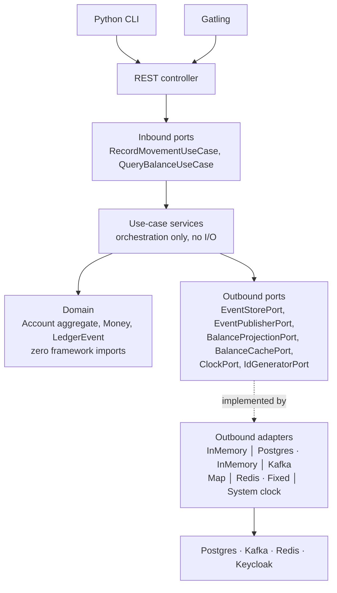

# Tiny Ledger — Technical Specification

**Author:** Flávio Oliva
**Version:** 3.37
**Status:** Contract for implementation
**Supersedes:** Event-Sourced Banking Ledger PoC V2

---

## 1. Purpose and dual delivery

An event-sourced banking ledger — single-entry per account, double-entry transfers recorded as the
next increment (§13) — built as a modular monolith and specified for production readiness:
containerised, observable, secured, rate-limited, cached, and tested at every level from unit to
load. §14 tracks which of those are built; *Open issues* records where this document and the code
differ today.

The origin is a *"Build a tiny ledger"* take-home exercise. That brief asks for three features in a few
hours with in-memory storage and explicitly excludes auth, monitoring and atomic operations. This
specification deliberately goes far beyond it, so the repository ships **two run modes from one
codebase**:

| Mode | Command | What runs | Purpose |
|---|---|---|---|
| **`standalone`** (default) | `./mvnw spring-boot:run` | In-memory event store, in-memory cache, no auth, no broker. Binds `127.0.0.1` only; the startup banner prints `AUTH DISABLED (standalone)`. **JDK 25** is the only prerequisite. | The brief's runtime in one command: clone, run, curl the APIs. The scope beyond the brief is a recorded, deliberate choice (`agentic-workflow.md` §6) — an accepted submission risk, not claimed compliance. |
| **`full`** | `docker compose -f docker/docker-compose.yml up -d`, then `./mvnw spring-boot:run -Dspring-boot.run.profiles=full` — **two steps: the app is not a Compose service** (§12) | **Built:** PostgreSQL, Kafka (KRaft, no ZooKeeper), Redis — see `docker/docker-compose.yml`; the jar runs on the host against their published ports. **Keycloak is built as an integration but absent from Compose:** the realm, the resource server and role enforcement are delivered (§6.4, §14 step 8) and every IT runs against a real Keycloak container, but `docker-compose.yml` declares no Keycloak service — so a hand-run `full` boot must supply its own issuer via `LEDGER_ISSUER_URI` (`application-full.properties:15`), whose default `localhost:8081` nothing in this repository serves. **Observability, §14 step 9:** the Actuator probes and OTLP instrumentation ship inside the application, and the telemetry backend is an **opt-in** Compose profile carrying an OTel Collector *alone* — the default `up` is unchanged, and there is deliberately no Prometheus, Grafana, Tempo or Loki service (§6.6). | The production-shaped system. |

Both modes run the **same domain code and the same core ledger API** — the two auditor operations
are `full`-only (§7), a declared profile-gated exclusion from parity, not an adapter difference.
Everything else differs only in which adapters are active — the point of the hexagonal boundaries
in §4. The default mode is the submittable artefact; the full mode is the depth story for the
follow-up conversation.

**Fail-closed guard:** `standalone` being the default must never become a fail-open path. If
full-mode configuration is present while the `standalone` profile is active — an OAuth2
`issuer-uri`, a JDBC datasource — startup **fails**, naming the conflict. Losing a profile flag in
a real deployment degrades to a refusal, never to an unauthenticated ledger.

**Design rule that follows from this:** no infrastructure concern may leak into the domain. If a
domain class imports Kafka, Redis, JPA or Spring Security, the design has failed and the
architecture tests in §9.2 fail the build.

---

## 1.5 Stack and conventions

Versions are governed by **`dr-jskill`'s `versions.json`**, not chosen ad hoc.

| Component | Version | Note |
|---|---|---|
| Java | **25** (LTS, Corretto) | Records, sealed interfaces, pattern matching and virtual threads are all load-bearing below |
| Spring Boot | **4.1.0** (Spring Framework 7.0) | `ProblemDetail`, Modulith integration and `@ServiceConnection` come free |
| Spring Modulith | Boot-4 line | Module verification, event publication registry, programmatic event externalisation (§4.3) |
| PostgreSQL | **18** | Event store + projections |
| Hibernate | **7.4** | Outbound persistence adapter only |
| Testcontainers | **2.0.5** | Integration and e2e |
| Maven wrapper | 3.8+ | `./mvnw` — a JDK is the only prerequisite |

**Jackson 3** ships with Boot 4; annotation imports differ from Jackson 2 and the DTO layer must be
written against it from the start rather than migrated.

### Conventions adopted from `dr-jskill`

`dr-jskill` (jdubois, Apache-2.0) is agent tooling used during the build, credited in
`docs/agentic-workflow.md` §3 rather than vendored into this repository. It is the JHipster
author's opinionated Spring Boot baseline; adopting it means the boring decisions are already made
and internally consistent.

**Adopted as-is:**

- **Bump `versions.json` first**, then propagate. Never edit a version directly in `pom.xml`.
- **`.properties`, not YAML.** `@ConfigurationProperties` for type safety.
- **`.env` is the single local secret store — never read, never printed.** Only `.env.example`, with
  placeholder values, is displayed or committed.
- **A startup banner printing access URLs** once the app is ready.
- Testing: Mockito for unit, `@WebMvcTest` at the web-slice level (§9.4 — not §9.1's
  zero-Spring-context unit level), Testcontainers with **`@ServiceConnection`** for integration,
  Given-When-Then with AssertJ.
- Docker asset set: standard, AOT, native and CRaC variants; devcontainer; `.editorconfig`;
  `.gitattributes`.
- **Ask before running git commands.** The human reviews before anything is committed.

**Deliberately overridden — the package layout (ADR-003).** `dr-jskill` mandates a flat, layer-first
structure — `config/`, `controller/`, `service/`, `repository/`, `domain/` — with the explicit rule
that *"the service layer is only included if it adds value… for simple CRUD applications, the
controller can directly call the repository."*

That rule is right, and it identifies precisely why it does not apply here. This is not a CRUD
application: there is no repository for a controller to call, because the write model is an event
stream behind `EventStorePort` and the read model is a projection owned by a different module. A flat
`controller/service/repository` layout cannot express a Modulith boundary, and collapsing the service
layer would put orchestration into a controller, which §4 forbids.

So the layout is §3.1's — module-first, hexagonal layers within. Everything else from `dr-jskill`
stands. This is recorded as an ADR because departing from an adopted convention must never look like
an accident.

---

## 2. Domain

### 2.1 Ubiquitous language

| Term | Meaning |
|---|---|
| **Account** | The aggregate root. Owns a stream of ledger events and enforces every monetary invariant. |
| **Money** | Value object: signed amount in **minor units** (`long`) plus `Currency`. Never a `double`. |
| **Movement** | A single recorded change of funds — a deposit or a withdrawal. |
| **LedgerEntry** | The immutable, persisted record of a movement, carrying the resulting balance. |
| **Balance** | A *projection* of the event stream. Never an independently writable field. |
| **Stream version** | Monotonic sequence number per account; the optimistic-concurrency token. |

### 2.2 Aggregate: `Account`

Invariants, enforced inside the aggregate and nowhere else:

1. A withdrawal may not take the balance below zero (no overdraft in this PoC).
2. Movement amounts are strictly positive and in the account's currency.
3. Every applied event increments `version` by exactly one.
4. Balance is recomputed only by applying events, never assigned.

### 2.3 Domain events

Immutable Java `record`s, versioned by schema:

| Event | Emitted when |
|---|---|
| `AccountOpened` | Account created. Carries the initial `currency`, the **`owner`** (caller principal) and the account **`name`** — ownership and naming are facts of the stream, not sidecar state. |
| `MoneyDeposited` | Funds credited. Carries the **`actor`**. |
| `MoneyWithdrawn` | Funds debited after invariant checks pass. Carries the **`actor`**. |
| `MovementRejected` | A command failed a business invariant. Recorded, not thrown away — rejections are audit-relevant. Carries the **`actor`**. |

Every event answers **`actor()`** — the principal that issued the command — declared on the sealed
`LedgerEvent` interface beside `accountId`, `version` and `occurredAt`, so the audit projection maps
one accessor instead of switching on type. On the three movement events it is a record component; on
`AccountOpened` it is derived from `owner`, because an account has no owner to act on behalf of until
it exists (§15.8). For an owner-initiated movement `actor` equals the stream's `owner`; when an admin
acts on the owner's behalf (§6.4) the pair `(actor, owner)` is the whole record of the delegation —
one immutable row answering both *who acted* and *whose account it was*.

Events are the write model's source of truth. Nothing else is.

### 2.4 Commands

`OpenAccount`, `Deposit`, `Withdraw`. Every command carries the **caller principal** (the JWT
subject; a fixed local principal in `standalone`) — authorisation is a use-case concern (§6.4), and
a use case cannot check what it never receives. The principal is not only checked: the use case
stamps it onto every event it emits as the `actor` (§2.3), so *who acted* survives in the log rather
than only in a request that is already gone. `Deposit` and `Withdraw` also carry a
**client-generated movement UID** — at once the idempotency key and the movement's permanent
identity (§6.3) — and an optional free-text `reference` that travels to the feed item (§7).

---

## 3. Module structure (Spring Modulith)

One deployable, one Maven module, package-per-application-module under
`com.ffroliva.tinyledger`. Boundaries are verified at build time by
`ApplicationModules.of(TinyLedgerApplication.class).verify()`.

**Four application modules, one open kernel, one non-module platform package.**

An earlier draft of this spec listed seven modules, including `security`, `ratelimit` and
`observability`. That was wrong. A Spring Modulith application module is a **business capability**;
those three are technical aspects applied uniformly to every module, and promoting them to modules
inflates the count while saying nothing about the domain. They now live in `platform`, which is
excluded from the module graph.

| # | Module | Type | Responsibility | May depend on |
|---|---|---|---|---|
| — | `shared` | **open kernel** | `Money`, `AccountId`, `Currency`. Value semantics only, no behaviour, no growth. | — |
| 1 | `ledger` | closed | **Write side.** The `Account` aggregate, commands, domain events, event store port, command use cases, write API. | `shared` |
| 2 | `balance` | closed | **Read side.** Balance and history projections, their own query API. Subscribes to `ledger` events. | `shared`, `ledger::events` |
| 3 | `audit` | closed | Compliance trail, retention, auditor-facing API. Subscribes to all events. | `shared`, `ledger::events` |
| 4 | `notification` | closed | Signals **large movements** (single movement ≥ a configurable threshold, default 10 000.00) and every `MovementRejected`, as structured log entries. Earns its place as a subscriber with business rules of its own — not a second proof of `balance`'s mechanism. | `shared`, `ledger::events` |
| — | `platform` | not a module | Security, rate limiting, observability. Filters and technical `@Configuration` only — no domain logic. | — |
| — | `config` | not a module | The composition root (§4.5) — the only place adapters are constructed. | — |

**Why `account` is not a fifth module.** Account lifecycle and money movement look like separate
capabilities, but the `Account` *is* the aggregate that owns the event stream — splitting them puts a
consistency boundary through the middle of a single transactional invariant. Opening an account emits
`AccountOpened` onto the same stream as every movement. One aggregate, one module.

**Why `balance` is separate from `ledger`.** This is the CQRS boundary made structural — see §4.0.
The read side subscribes to events and serves its own queries; it never calls into the write side,
and the write side does not know it exists. Deleting `balance` would break reads and leave writes
working, which is the test of whether the split is real.

`shared` is an **open** module so value objects can cross boundaries without ceremony. It is capped
at value types deliberately: a shared kernel that accumulates behaviour becomes the coupling it was
meant to prevent, and an ArchUnit rule keeps services and repositories out of it.

Cross-module communication is **domain events only** — no direct service calls between closed
modules. Each module exposes a `package-info.java` declaring its named interface; internals live in
sub-packages that Modulith enforces as private.

### 3.1 Reconciling Modulith with hexagonal layering

Spring Modulith organises **feature-first** (a package per bounded context). Hexagonal architecture
organises **layer-first** (domain / application / adapters). These are orthogonal, and the
combination is: *module at the top level, layers inside each module.*

```
com.ffroliva.tinyledger
├── shared/                              ← open module: Money, AccountId, Currency
├── ledger/                              ← closed module — the write side
│   ├── package-info.java                ← @ApplicationModule, allowedDependencies
│   ├── domain/                          ← zero framework imports. Enforced by ArchUnit.
│   │   ├── Account.java                 ← aggregate root
│   │   ├── LedgerEvent.java             ← sealed interface + record variants
│   │   └── policy/OverdraftPolicy.java
│   ├── application/
│   │   ├── port/in/                     ← inbound ports — commands, plus the §4.4 strong read; other queries live in `balance`
│   │   │   ├── OpenAccountUseCase.java
│   │   │   └── RecordMovementUseCase.java
│   │   ├── port/out/                    ← outbound ports (capabilities the app needs)
│   │   │   ├── EventStorePort.java
│   │   │   ├── EventPublisherPort.java
│   │   │   ├── ClockPort.java
│   │   │   └── IdGeneratorPort.java
│   │   └── usecase/                     ← plain classes; orchestration only
│   │       ├── RecordMovementService.java
│   │       └── OpenAccountService.java
│   └── adapter/
│       ├── in/web/LedgerController.java     ← implements the generated OpenAPI interface
│       └── out/
│           ├── inmemory/InMemoryEventStore.java
│           ├── postgres/PostgresEventStore.java
│           └── spring/SpringEventPublisher.java  ← EventPublisherPort, both modes; Kafka is externalised by config, no adapter (§4.3)
├── balance/                             ← closed module — the read side; the other half of CQRS
│   ├── application/
│   │   ├── port/in/                     ← queries only
│   │   │   ├── QueryBalanceUseCase.java
│   │   │   ├── QueryHistoryUseCase.java
│   │   │   └── QueryAccountsUseCase.java
│   │   ├── port/out/
│   │   │   ├── BalanceProjectionPort.java   ← never touches the aggregate (§4.0)
│   │   │   └── BalanceCachePort.java
│   │   └── projection/BalanceProjector.java ← plain class; applies events via the ports
│   └── adapter/
│       ├── in/events/LedgerEventsListener.java  ← the inbound adapter driving the projector — synchronous @EventListener in both run modes (§4.3)
│       ├── in/web/BalanceController.java    ← read-side API, same generated OpenAPI interface
│       └── out/
│           ├── inmemory/… · postgres/…      ← projection store per run mode
│           └── redis/RedisBalanceCache.java
├── audit/                               ← closed module — consumes via Kafka, deliberately (§4.3)
│   ├── application/                     ← RecordAuditEntryUseCase, QueryAuditTrailUseCase, AuditTrailStorePort
│   └── adapter/
│       ├── in/kafka/AuditEventConsumer.java ← the Kafka consumer — the module→service extraction seam
│       └── in/web/AuditController.java      ← auditor-facing API (`ledger:auditor`, §6.4)
├── notification/                        ← closed module — threshold/rejection rules, log-entry adapter (§3)
├── platform/                            ← not a module — security, rate limiting, observability (§3)
└── config/                              ← composition root (§4.5)
```

**Ports model capabilities, not technologies.** `EventStorePort` exposes
`append(streamId, expectedVersion, events)`, `read(streamId)` and `findByMovementUid(movementUid)`
— §6.3's global lookup is part of the port's contract — and nothing in those signatures reveals
whether the implementation is a `ConcurrentHashMap` or Postgres, which is precisely what makes §1's
two run modes possible.

`ClockPort` and `IdGeneratorPort` exist because an event-sourced aggregate stamps every event with a
timestamp and an identity. If those come from `Instant.now()` and `UUID.randomUUID()` inside the
domain, the domain is no longer deterministic and its tests must either sleep or assert loosely.
Injected, event application is a pure function and the unit tests in §9.1 assert exact values.

---

## 4. Architecture: hexagonal, event-sourced, CQRS

### 4.0 Where CQRS sits relative to ports and adapters

**Question asked during design:** should CQRS go *in front of* the ports and adapters?

**Answer: no — CQRS is not a layer, it is a split, and it is expressed *as* the port structure.**
The two patterns act on different axes and compose rather than stack:

| | Axis | Question it answers |
|---|---|---|
| **Hexagonal** | inside ↔ outside | What may depend on what? |
| **CQRS** | write ↔ read | Which model serves this request? |

Putting a command bus or mediator in front of the adapters — a `CommandDispatcher` that resolves
handlers from a registry — is the usual way this goes wrong. It buys a runtime lookup in exchange for
compile-time wiring, readable stack traces, and IDE navigation. In a modular monolith with a
composition root (§4.5), there is nothing left for it to do: dispatch is a constructor argument.

CQRS instead appears in three places, all structural:

1. **Two families of inbound ports.** `RecordMovementUseCase` and `OpenAccountUseCase` are commands;
   `QueryBalanceUseCase` and `QueryHistoryUseCase` are queries. Different interfaces, different
   transaction semantics, different failure modes.
2. **Two families of outbound ports.** Writes go through `EventStorePort` and its optimistic
   concurrency check. Reads go through `BalanceProjectionPort` and never touch the aggregate — a query
   that rehydrates an aggregate has silently abandoned CQRS. The single exception is deliberate and
   write-side-owned: the `consistency=strong` escape hatch (§4.4) is served by `ledger` itself,
   never by the read module.
3. **Two modules.** `ledger` (write) and `balance` (read), coupled only by domain events (§3).

So the layering is: **adapter → inbound port (command *or* query) → use case → domain and outbound
ports.** CQRS chooses *which* path; hexagonal governs the direction of every arrow on both paths.
Neither wraps the other.

The read side owning its own controller follows directly. `GET /api/v1/accounts/{accountUid}/balance` is served
by an adapter inside `balance` — except the strong-read mapping, which §4.4 assigns to `ledger` and
disambiguates with a request-mapping `params` condition. Neither module reaches across the boundary.



Dependency direction is always inward. The domain depends on nothing; use cases depend only on
ports; adapters depend on the application. **No adapter calls another adapter** — the cache is
invalidated by an event handler reacting to a domain event, not by the Postgres adapter reaching
sideways into the Redis adapter.

Errors are translated at the boundary: a `SQLException` or a Redis timeout never escapes an outbound
adapter. It becomes an application-level failure (`EventStoreUnavailable`, `ConcurrencyConflict`)
which the inbound adapter maps to the problem details in §6.5. The domain has no vocabulary for
infrastructure failure and should not acquire one.

### 4.1 Write path

1. Command arrives, validated at the boundary (shape only, §4.6).
2. Aggregate rehydrated by replaying its event stream; **ownership checked against the caller
   principal before anything else is answered** — or, for a caller holding `ledger:admin`, the
   widened check of §6.4. A caller who satisfies neither gets the §6.5 refusal, never an idempotency
   oracle.
3. Movement UID checked **globally** via `findByMovementUid` (§4.2's unique index) — a replay is
   answered from the existing event, never re-applied; a UID found on a *different* stream is an
   idempotency conflict (§6.3).
4. Command applied; the aggregate emits events or rejects — each emitted event stamped with the
   caller principal as its `actor` (§2.3).
5. Events appended to the store **with an optimistic-concurrency check on stream version**;
   a conflict returns `409` and the caller retries.
6. Events published to subscribers via the transactional outbox (§4.3).

### 4.2 Event store — Postgres, not Kafka

**Decision (ADR-002):** PostgreSQL is the event store and system of record. Kafka is the
publication bus, fed by a transactional outbox.

Kafka is not a system of record for an aggregate that needs per-stream optimistic concurrency: it
offers no conditional append, no read-your-writes on a stream, and unbounded retention is a
compliance liability rather than a feature. Postgres gives an `append(streamId, expectedVersion,
events)` that is atomic with a `UNIQUE (stream_id, version)` constraint — which *is* the concurrency
control. Kafka then does what it is genuinely good at: fanning events out to consumers that must not
share a database.

```sql
CREATE TABLE ledger_event (
    stream_id       UUID        NOT NULL,
    version         BIGINT      NOT NULL,
    event_type      TEXT        NOT NULL,
    schema_version  INT         NOT NULL,
    payload         JSONB       NOT NULL,
    occurred_at     TIMESTAMPTZ NOT NULL,
    movement_uid    UUID,
    PRIMARY KEY (stream_id, version)
);
CREATE UNIQUE INDEX ON ledger_event (movement_uid) WHERE movement_uid IS NOT NULL;
```

### 4.3 Outbox

**Do we need to hand-write Kafka producers and consumers to move events between Modulith modules?
No — and mostly we do not need Kafka for that at all.** Two distinct mechanisms exist and each has
one job:

| Mechanism | Carries events | Guarantee | Used by |
|---|---|---|---|
| **Synchronous `@EventListener`** | *Within* the deployable | In-process, inside the publishing transaction. Read-your-writes; no registry row, so nothing to retry | `balance`, `notification` |
| **Spring Modulith event publication registry**, routed to **Kafka** by `EventExternalizationConfiguration` | *Out of* the deployable | At-least-once, ordered per partition key. The publication row commits with the event append; incomplete publications are republished on restart | `audit` |

Inside one deployable, Kafka between modules is a network hop, a serialisation round-trip and a loss
of transactional coupling, bought in exchange for nothing. A plain listener already gives decoupled
delivery with the module boundary enforced at build time, and it costs no infrastructure at all.

**In-process delivery is synchronous in both profiles (v3.8).** The registry mechanism presupposes a
persistence module and a transaction manager, neither of which exists in standalone — there
`@ApplicationModuleListener` (meta-annotated `@Async` + `@TransactionalEventListener`,
`fallbackExecution=false`) is registered and then silently never invoked, which v3.5 recorded. Full
mode did **not** flip it back: only the externalisation leg is a persisted listener, so the balance
projection stays a plain synchronous `@EventListener` and read-your-writes is identical in both run
modes (ADR 0001, "Only persisted listeners get a publication row"). Asynchronous projection is a
Plan 3 question, not a mode difference.

**So why is Kafka here at all?** Because it is the seam where a module becomes a service, and
demonstrating that seam is the entire value proposition of a modular monolith. `audit` is therefore
wired through Kafka *deliberately*, as the worked example of the extraction path: different retention,
different scaling profile, compliance isolation, and no shared database — the four reasons an audit
trail is the realistic first module to leave the monolith.

**No hand-rolled outbox poller.** Spring Modulith's event externalisation does exactly this job —
declared programmatically in `config`, so the domain records stay annotation-free (§9.2):

```java
@Bean
EventExternalizationConfiguration ledgerEventExternalization() {
    return EventExternalizationConfiguration.externalizing()
            .select(event -> event instanceof LedgerEvent)
            .route(LedgerEvent.class,
                   e -> RoutingTarget.forTarget("ledger.events").andKey(e.accountId().toString()))
            .build();
}
```

The publication registry row and the event append commit in one transaction; the externaliser
publishes afterwards and marks the publication complete. That *is* the transactional outbox, already
written, already tested. Writing a bespoke poller here would be re-implementing a supported
framework feature — and getting the incomplete-publication retry subtly wrong.

**Division of labour with `EventPublisherPort` — one mechanism per leg.** The port owns the
*in-process* leg only: its single implementation wraps Spring's `ApplicationEventPublisher` in both
run modes, which is what keeps framework types out of the use cases. The *Kafka* leg belongs to
the programmatic externalisation entirely — there is no `KafkaEventPublisher` adapter to write, and a port with one
implementation needs no §9.2b contract suite. Same event, two legs, one owner each.

**Topic design — decide correctness, configure the rest.** Exactly two Kafka decisions are design,
both fixed here: **one topic, `ledger.events`** — `audit` consumes every event type and needs their
per-account order preserved; topic-per-event-type would destroy it — and **partition key =
`accountId`**, because Kafka orders only within a partition and the key is what makes E5/E6
physically possible. Everything else (partition count, retention hours, compression, batch sizes)
is `spring.kafka.*` configuration with defaults fine for a PoC, revisited only against §9.7
measurements. Kafka retention is deliberately short: the topic is transport, never the record
(ADR-002).

**Three copies of one event is staged delivery, not duplication.** The `ledger_event` row is the
permanent truth (§4.2). The Modulith `event_publication` row is a transient *delivery ledger* — one
row per event×listener, holding completion state; completed rows are removed via
`spring.modulith.events.completion-mode=delete`, and the incomplete ones are precisely what E7's
restart-replay exercises. The Kafka copy is a time-boxed transport buffer. One truth, one outbox,
one wire — each with its own lifecycle.

**The registry's guarantees are configured, not assumed.**
`republish-outstanding-events-on-restart=true` is set explicitly — E7 is a test of that property,
which is off by default. And externalisation is asynchronous after commit, so cross-event *arrival*
order is not guaranteed even on one partition: the audit consumer is therefore idempotent and
order-restoring, keyed on `(stream_id, version)` — the same discipline E4/E5 demand of projections
— and E6's no-gaps-no-duplicates is asserted on the *stored trail*, not on arrival order.

**Where the Kafka code actually lives.** Under hexagonal rules a Kafka consumer is simply another
*inbound adapter*, no different in kind from the REST controller — and there is one consumer class
per consuming module, never a shared or generic one:

```
audit/
├── application/port/in/RecordAuditEntryUseCase.java
└── adapter/in/kafka/AuditEventConsumer.java   ← @KafkaListener, maps to the use case
```

The listener deserialises, maps the Kafka payload to a use-case input, and calls the port. It holds
no business logic, so the same use case is driven by a unit test with no broker present. The producer
side is Modulith's externalisation and therefore not code we own at all.

### 4.4 Read path

Projections are updated from events and served from Redis with Postgres as the fallback:

- `GET /balance` → Redis (`ledger:balance:{accountId}`), miss → replay/read projection → cache.
- `GET /transactions` → Postgres projection, keyset-paginated. Not cached; histories grow.
- `GET /accounts` and `GET /accounts/{accountUid}` → the **accounts projection**, owner-indexed,
  maintained by `balance` from `AccountOpened` events — the store behind name→uid resolution (§11)
  and list scoping (N12).

**Pagination is keyset, and Spring's types stay inside the adapter.** The wire cursor (§7) is an
opaque encoding of `(transactionTime, transactionUid)`; the projection query is one index-backed
`WHERE (transaction_time, transaction_uid) < (?, ?) ORDER BY … DESC LIMIT n+1`, the extra row being
the `links.next` signal. `Pageable`/`Page` are deliberately absent: offset pagination is unstable
under concurrent inserts, `OFFSET`-slow on growing feeds, and `Page` adds a count query per
request — and they are framework types, which §9.2 keeps out of inbound ports.
`QueryHistoryUseCase` takes a plain `{cursor, limit, timeRange}` value; if the Postgres adapter
wants framework leverage it uses Spring Data's keyset scrolling (`ScrollPosition.keyset()` /
`Window`) internally and translates. Spring Data `Specification` is skipped for the same reason
`changesSince` was (§7.1): the feed has exactly two optional filter axes, which is one query with
two predicates, not a composable-predicate framework.

**Consistency:** the write path is strongly consistent (the aggregate is authoritative); read models
are eventually consistent. Every projection response carries `asOf` and `streamVersion` so a client
can detect staleness. This trade-off is documented, not hidden.

**The strong read is a write-side endpoint — the one documented CQRS exception.**
`GET /balance?consistency=strong` is served by the `ledger` module's own controller, which replays
the aggregate and answers from the authoritative stream. `balance` never touches the aggregate and
`ledger` never touches the projection — §4.0's rule stays intact for the read module; the exception
lives where the authority lives. It is deliberately the expensive path (full replay, no cache):
only the write side can promise read-your-writes, and pricing it honestly is what keeps the
projection the default. Routing is explicit, never ambiguous: `ledger`'s mapping carries Spring's
`params = "consistency=strong"` condition, `balance`'s handles the parameterless default — one
path, two disambiguated mappings, each inside its owning module.

### 4.5 Composition root — the mechanism behind the two run modes

Wiring lives in exactly one place, `com.ffroliva.tinyledger.config`, as Spring `@Configuration`
classes selected by profile. Nothing else in the codebase constructs an adapter, and no use-case or
domain class carries a Spring stereotype annotation — use cases are plain classes instantiated by the
composition root with constructor injection.

Transaction demarcation is wiring too: `UseCaseConfig` wraps each command use case in a
`TransactionalUseCaseDecorator` built on Spring's `TransactionTemplate`, so §4.3's promise — event
append and publication-registry row committing together — holds without a single framework
annotation entering the application layer (§9.2 enforces this for the three annotations its ArchUnit
rule names — `@Service`, `@Component`, `@Transactional`; the rule here is the design rule, which is
broader).

```java
@Configuration
@Profile("standalone")
class StandaloneAdapterConfig {
    @Bean EventStorePort eventStore()          { return new InMemoryEventStore(); }
    @Bean BalanceCachePort balanceCache()      { return new MapBalanceCache(); }
    @Bean ClockPort clock()                    { return Instant::now; }
    @Bean IdGeneratorPort ids()                { return UUID::randomUUID; }
}

@Configuration
@Profile("full")
class FullAdapterConfig { /* Postgres and Redis equivalents; no Kafka publisher — §4.3 */ }

@Configuration
class UseCaseConfig {                                   // profile-independent
    @Bean EventPublisherPort publisher(ApplicationEventPublisher p) {
        return new SpringEventPublisher(p);             // single implementation, both modes (§4.3)
    }
    @Bean RecordMovementUseCase recordMovement(
            EventStorePort store, EventPublisherPort publisher,
            ClockPort clock, IdGeneratorPort ids) {
        return new RecordMovementService(store, publisher, clock, ids);
    }
}
```

**This is the whole trick of §1.** `UseCaseConfig` never changes between modes; only the adapter
configuration does. The take-home-compliant run and the full production stack execute *the same
compiled domain and application code*. If a *core-API* behaviour differs between modes, an adapter
is at fault, and §9.2b is the test that catches it; the auditor pair's absence in `standalone` is
the one declared, profile-gated exception (§7).

Auditing the wiring is reading three small files. That is deliberate: dependency wiring scattered across
sixty `@Component` annotations is a service locator with extra steps, and it is how framework
concerns leak inward without anyone noticing.

### 4.6 Data shapes and mapping between layers

One rule, stated once: **each layer owns its own shape of the data, and every conversion is an
explicit mapper owned by the adapter that needs it.** Nothing crosses a boundary in a foreign shape.

| Shape | Lives in | Examples | Notes |
|---|---|---|---|
| Wire DTOs | generated from `openapi.yaml` (§5); referenced only by `adapter/in/web` | `DepositRequest`, `BalanceResponse` | Jackson 3; Bean Validation annotations generated from the OpenAPI constraints carry the §9.5 boundary checks |
| Domain | `domain/` + `shared` | `Deposit` command, `MoneyDeposited` event, `Money` | Zero framework imports (§9.2); the only shape use cases and the aggregate ever see |
| Persistence | inside `adapter/out/postgres` | event row (JSONB payload + `schema_version`), projection row | Payload (de)serialisation is versioned; readers tolerate unknown fields |
| Cache | inside `adapter/out/redis` | serialised balance snapshot | Never a second source of truth (§6.2) |

The mapping rules, enforced by dependency direction rather than convention:

1. **The inbound web adapter** maps wire DTO → command and result → response DTO. Validation is
   two-level, deliberately: Bean Validation on the DTO rejects malformed *shape* (`400`); the
   aggregate rejects invalid *state* (`422`). The domain re-checking what the boundary checked is
   not duplication — the domain cannot know who called it.
2. **Each outbound adapter** owns its own mapping: the Postgres adapter owns event ↔ JSONB keyed by
   `schema_version`, the projector maps event → projection row, the read adapter maps projection
   row → response DTO.
3. **Mappers are hand-written static functions in the adapter package** — records make each one a
   constructor call. No MapStruct, no ModelMapper: a mapping framework is a dependency, a build
   step and a reflection surface bought to avoid code the compiler already checks. When a record
   gains a field, every mapper that ignores it fails compilation — that is the review we want,
   free.
4. **No shape escapes its owner.** A wire DTO below the controller, a persistence type above its
   adapter, or a domain object serialised straight onto the wire are the same bug — a boundary
   that stopped being one. ArchUnit rules (§9.2) fail the build on each.
5. **Shared behaviour has exactly three sanctioned homes**: domain policy (`OverdraftPolicy`),
   `shared`-kernel value semantics (`Money`), or `platform` technical aspects. A use-case service
   is never a library for another use-case service — extracting a helper two services both call is
   how a CRUD god-service starts.

---

## 5. Spec-driven design

The contract precedes the code in three version-controlled artefacts. Their current enforcement is
different and is stated rather than inferred:

1. **`docs/api/openapi.yaml`** — OpenAPI 3.1, hand-written first. The build generates request/response
   DTOs and server interfaces from it; controllers implement generated interfaces, so a controller
   that drifts from the contract fails compilation. Live-application validation through `springdoc`
   is not built: there is no `springdoc` dependency or runtime validation gate.
2. **`src/test/resources/features/*.feature`** — the committed `@standalone` Gherkin subset, executed
   by Cucumber/JVM inside `verify`. Catalogue rows without a feature are not represented as Gherkin;
   current full-profile evidence is JUnit (§9.3).
3. **`docs/adr/*.md`** — Architecture Decision Records for selected non-obvious choices, with context,
   decision, consequences and alternatives rejected. Version control, not a build gate, protects their
   history.

**Delivery policy:** an endpoint should have its OpenAPI operation and executable acceptance proof
before implementation. No gate can prove that historical ordering. Current evidence is split between
the committed `@standalone` Cucumber subset and full-profile JUnit integration tests (§9.3); stage 9's
pytest-bdd catalogue binding remains planned and unbuilt.

**Requirement IDs:** P0…P9, N1…N18 and E1…E9 are the catalogue's stable labels. Committed feature
scenarios use tags such as `@P0` and `@N11`; Java tests name the applicable label in code or prose.
There are currently no `REQ-*` test tags, and nothing harvests a traceability matrix from tests.
Automated traceability remains planned (§8.2).

---

## 6. Cross-cutting requirements

### 6.1 Rate limiting

Token bucket per principal *and* per IP, whichever is more restrictive. Bucket4j backed by Redis
(`lettuce`) so limits are shared across instances; in `standalone` mode it falls back to a local
in-memory bucket.

| Scope | Limit |
|---|---|
| Write endpoints, per principal | 100 / minute |
| Read endpoints, per principal | 1000 / minute |
| Unauthenticated, per IP | 20 / minute |
| Any traffic, per IP (backstop) | 300 / minute |

Exceeding returns `429` with `Retry-After` and a `RateLimitExceeded` problem detail. Limits are
configuration, not constants.

**`burst` is configured but has no operative effect.** `RateLimitProperties.Limit` still carries a
`burst` field, and `application.properties` still declares
`ledger.rate-limit.write-per-principal.burst=20` — but `RateLimitFilter#probe` builds the bucket's
`Bandwidth` from `capacity()` alone; `burst` is never added to it. §9.3's N9 (`alice` exceeds 100
writes in a minute → 429) requires the **101st** write to be refused, which a capacity-plus-burst
reading of the old "100/minute, burst 20" row would have contradicted by refusing only the 121st.
`grep "burst()"` over `src/main` returns zero call sites.

Two production details the naive version gets wrong. **Client IP is `getRemoteAddr()`, never a raw
`X-Forwarded-For`** — the forwarded-header strategy is enabled only when a trusted proxy fronts the
app and that proxy overwrites the header; an unconfigured deployment must not let clients spoof
their way past the per-IP bucket. And **per-IP buckets live in a bounded, expiring store** (Caffeine
in `standalone`, Redis TTL in `full`) so unauthenticated traffic cannot grow memory without bound.

An operator may exempt specific source IPs from every bucket via a configured list — **empty by
default**, matched against the same `getRemoteAddr()` source the buckets themselves read, never a
header, and configuration-only: there is no endpoint to add or remove an entry at runtime.

**Row 3's 20/minute governs only token-less traffic, not all unauthenticated traffic.** In `full`, a
request carrying an unparseable, expired, or wrong-audience token is refused by
`BearerTokenAuthenticationFilter` before `RateLimitFilter` ever runs, so it is metered only by the
300/minute backstop (row 4) — 15× row 3's budget. This is inherent, not a defect (row 3 needs identity
to know the caller is unauthenticated, so a rejected token can't be routed there), but a reader
budgeting abuse capacity from this table alone will be wrong by 15×: sending garbage is strictly
cheaper for an attacker than sending nothing.

**In `standalone`, rate limiting is entirely inert, deliberately.** The profile binds
`server.address=127.0.0.1` and its own `ledger.rate-limit.exempt-ips=127.0.0.1` exempts that same
address, so every request in this mode — which can only ever arrive from loopback, by the bind above
— matches the exemption and skips both buckets. The blast radius is nil: there is no remote caller
this could expose. Recorded here because §9.2b's mode-parity rule treats a behavioural difference
between `standalone` and `full` as a defect unless this document says otherwise — so this is that
statement.

### 6.2 Caching

| Cache | Store | TTL | Invalidation |
|---|---|---|---|
| `balance` | Redis | 60 s | Evicted on `MoneyDeposited` / `MoneyWithdrawn` for that account |

One cache, deliberately. Account metadata is immutable after opening (§2.3) — caching what cannot
change needs no cache — and aggregate snapshots are cut entirely (§13). The TTL is part of the
port's contract: `MapBalanceCache` expires entries too — a timestamp check on read, no background
thread — and the §9.2b suite asserts expiry against both implementations.

The cache sits behind `BalanceCachePort` — `MapBalanceCache` in `standalone`, Redis in `full` — the
**same** swap mechanism as every other adapter (§4.5), deliberately not a second one via Spring's
`@Cacheable`: two swap conventions for one concern is the §4.3 dual-mechanism disease applied to
caches. **Event-driven eviction, never write-through** — a listener calls the port on
`MoneyDeposited`/`MoneyWithdrawn`; the cache must never be a second source of truth.

### 6.3 Idempotency

Starling's mechanism, adopted whole: **the client generates the movement's UUID and `PUT`s to it** —
the verb that is idempotent by contract, at a path that names the movement. The UID in the path is
simultaneously the dedup key and the movement's permanent identity, stored on the event row under a
unique index (§4.2). The event store itself enforces exactly-once; there is no separate idempotency
store to drift from it, no header machinery, and no expiry window — an identity does not expire.

| Case | Response |
|---|---|
| First write | `201` |
| Same UID, same payload | `200` with the original result — replayed, never re-applied |
| Same UID, different payload | `409` `/errors/idempotency-conflict`; the original movement stands |

Replays are answered only after ownership of the path account passes (§4.1) — idempotency is never
an authorisation bypass. Lookups are global, matching the index: reusing a UID against a
*different account* is a `409` idempotency conflict, not a fresh movement.

**Racing duplicate `PUT`s need no special path, but not for the reason this section claimed until
v3.16.** Through v3.15 it read: "the loser's unique-constraint violation triggers a re-read by UID".
**Measured on CI 2026-08-07, by `N19` on its first ever run: that path does not fire.** All the
racers read the same stream version, so every loser fails the event store's *version* check — which
runs **before** the UID check (`PostgresEventStore:66`, `InMemoryEventStore:21`) — and is answered
`409` `/errors/version-conflict`.

The unique-constraint path is in fact unreachable for same-stream racers: a racer that had read the
later version would already have found the UID at `RecordMovementService:68` and returned `200`
without appending at all. Version and UID are facts of the same committed row, so no window exists
where one is fresh and the other is not. (It remains reachable for a *cross-stream* race — the same
UID against a different account, `N20` — where the version check passes because it is a different
stream and the global unique index is what fires.)

The guarantee itself is unchanged, and arrives one retry later: **a bare `409` version conflict is
not terminal**, and the retry re-reads and answers from the table above exactly as a sequential
replay would. So the contract for *n* racing duplicates is **one `201`, *n*−1 eventual `200`s,
credited once** — with the retry being the client's obligation, the same one `N2` depends on.

Rejections replay deterministically too: `MovementRejected` carries the UID, so retrying a refused
withdrawal with the same UID returns the original `422`. A retry *after* topping up is a new attempt
and therefore a new UID — exactly the semantics a ledger wants.

Account opening stays `POST /api/v1/accounts` with a server-generated `accountUid`: opening is not a
retried money movement, and Starling does not model account creation as client-idempotent either.

### 6.4 Security

Keycloak as OAuth2/OIDC provider; the app is a resource server validating JWTs.

| Role | May |
|---|---|
| `ledger:reader` | Read balance and history for owned accounts |
| `ledger:writer` | Record movements on owned accounts |
| `ledger:auditor` | Read the audit trail across all accounts; no writes |
| `ledger:admin` | Widen `ledger:writer` to **any** account for change operations, acting on behalf of its owner; never widens `ledger:reader` — reads, including `?consistency=strong`, stay owner-scoped. Grants no operation on its own, and no access to the audit trail |

Owner-scoped reads stay a decision, not an absolute: the change operation's own response necessarily
carries the resulting `balanceAfter` (§7), so an admin who deposits into an account they do not own
learns that account's new balance as a side effect of the deposit. That is inherent to permitting the
change at all, not a gap in the read boundary — you cannot record a movement without knowing what it
left the account holding.

Authorisation is never an annotation on an application class — the application layer carries no
Spring annotations (§4.5). Where each decision *is* made follows from the principle below, not from
a single mechanism.

**Every authorisation decision is made by the component that holds the state the decision needs.**
That principle decides where a new operation's check belongs. It yields five comparison points
across four sites, and **this list is closed — a sixth requires an ADR.**

| The operation | Authorised | Because |
|---|---|---|
| Changes state (`PUT .../deposits/*`, `PUT .../withdrawals/*`) | In `RecordMovementService`, against the rehydrated aggregate, before the idempotency lookup (§6.3). Ownership admits the caller if the account's `owner` matches **or** the caller holds `ledger:admin` — the one comparison point `ledger:admin` widens | The decision must be taken against the same state, at the same version, the command is applied to |
| Reads at the aggregate's version (`?consistency=strong`) | In `StrongBalanceService`, against the rehydrated aggregate — the same in-service mechanism as the row above, **not widened**: a strong read is still a read | The strong read is the write-side escape hatch (§4.4) — only `ledger` can promise read-your-writes, so it authorises against the same aggregate state a write would; `ledger:admin` is a change-operation grant, not a read grant, so this comparison is untouched |
| Reads a read model for one named account | A decorator wrapping the inbound port (§4.5), **not widened** | The read model is the authority for a question the read model answers |
| Returns a collection the caller sees only part of | The port takes the visibility scope as a parameter (`accountsOwnedBy`) — the scope *is* the authorisation, **not widened** | There is no set to decorate; widening it is a port-signature change |
| Depends on role alone, with no account subject (`/audit/**`, `/accounts/*/events`) | The security filter chain in `config` — `ledger:admin` is absent from both matchers | There is no subject to compare and no inbound port to decorate |

Absent is never answered as unowned: an account that does not exist is §6.5's 404, whoever asks —
on every route but `/transactions`, whose 200-with-empty-page divergence the gaps table records.

No gate enforces the closure clause — it is a review obligation, not a build failure. `HexagonalRulesTest`
constrains where code may live, not where a check may be made.

#### Test users

Provisioned by `docker/keycloak/realm-tiny-ledger.json`, imported on container start — fixtures,
not credentials: passwords are `dev-only` throughout and the realm is never deployed anywhere but a
laptop and CI. **Built:** the realm file exists and `AbstractIntegrationTest` imports it into a real
Keycloak container for every IT (§9.4); the table below is the intended fixture set, not a description
of the tree.

| User | Roles | Owns | Exists to prove |
|---|---|---|---|
| `alice` | `ledger:writer`, `ledger:reader` | `ACC-001` | The positive path: deposit, withdraw, read own balance and history |
| `bob` | `ledger:writer`, `ledger:reader` | `ACC-002` | A second independent stream — that aggregates are isolated and concurrency is per-account |
| `carol` | `ledger:reader` | `ACC-003` | **403 on write.** A reader may not move money |
| `dave` | `ledger:auditor` | — | Reads the audit trail and raw event streams across all accounts; **403 on every write** |
| `mallory` | `ledger:writer`, `ledger:reader` | `ACC-004` | **403 on cross-account access.** Valid token, correct role, wrong owner — the authorisation bug that role checks alone miss |
| `trent` | `ledger:writer`, `ledger:reader`, `ledger:admin` | — | **On-behalf-of.** Moves money on an account he does not own; the movement records `actor=trent` on `alice`'s stream while the owner stays `alice`. **403 on the audit trail** — acting and reviewing are different jobs |
| `ledger-cli` | service account, `ledger:writer`, `ledger:reader` | `ACC-900` | Client-credentials flow for the Python CLI and the e2e suite |

`mallory` is the one that earns its place. Role-based checks pass for her on every endpoint; only the
ownership check against the JWT subject stops her reading `ACC-001`. A test suite without a
`mallory` proves authentication and nothing about authorisation.

`trent` is the cryptographic literature's trusted arbitrator, and the name is the point: authorised,
and still not above the record. He earns his place from the opposite side to `mallory` — `mallory`
proves the ownership comparison exists, `trent` proves the exception to it is exactly one clause
wide. A suite whose `trent` can also read the audit trail has tested a superuser and called it an
administrator.

`ACC-001`…`ACC-900` are account *names* (Starling's `AccountV2.name`), not identifiers — the API
knows only `accountUid`s, pinned to deterministic UUIDs by `docker/keycloak/realm-tiny-ledger.json`
plus a seed script the compose stack runs once, so scenarios can reference them — the realm file is
built; **the seed script is still not**.

**The ownership mechanism, end to end:** `AccountOpened` records the `owner` (§2.3), so ownership
is a fact of the event stream, not sidecar state; every command and query carries the caller
principal (§2.4); the use case compares the two. For a command — `RecordMovementService` alone —
that comparison admits the caller if they hold `ledger:admin`; every query's comparison,
`StrongBalanceService`'s strong read included, is untouched, because admin widens change operations
only, never reads. Every event a command then emits records the caller as its `actor` (§2.3), so an
admin-performed movement carries both halves of the answer an investigation needs — *who acted* and
*whose account it was* — on the same immutable row, and the audit trail surfaces the pair (§7).
`mallory`'s N7 is a test of the comparison, not of a role. `trent` has both unit and real-stack
coverage: `RecordMovementServiceTest#adminCanDepositOnAnAccountTheyDoNotOwn` proves the widened write
predicate directly, while
two `SecurityConfigIT` tests carry the real-stack half between them, deliberately split so a
regression in the write clause cannot hide the read refusals behind its own failure:
`#anAdminRecordsACrossAccountMovementAndTheAuditTrailAttributesItToHim` performs the cross-account
deposit **and withdrawal** against Postgres/Redis/Kafka/Keycloak — the two are wired into
`LedgerController` independently, so each needs its own evidence — keeps `alice`'s strong balance
readable at the net figure, and finds `trent` as the audit actor without assuming row order;
`#anAdminCannotReadTheBalanceOfAnAccountHeDoesNotOwn` refuses `trent` on both the eventual and the
strong read of an account he does not own. Each opens its own account, so the claim is "an account
`trent` does not own", not one shared UID. The refusal in the other direction —
`mallory`, a writer without `ledger:admin`, on both verbs — is
`#aWriterWithoutAdminCannotDepositIntoSomeoneElsesAccount` and
`#aWriterWithoutAdminCannotWithdrawFromSomeoneElsesAccount`. A pytest-bdd/Cucumber `@full` binding is
not built (§9.3).

### 6.5 Error handling

RFC 7807 `ProblemDetail` throughout, via Spring's built-in support
(`spring.mvc.problemdetails.enabled=true`).

| Condition | Status | `type` |
|---|---|---|
| Insufficient funds | 422 | `/errors/insufficient-funds` |
| Malformed shape — zero, negative or non-integer `minorUnits`, bad currency code | 400 | `/errors/invalid-amount` |
| Currency mismatch with the account | 422 | `/errors/currency-mismatch` |
| Concurrent modification | 409 | `/errors/version-conflict` |
| Reused movement UID, different payload | 409 | `/errors/idempotency-conflict` |
| Rate limit exceeded | 429 | `/errors/rate-limit-exceeded` |
| Unauthenticated | 401 | `/errors/unauthenticated` |
| Forbidden — wrong role, or wrong owner — widened on a change operation only, and only by `ledger:admin` | 403 | `/errors/forbidden` |
| Unknown account | 404 | `/errors/account-not-found` |
| Event store unreachable | 503 | `/errors/event-store-unavailable`, with `Retry-After` |
| Auditor operation invoked in standalone | 501 | `/errors/not-available-in-standalone` |

Problem responses carry a `traceId` correlating to the tracing backend. No stack traces, no internal
identifiers, no SQL fragments cross the boundary.

Wrong-owner access returns `403`, not `404`. The account-existence oracle this admits is accepted
because `accountUid`s are unguessable UUIDs — recorded here so the trade-off is a decision, not an
accident.

### 6.6 Observability

**OpenTelemetry is the single instrumentation API for all three signals.** Traces, metrics and logs
are emitted via OTLP to an OTel Collector, which forwards them to whatever backend the operator has
configured. The application knows only OTLP; swapping a backend is Collector configuration, not a
code change.

Instrumentation is Micrometer + Micrometer Tracing with the OTel bridge — the Spring Boot-native
path — rather than the standalone Java agent, so domain spans are written explicitly and stay
reviewable in the source.

**Domain spans are added by decoration, not by annotation.** `UseCaseConfig` already wraps every
command use case in a `TransactionalUseCaseDecorator` (§4.5), and the use-case span decorator is the
same shape in the same place. This is what keeps §9.2's framework-free application layer intact: no
Micrometer type is imported by `..application..`, exactly as no `@Transactional` is. Event-append
spans live in the store adapters and projection-apply spans on `LedgerEventsListener`, both of which
are adapters where framework coupling is already allowed.

**The backend is opt-in, and it is not local.** The Collector is a single Compose service behind a
`profiles: [observability]` key, so the default `docker compose up` is unchanged and still starts
four containers. It forwards to **Grafana Cloud** over OTLP, addressed by
`GRAFANA_CLOUD_OTLP_ENDPOINT` and a token supplied as environment variables (§1.5, `.env.example`).
The posture is the one the `load` profile already takes: a five-container visualisation stack that
most runs never open is a cost paid on every `up` for a benefit taken occasionally.

With the profile inactive, **OTLP export is off by default** — `management.otlp.*.export.enabled` is
`false` in the base configuration. Spans and meters are still *created*, so `trace_id` and `span_id`
still reach every log line and the §9.4 assertions still have something to read; nothing is shipped,
and nothing fills the log with failed-export retries against a port no one is listening on. Turning
the Collector on means starting the profile and flipping one variable, and the README documents it
rather than implying it.

#### Trace context across async boundaries — the part that usually breaks

A ledger write is `HTTP → command → event append → synchronous projection → Kafka → audit consumer`.
Two of those arrows cross a thread or process boundary — the projection does not, it runs on the
publishing thread inside the same transaction (§4.3) — and on each one an unconfigured setup silently
starts a fresh trace. The result is the classic failure: four disconnected traces and no way to answer
*"which request caused this audit entry?"*

| Boundary | Loses context because | Fix |
|---|---|---|
| `@ApplicationModuleListener` → new thread — *not today; applies only if the projection goes async in Plan 3* | Context is thread-local | `ContextPropagatingTaskDecorator` on the Modulith async executor |
| Event publication registry → retry after restart | The original thread is long gone | Trace context travels *inside the event envelope* (a `traceparent` attribute serialised with the event — the registry schema stays stock); the republished delivery emits a span **linked** to the original |
| Producer → Kafka → consumer | Different process | W3C `traceparent` in Kafka headers; Spring Kafka propagates it both ways |

**Fan-out uses span links, not parent-child.** One write produces `balance`, `notification` and
`audit` work concurrently. Modelling those as children of the HTTP span makes the request span appear
to last until the slowest consumer finishes, which misreports latency to every dashboard. Each
consumer starts a new trace **linked** to the producing span — the correct OTel semantic for
asynchronous fan-out, and it keeps `http.server.duration` honest.

#### What is instrumented

| Signal | Content |
|---|---|
| **Spans** | HTTP (auto), use-case execution, event append with `expectedVersion`, projection apply, Kafka produce/consume, Redis, Postgres. Domain attributes on every one: `ledger.account_id`, `ledger.stream_version`, `ledger.movement_type`, `ledger.rejection_reason` |
| **Metrics** | RED per endpoint, USE per resource. Domain: movements/sec by type, **rejection rate by reason**, **concurrency-conflict rate**, **`ledger.outbox.pending.age.seconds`** (the outbox/audit-consumer gauge — *not* projection lag, which is structurally zero here; see Health below), cache hit ratio, rate-limit rejections, idempotent-replay count |
| **Logs** | Structured JSON via `structlog`-equivalent (Logstash encoder), no PII, every line carrying `trace_id` and `span_id`. **The no-PII rule is stated for logs and not for spans, and that asymmetry is a gap, not a decision** — the Spans row above mandates `ledger.account_id` on every span, and spans leave the process to a third-party backend. A data-classification rule covering spans is owed (§14 step 9 part 2) and **no gate enforces either** |
| **Exemplars** | **Specified, not delivered.** Prometheus exemplars link a latency histogram bucket directly to a sampled trace — click the p99 spike, land on the request that caused it. They are a feature of Micrometer's *Prometheus* registry; this application exports metrics over OTLP and publishes no scrape endpoint, and there is no flag that turns them on along that path. Recorded as absent rather than carried as a promise nothing is building |

Semantic conventions are the OTel standard ones (`messaging.*`, `db.*`, `http.*`); domain attributes
use a `ledger.*` prefix so they never collide with a future convention.

**Cardinality is a one-way door, and the rule is absolute: account identifiers, movement UIDs and
interaction ids go on spans and logs, never on meters.** A span is a sampled individual record, and
high-cardinality attributes are most of why it is worth keeping. A meter is one time series per unique
tag combination — tagging a counter with an account id creates one series per account, permanently, and
at scale that does not slow a metrics backend down, it takes it out. Meter tags stay bounded and
enumerable: movement type, rejection reason, endpoint, status class, outcome. **If a proposed tag's
value set grows with traffic, it belongs on the span.** *No gate enforces this* — it is a review rule,
and it is written down because it looks harmless in a diff and is discovered in production
(ADR 0005).

**Resource attributes are not optional, because replicas are the point.** Every signal carries
`service.name`, `service.namespace` and `service.instance.id` from the environment, plus the `k8s.*`
conventions where the platform supplies them. Without them, twenty replicas emit one indistinguishable
stream and *"which instance is slow"* has no answer. This is the retrofit that costs most: invisible in
the application, visible in every dashboard and alert built before it.

**`ledger.outbox.pending.age.seconds` aggregates with `max`, never `sum`.** It reads a shared table, so every
replica reports the same global value; summed across twenty pods it reads twenty times the truth. A
wrong aggregation here is not visibly wrong on a chart — it is a plausible number that is false, which
is the hardest class of monitoring defect to catch.

**Sampling:** parent-based, 100% in `standalone` and CI, tail-sampled in `full` — always keep traces
containing an error, a `409`, a `422` or a duration over p99. Sampling that discards the interesting
traces is the same as no tracing.

**Health:** liveness and readiness are separate, and what each group *contains* is a decision here
rather than a default.

| Probe | Group contains | Why |
|---|---|---|
| `liveness` | `livenessState` | A liveness probe that fails on a dependency restarts a process that was working |
| `readiness` | `readinessState` + `db` | Event-store reachability. In `full` the event store **is** Postgres, so Boot's `db` indicator is that check; in `standalone` the store is in-memory and the group is `readinessState` alone |
| — | **`redis` excluded — a guard** | Boot *does* auto-configure a Redis indicator and the default grouping would pull it in. Leaving it would contradict **E10**, which requires the ledger to keep answering, and `?consistency=strong` to stay exact, while Redis is down |
| — | **`kafka` excluded — intent, not a guard** | Corrected at v3.37: `spring-boot-kafka-4.1.0.jar` ships **no** health contributor, so there is nothing to exclude. **E11** is protected by that absence rather than by this decision — worth knowing, because the absence is a property of the framework version and could change under an upgrade. Note also that naming a contributor that does not exist is a *startup failure*, not a no-op: `HealthContributorMembershipValidator` refuses to boot on an unknown name |

**Endpoint exposure is assessed, not defaulted.** `health` alone is web-mapped; the **two probe group
paths** are the only unauthenticated routes, and `/actuator/**` is otherwise denied — two independent
layers, so widening the exposure property cannot by itself open an endpoint to any valid token.
`heapdump` would render balances and bearer tokens, `env` and `configprops` the issuer URI and
datasource URL, `loggers` is a runtime write and `httpexchanges` is PII: each is refused for a stated
reason in `adr/0004`. Health detail is `never`, for every caller — which component is down is answerable
from the gauge and the logs, by people who already have access to them.

**The `health` root is closed, and closing it takes an explicit matcher.** Exposing `health` is exactly
what maps `/actuator/health`, and a permit expressed as `EndpointRequest.to(HealthEndpoint.class)` would
match the root *and* its groups — granting the aggregate status this section refuses. The two group
paths are therefore matched literally and the root falls to `denyAll`. Recorded because the cheapest way
to make a failing test green here is to delete the root from the assertion, which converts a refused
verdict into an accepted one with no record of the change.

**Probes bind to a separate management port** (ADR 0005), so a misconfigured endpoint is unreachable
rather than merely denied. Two qualifications, because the first version of this sentence claimed more
than it delivers:

- **The bind address must be set explicitly.** `ManagementWebServerFactoryCustomizer` applies
  `management.server.address` unconditionally, so declaring only the port overwrites the parent's
  address — and `standalone`, whose entire safety argument is that it binds `127.0.0.1` only, would gain
  a listener on `0.0.0.0`. The management address defaults to loopback for that reason.
- **"Reachable from inside the network only" is not enforced by anything here.** It is a property of how
  the port is published — a Compose port mapping, a Kubernetes Service, a NetworkPolicy — none of which
  this repository contains. Per `AGENTS.md`, saying so is the point: **no gate enforces it**, and the
  thing that would is a NetworkPolicy that does not exist yet.

**Readiness has a second job under an orchestrator, and it is a correctness one.** On `SIGTERM` the
instance must leave the load balancer *before* the listener stops: `server.shutdown=graceful` plus
Boot's readiness flip on shutdown is what makes a rolling deploy or a scale-down safe. Without it,
in-flight writes die mid-request during an ordinary deployment. For a ledger that is not an operational
nicety — and note it is a reason readiness matters that ADR 0004's own reasoning never needed.

**Readiness does not gate on lag, and the reason is architectural rather than a preference.** This
section said the opposite through v3.31, and `E9` was written against it. It cannot hold here: the
balance projection is a synchronous `@EventListener` on the publishing thread inside the write
transaction — the trace-context table above says so four paragraphs earlier, and §4.3 ratified it —
so balance-projection lag is structurally **zero**, not merely small. Corroborated independently and
before this revision: `PausableListenerGate` — the test-support class E1–E5 depend on — exists *because*
"a write is projected before the `PUT` returns and there is no window to observe", and it manufactures
the stale window E1 asserts by substituting a `@Primary` projector. **E1's window is test scaffolding,
not production behaviour.**

**A narrower statement than the one this section carried at v3.32, corrected here.** It said the harm
E9 named — *"serving stale balances"* — had *no mechanism at all*. That was wrong, and the mechanism is
in production code: `BalanceProjector` evicts the cache **inside the still-open append transaction**, so
a concurrent read landing between the eviction and the commit can repopulate the cache with the
pre-write balance, stale for up to the 60 s TTL (§6.2). The class documents this itself. It is bounded,
it is visible to clients through `asOf`/`streamVersion`, and `?consistency=strong` bypasses it (E3) —
consistent with §4.0, which has always said read models are eventually consistent.

What holds, stated exactly: **projection lag cannot make a balance stale, and readiness gating would not
help with the mechanism that can.** A stale cache entry sits in shared Redis and is visible to every
replica, so removing one instance from service changes nothing about it. That is a stronger reason for
ADR 0004's decision than the absence originally claimed here.

The lag that genuinely exists is on the Kafka leg — and **it is two lags, not one**, separated by the
broker. Corrected at v3.37, having been conflated since v3.32:

| Lag | Measured by | Rises when |
|---|---|---|
| **Producer side** — committed, not yet acked by Kafka | `ledger.outbox.pending.age.seconds` | The **broker** is slow or down |
| **Consumer side** — acked, not yet in the audit trail | **nothing today** | The consumer is slow, stopped or rebalancing |

`completion-mode=DELETE` (`application-full.properties:47-50`) is why: its own comment states that *"the
publication row goes the moment Kafka acknowledges — the queue only ever holds in-flight and failed
work"*, and `AuditKafkaListener` is a `@KafkaListener` on its own consumer group, downstream of that ack.
**Stopping the consumer leaves the gauge reading `0.0`.** The gauge was named `ledger.audit.lag.seconds`
through v3.36, which described a quantity it cannot observe.

Gating readiness on either would take every instance out of service during precisely the Kafka outage
**E11** requires the ledger to survive. So it is **measured and not gated**:
`ledger.outbox.pending.age.seconds` is a gauge over the age of the oldest incomplete publication, `full`
only, because `standalone` has no such table. **Its query must exclude `status = 'FAILED'`** — Modulith's
mark-failed path never sets `completion_date` and resubmission is restart-only, so one poison row would
pin `MIN(publication_date)` permanently, firing the alert forever and hiding every genuine excursion
behind the stuck value.

**Consumer lag and the dead-letter topic are unobserved, and that is a named gap rather than an
oversight.** Nothing watches consumer offsets, and `FullAdapterConfig` parks unprocessable records on
`ledger.events.DLT` with a javadoc saying it exists to prevent *"a silent, permanent hole in the
compliance trail"* — with nothing observing that topic either, which is operationally the hole it was
written to avoid. Both belong to step 9 part 2, where an exporter exists to carry them.

**The numbers survive as alerting thresholds, relabelled to what they actually describe:**
outbox pending-age SLO **p99 < 2 s** steady-state, **5 s** the level worth paging on. Both are
configuration, not constants, and they are the defaults `E9` asserts. **No probe and no gate consumes
them** — they are inputs to an alert this repository does not ship, and naming that is the point
(`AGENTS.md`: an unenforced rule is a hope). [`adr/0004-readiness-does-not-gate-on-lag.md`](adr/0004-readiness-does-not-gate-on-lag.md)
records the decision and the two cases that forced it.

**Observability is tested, not assumed** (§9.4): integration tests assert with an
`InMemorySpanExporter` that a withdrawal produces the expected span tree, that `traceparent` survives
the Kafka hop, and that a `MovementRejected` increments the rejection counter with the right reason
tag. One test goes further and asserts telemetry actually **leaves the process** — a Collector
container with a file exporter receives real spans and metrics over OTLP — which is the closest a
build can get to "the dashboard works". Untested instrumentation rots into dashboards full of zeroes.

---

## 7. API

Full contract in `docs/api/openapi.yaml`. The conventions are Starling Bank's public API wherever
they fit a ledger; §7.1 records each adoption, adaptation and refusal. Summary:

| Method | Path | Notes |
|---|---|---|
| `POST` | `/api/v1/accounts` | Open an account. `ledger:writer`. `201` + `Location`. `accountUid` server-generated. |
| `GET` | `/api/v1/accounts` | The caller's own accounts, scoped to the JWT subject (N12). `ledger:reader`. The CLI's name→uid resolution (§11). |
| `GET` | `/api/v1/accounts/{accountUid}` | Account metadata: `name`, `currency`, `createdAt`, `owner`. |
| `PUT` | `/api/v1/accounts/{accountUid}/deposits/{depositUid}` | Client-generated UUID = idempotency (§6.3). |
| `PUT` | `/api/v1/accounts/{accountUid}/withdrawals/{withdrawalUid}` | `422` on insufficient funds. |
| `GET` | `/api/v1/accounts/{accountUid}/balance` | `?consistency=strong` bypasses cache. |
| `GET` | `/api/v1/accounts/{accountUid}/transactions` | Cursor pagination, newest first. |
| `GET` | `/api/v1/accounts/{accountUid}/events` | Raw event stream. `ledger:auditor` only. |
| `GET` | `/api/v1/audit/entries` | The audit trail, filterable by account and time range. `ledger:auditor` only. |

The two auditor operations exist in `full` mode only — `audit` consumes via Kafka (§4.3) and the
role exists only where auth does (§6.4). `standalone` answers them `501`, documented in the README.

Identifiers are UUIDs named `<entity>Uid` — `accountUid`, `depositUid`, `transactionUid` — never
`id`, never a database key.

Money is one shape everywhere — requests, responses, balances:

```json
{ "currency": "GBP", "minorUnits": 10000 }
```

`minorUnits` is an `int64` of pence or cents: the domain `Money` (§2.1) serialised without
translation. No float anywhere, and no decimal-string parsing ambiguity either.

A transaction:

```json
{
  "transactionUid": "8b0c…", "accountUid": "f91e…",
  "type": "WITHDRAWAL", "direction": "OUT",
  "amount": { "currency": "GBP", "minorUnits": 2000 },
  "balanceAfter": { "currency": "GBP", "minorUnits": 8000 },
  "status": "SETTLED",
  "transactionTime": "2026-08-03T17:12:09Z",
  "settlementTime": "2026-08-03T17:12:09Z",
  "reference": "rent"
}
```

`direction` (`IN`/`OUT`) with an always-positive `amount`: the sign lives in semantics, not
arithmetic — Starling's cleanest idea, and the public projection of a double-entry leg. `type` is
the orthogonal axis saying what kind of movement it was. `status` is `SETTLED` on everything this
ledger emits (appends settle atomically); the enum reserves `PENDING` and `REVERSED` so pending
states never need a breaking change, and the two timestamps are equal today for the same reason.

An audit entry carries one field the transaction does not: the **`actor`**, the principal that
issued the command, which for an on-behalf-of movement is not the account's `owner` (§6.4). The
raw event stream exposes it inherently — it is a field of the event. The customer-facing
transaction resource is deliberately silent on it: the compliance trail is where attribution is
read, and `actor` is an optional field, so surfacing it on the feed later is an addition, not a
break.

The balance resource returns the money object plus the staleness markers §9.3 E1 demands:

```json
{ "accountUid": "f91e…", "amount": { "currency": "GBP", "minorUnits": 8000 },
  "asOf": "2026-08-03T17:12:10Z", "streamVersion": 3 }
```

Lists are wrapped in a named key — extensible without breaking clients — and paginated by cursor,
with optional `minTransactionTimestamp` / `maxTransactionTimestamp` filters (Starling's parameter
names, verbatim):

```json
{ "transactions": [ … ], "links": { "next": "…/transactions?cursor=…" } }
```

### 7.1 Starling alignment

Reference: the Starling Bank public API (`developer.starlingbank.com`, OpenAPI, 68 paths). Recorded
so that every convention argument resolves to a citation rather than a taste.

| Starling convention | Verdict | Why |
|---|---|---|
| `<entity>Uid` UUID identifiers | **Adopt** | No `id`, no database leakage |
| `{currency, minorUnits}` money | **Adopt** | Matches the domain `Money` exactly |
| `PUT` + client-generated UID for money movement | **Adopt** | Idempotency without header machinery; deleted a port (§6.3) |
| `direction` `IN`/`OUT` + unsigned amounts | **Adopt** | Sidesteps signed-amount bugs |
| Path versioning | **Adopt** | As `/api/v1` — boring and correct |
| Wrapped list responses | **Adopt** | `{"transactions": […]}` |
| Cursor pagination with `links` | **Adopt** | Trimmed to `links.next` |
| Timestamp-range feed filters | **Adopt** | Parameter names verbatim |
| `status` lifecycle, dual timestamps | **Adapt** | Vocabulary kept; only `SETTLED` is produced today |
| Balance object (`clearedBalance`, `effectiveBalance`, …) | **Adapt** | Appends settle atomically, so one truthful `amount`; the object shape leaves room for siblings |
| Error shape `{"errors": [{"message"}]}` | **Diverge** | RFC 7807 (§6.5) — Starling's errors carry no machine-readable code; ours must |
| `changesSince` sync endpoint | **Skip** | No sync consumer exists. YAGNI |
| Categories / spaces sub-ledgers | **Skip** | Banking-app concept; needless path depth |
| Request signing (`BearerAndSignature`) | **Skip** | Out of scope (§13) |

### 7.2 Open Banking / FAPI 2.0 alignment

Reference: UK Open Banking Read/Write API Standard v4.0.1 and FAPI 2.0 Security Profile (Final,
Feb 2025), reviewed 2026-08-04.

| OB convention | Verdict | Status | Why |
|---|---|---|---|
| `x-fapi-interaction-id` request/response correlation header | **Adopt** | Built | One filter; gives 2xx responses the correlation `traceId` only gives errors |
| Unsigned amount + direction indicator (`CreditDebitIndicator`) | **Adopt** (already, as `direction` `IN`/`OUT`) | Built | Same idea, arrived at via Starling; record the mapping |
| Keyset cursor pagination | **Adopt** (already conformant) | Built | OB leaves the pagination mechanism to the ASPSP |
| Sender-constrained tokens (FAPI 2.0 §5.3.4) via DPoP | **Adopt** | Not built | Keycloak 26.4 client profile + Spring Security 7 auto-validation; the §6.4 gap this table's conventions surface |
| `Links.Self` on list and item responses | **Adapt** | Not built | One field, good REST; the rest of the `Data`/`Meta` envelope is not worth the churn |
| `Data`/`Meta` response envelope | **Diverge** | n/a | Named list keys (`{"transactions": […]}`) already extensible; wrapping buys nothing without an OB client |
| `{Amount: "10.00", Currency}` decimal-string money | **Diverge, documented** | n/a | §2.1 — precision safety over conformance; the divergence is recorded, not accidental |
| `x-idempotency-key` header, 24-hour window | **Diverge, documented** | n/a | §6.3 — the path-UID mechanism has no window and no second store to drift |
| `OBErrorResponse1` error shape | **Diverge, documented** | n/a | §6.5 — RFC 7807 is an IETF standard with framework support; OB's code set does not describe this domain |
| Unknown resource-id → 400 rather than 404 | **Diverge** | n/a | 404 on an unguessable UUID is better engineering (§6.5) |
| `/open-banking/v4.0/aisp/…` URI structure | **Skip** | n/a | The `aisp` segment asserts a PSD2 role this app does not hold |
| Account-access-consent / intent lifecycle, `Permissions` | **Skip** | n/a | No TPP, no PSU/TPP split, no delegated access to consent to |
| Detached JWS message signing, trust anchor | **Skip** | n/a | Out of scope — needs a trust anchor a laptop does not have |
| OB Directory, eIDAS/OBWAC/OBSEAL certificates, TPP onboarding | **Skip** | n/a | Ecosystem membership, not software |
| FAPI 1.0 Advanced hybrid flow, JAR, JARM | **Skip** | n/a | Superseded by FAPI 2.0 for new work; conformance value is zero outside the OB ecosystem |
| MI / availability / performance reporting | **Skip** | n/a | Regulated-entity obligation |

---

## 8. Documentation

**Documentation is a first-class citizen**, with current enforcement and intended enforcement kept
distinct. Docs that are merely *encouraged* rot, but a planned gate must not be described as one the
build already runs.

1. **No CI stage gates documentation, by decision.** There was one — stage 6 of §12.1 — and it was
   removed rather than repaired, because it scanned nothing in this repository (§8.4). Every
   convention below is a convention, upheld by review and by nothing mechanical.
2. **Generation is the target wherever generation is possible.** The current and planned rows are
   distinguished in §8.2.
3. **Committed Gherkin is executable today.** README example extraction belongs to unbuilt stage 9
   (§8.3/§9.6).
4. **Docs have a lifecycle** — an index, an archive, and a revision history (§8.5). This is a
   documentation convention; no gate enforces it.

### 8.1 Structure — Diátaxis

`docs/` is organised by *what the reader is trying to do*, not by what the writer happened to write.

| Quadrant | Where it lives today | Answers |
|---|---|---|
| **Tutorial** — learning | `README.md` | "I have never seen this before. Get me to a working ledger." |
| **How-to** — a task | *Nothing written* | "Audit-trail lag is alerting. What do I do?" |
| **Reference** — facts | `docs/api/openapi.yaml` | "What exactly does this endpoint return?" |
| **Explanation** — why | `docs/spec.md`, `docs/architecture.md`, `docs/adr/`, `docs/agentic-workflow.md` | "Why Postgres and not Kafka as the event store?" |

The most common documentation failure is a single file trying to be all four. The split is load-bearing.

**The How-to quadrant is empty, and the directory that used to stand in for it is gone.** `docs/`
carried `how-to/` and `tutorial/` trees holding nothing but `.gitkeep`, routed to from `INDEX.md`. An
empty directory a router points at is worse than an acknowledged absence: it costs a reader a click
to learn nothing. A runbook belongs with the observability stack (§14 step 9). Step 9 gives the
gauges a value, but **nothing alerts on them** (§6.6) — so the how-to this quadrant wants still has no
trigger to describe, and it stays unwritten and stays named as absent rather than being filled with a
procedure nobody can be paged into.

### 8.2 Generated, not written

The design target is to generate derivable material with a **test**, so a stale artefact fails the
build rather than misleading a reader. The table includes planned outputs; only a wired generator is
a current gate.

| Artefact | Generated from | By |
|---|---|---|
| C4 component diagrams, module canvas | The module graph | Spring Modulith `Documenter` |
| API reference + Swagger UI (planned) | `openapi.yaml` | `springdoc` is not a dependency or current gate; OpenAPI-generated interfaces are the enforcement that exists (§5) |
| CLI reference (planned) | `openapi.yaml` | Pydantic model generation is not wired; the CLI toolchain it belongs to is built (§11/§12.1 stage 8) |
| Traceability matrix rows (planned) | Catalogue labels in features and Java tests | No generator exists yet, and nothing harvests requirement tags |
| Coverage tables | JaCoCo | report merge |
| Dependency inventory / SBOM | The build | CycloneDX |

**Handwritten prose is reserved for what cannot be derived: intent, trade-offs, and rejected
alternatives.** That is exactly what ADRs are, and it is why §5 requires one per non-obvious
decision.

### 8.3 Executable documentation

The README's `curl` examples are intended to be extracted and executed by the e2e suite (§9.6), but
stage 9 is not built and those examples do not currently fail the build.

When built, that closes the common documentation lie of a quickstart that no longer runs. The
committed Gherkin subset in §9.3 already has that property: those files are simultaneously
specification and acceptance tests. Catalogue rows without a feature depend on their named JUnit
evidence instead; the catalogue as a whole is not yet one executable Gherkin suite.

### 8.4 Governance — a convention, and the gate that used to claim to enforce it

`docs/spec.md` carries seven literal section markers, and they are worth keeping because silence
under a heading is indistinguishable from an oversight:

```
**Version:**   ·   ## Table of contents   ·   ## Scope & purpose   ·   ## Glossary & acronyms
## Traceability   ·   ## Open issues / known gaps   ·   ## Revision history
```

`Not applicable — [reason]` under a heading is acceptable; omitting the heading is not. Working
papers, routers and registries (`docs/adr/`, `docs/_archive/`, `INDEX.md`) are exempt — ADRs and
plans have their own canonical formats.

**Nothing enforces this.** A check did: `scripts/ci/check_docs_governance.py`, wrapping a test
vendored from an `iso-compliance` skill, ran as §12.1 stage 6 on every push. It set
`REPO_ROOT = Path(__file__).resolve().parents[1]`, which resolved to the skill's own directory rather
than the repository root, so all five of its checks walked a tree containing none of this
repository's documents and it printed `governance OK: 17 known, 0 new` regardless of what changed
under `docs/`.

**The gate, the wrapper, the vendored skill and the baseline file were deleted on 2026-08-06 rather
than repaired.** Repairing the path would have made CI demand seventeen ISO 15289 / 27001 / 25010
artefacts — `security-policy.md`, `risk-register.md`, `statement-of-applicability.md`,
`incident-response.md`, `threat-models/` and the rest — which is a compliance programme, not the
documentation an event-sourced ledger needs. A green gate that verifies nothing is strictly worse
than no gate, because it reads as assurance; the honest state is the one recorded here.

### 8.5 Lifecycle

- **`docs/INDEX.md`** routes every document, and is **hand-maintained**. Adding a document without
  adding its row leaves a document nothing points at; nothing detects that.
- **`docs/_archive/`** holds superseded documents and delivered working artifacts, dated. Deleting
  documentation destroys the record of why a decision was made; leaving it live where a router points
  at it makes it a lie. Archiving is the third option, and it is where the implementation plans live.
- **`CHANGELOG.md`** — Keep a Changelog, per change. Earlier history stays in git and is never
  retro-documented.
- **Versioning** — this document's version is assigned by hand in its *Revision history*, one bump
  per landed change to it. `versions.json` (§1.5) governs *dependency* versions and has nothing to do
  with document versions; an earlier revision of this section claimed otherwise.
- **Ownership** — **not done.** No document here names an owner, and for a single-author exercise
  that would be ceremony. The claim that every document carries an owner was written aspirationally
  and is withdrawn rather than left standing.

None of the five is enforced by a gate. That is the whole list of documentation mechanisms in this
repository, and §8.4 says why there is no sixth.

### 8.6 Docs travel with the code

**Planned, not enforcing.** Nothing checks this today: `.github/workflows/ci.yml` is the only
workflow, it has no path filter and no step that reads a pull request's file list or body, and since
stage 6 was removed (§8.4) there is no documentation stage for such a check to live in.

When built, a pull request touching `src/**` and touching neither `docs/**` nor `CHANGELOG.md` would
warn with a prompt rather than a hard block — the escape hatch being a `docs: n/a — <reason>` line in
the PR body, which is recorded and reviewable. The goal is to make skipping documentation a
*deliberate, visible* act rather than the default.

---

## 9. Testing strategy

Eight levels. Every level has a distinct question it answers; none is ceremony.

### 9.1 Unit — JUnit 5 + AssertJ
Domain in isolation, zero Spring context. `Account` invariants, `Money` arithmetic and rounding,
event application. Concurrency correctness is deliberately *not* claimed here — the aggregate is
single-threaded by design, and N2 lives at the event store's optimistic-concurrency boundary
(§9.2b, stage 7), the component that actually enforces it. **Target: 90% line, 85% branch on
`domain` packages, enforced by JaCoCo.**

### 9.2 Architecture — ArchUnit + Spring Modulith
- `ApplicationModules.verify()` — no illegal cross-module access.
- Domain packages import no `org.springframework`, `jakarta.persistence`, `kafka` or `redis`.
  One carve-out: `package-info.java` files, which carry the Spring Modulith boundary metadata §3
  mandates (`@ApplicationModule`, `@NamedInterface("events")`) — a boundary declaration is not
  domain logic, so the ArchUnit rule exempts classes named `package-info`.
- Controllers never touch repositories directly.
- No cyclic package dependencies.

Additional rules that follow from §3.1 and §4.5:

- Nothing outside `config` may instantiate a class from an `adapter.out` package.
- No class in `application.usecase` carries a Spring stereotype annotation.
- `adapter.out.*` packages do not depend on each other — adapters never call adapters.
- `domain` does not import `java.time.Instant.now` or `java.util.UUID.randomUUID`; time and identity
  arrive through ports.

And the rules that keep §4.6's shape boundaries and kill the CRUD god-service structurally:

- No class in `application.usecase` implements more than one inbound port — one use case, one
  service. A second port on a service is the first symptom of responsibilities clustering.
- Generated wire DTOs are referenced only from `adapter.in.web`; persistence and cache types only
  from within their own `adapter.out.*` package.
- No use-case service depends on another use-case service; shared behaviour moves to a domain
  policy, the `shared` kernel, or `platform` (§4.6 rule 5).

A build that violates the architecture fails, so §1's design rule is mechanically enforced.

### 9.2b Port contract tests — the guarantee that both run modes agree

For every outbound port with more than one implementation, a **single abstract contract suite**
defines the port's semantics, and each adapter runs it:

```java
abstract class EventStoreContract {
    abstract EventStorePort subject();

    @Test void appendsAtExpectedVersion() { … }
    @Test void rejectsStaleExpectedVersion() { … }   // optimistic concurrency
    @Test void readsBackInAppendOrder() { … }
    @Test void isIdempotentForARepeatedMovementUid() { … }
    @Test void concurrentAppendsYieldExactlyOneWinner() { … }
}

class InMemoryEventStoreTest extends EventStoreContract { … }
class PostgresEventStoreTest extends EventStoreContract { … }   // Testcontainers
```

Same for `BalanceCachePort` (map vs Redis) and `BalanceProjectionPort` (in-memory vs Postgres).
`EventPublisherPort` no longer qualifies — it has exactly one implementation (§4.3). The
repeated-movement-UID replay in `EventStoreContract` is what §6.3 leans on in both modes.

This is the test that makes the dual delivery in §1 honest rather than a marketing claim. Without it,
"the same code runs in both modes" is an assertion; with it, the in-memory store is held to the same
concurrency semantics as Postgres, and a reviewer running `./mvnw spring-boot:run` gets a system that
demonstrably behaves like the deployed one. It is also the cheapest possible defence against the
classic event-sourcing bug: an in-memory store that silently accepts a stale `expectedVersion`.

### 9.3 BDD / acceptance catalogue
Gherkin scenarios in business language, run against the real application. Example:

```gherkin
Feature: Withdrawals respect the available balance

  Scenario: A withdrawal larger than the balance is refused
    Given an account "ACC-001" in GBP with a balance of 50.00
    When a withdrawal of 100.00 is requested
    Then the request is refused with "insufficient-funds"
    And the balance of "ACC-001" is still 50.00
    And a "MovementRejected" event is recorded
```

Steps drive the HTTP API, not internal classes — the specification must not depend on the design.

#### Scenario catalogue

The rows below are the contract's requirement catalogue; a row does not imply that a like-named
`.feature` file exists. The currently committed Gherkin subset is tagged **`@standalone`** and runs
in-process on every push (§12.1 stage 5); N11 is one exact scenario in that subset. P9 and N13–N17
have full-profile integration tests extending `AbstractIntegrationTest`. N6, N7, N8 and N10 have them
too — `RoleAuthorizationIT#aReaderMayNotWithdraw`, `SecurityConfigIT#aValidTokenForTheWrongOwnerIsForbidden`,
`RoleAuthorizationIT#anAuditorMayNotMoveMoney` and `SecurityConfigIT#anUnauthenticatedRequestIsRefused`
respectively. **N9 is the exception in that group**: `RateLimitIT` proves the 429, the `Retry-After`
header and the catalogued type against a real bucket, but as `bob` under a lowered limit, not as
`alice` at §6.1's 100/minute — the mechanism is evidenced, the exact scenario is not. N15 deliberately injects
JWT authorities because the filter-chain matcher — specifically the `ledger:admin` and
`ledger:writer` conjunction — is the unit under test; the shared full context supplies the rest of
the application, but that test is not evidence for Keycloak decoding. N12 has controller and
projection unit coverage, but no exact `mallory` HTTP acceptance test, so none is claimed here. N18
is different again: its executable evidence is the repository-level `AuditKafkaListenerTest`, not a
full-stack authentication scenario (§15.10). Stage 9's pytest-bdd binding of the whole catalogue is
still unbuilt (§9.6).

The auth scenarios N6–N10 and N12–N17, shared-limiter N9, Kafka E6, auditor P7, on-behalf-of P9,
restart-persistence E7 and real-Postgres N2 are classified **`@full`** by necessity: a mode with no
auth cannot assert a `403` or an admin, and a mode that loses state on restart cannot assert recovery.

**Positive**

| # | Scenario | Asserts |
|---|---|---|
| P0 | `alice` opens an account | `201` + `Location`; `AccountOpened` at version 1 carrying `owner=alice` and the account name; `GET` on the `Location` returns `name`, `currency`, `createdAt`, `owner` once the accounts projection converges — awaited (§9.3 method), a projection read like any other |
| P1 | `alice` deposits 100.00 into `ACC-001` | `201`; balance 100.00; `MoneyDeposited` on the stream at version 2 |
| P2 | `alice` withdraws 30.00 | `201`; balance 70.00; `MoneyWithdrawn` at version 3 |
| P3 | `alice` withdraws her exact balance | `201`; balance 0.00. The boundary is allowed — only *exceeding* is refused |
| P4 | `alice` reads history | Newest first; each entry carries the correct `balanceAfter`; the sequence reconciles to the balance |
| P5 | `bob` deposits into `ACC-002` while `alice` transacts | Streams are independent; neither balance is affected by the other |
| P6 | `alice` retries the same deposit `PUT` (same `depositUid`) | `200` not `201`, body identical to the original; **balance credited once** |
| P7 | `dave` reads the audit trail after `alice`'s deposit | `200`; the trail contains the corresponding entry — the auditor role gets a positive proof, not only refusals |
| P8 | `alice` deposits 15 000.00 (≥ the large-movement threshold, §3) | A notification record (structured log entry) carrying the movement UID is produced; a 20.00 deposit produces none |
| P9 | `trent` (admin) deposits 100.00 into `alice`'s account and then withdraws 40.00 from it, each addressed by its `accountUid` — not the `ACC-001` name | `201` on both; balance 60.00, a figure neither movement produces alone. **Both verbs are asserted because they are wired separately** — `LedgerController` passes the admin flag into `Deposit` and `Withdraw` as two independent arguments, so proving one proves nothing about the other. `MoneyDeposited`/`MoneyWithdrawn` on the stream carry `actor=trent` while the stream's `owner` stays `alice`; the audit entry for that version reports the same `actor` — the movement is attributable to the person, not merely to "an admin". `trent`'s own read of that balance is refused: `403`, same as any non-owner's — admin widens change operations only, never reads |

| P10 | **Transaction history paged one at a time with a cursor**, following `links.next` as a client would | The paged sequence equals the unpaged read exactly — every movement once, in the same order. §7's cursor was covered only for the audit trail and only against mocks for this endpoint, so a page-boundary off-by-one was invisible. Asserted against the unpaged read rather than a fixed list, because repeat, skip and reorder are all relational faults |

**Negative**

| # | Scenario | Asserts |
|---|---|---|
| N1 | Single withdrawal exceeds balance | `422` `insufficient-funds`; **balance unchanged**; `MovementRejected` recorded with a reason |
| N2 | **Concurrent withdrawals, individually affordable, collectively over balance** — 10 parallel withdrawals of 20.00 against a balance of 100.00, each request retrying `409`s until a terminal outcome | Exactly 5 end `201` and 5 end `422`. **The balance never goes negative at any observed point.** A bare `409` is not terminal — under optimistic concurrency, retries are part of the contract. Stream versions are contiguous with no gaps and no duplicates |
| N3 | Two writers race on the same aggregate with the same `expectedVersion` | Exactly one wins; the loser gets `409` `version-conflict` and succeeds on retry |
| N4 | Deposit of zero, negative, or non-integer `minorUnits` | `400` `invalid-amount`; nothing appended to the stream |
| N5 | Movement in a currency the account does not hold | `422` `currency-mismatch`; `MovementRejected` recorded — currency fit is aggregate *state*, not request *shape* (§4.6) |
| N6 | `carol` (reader) attempts a withdrawal | `403`; no event |
| N7 | `mallory` reads `ACC-001` | `403`. Valid token, correct role, wrong owner |
| N8 | `dave` (auditor) attempts a deposit | `403`; auditors observe, never mutate |
| N9 | `alice` exceeds 100 writes in a minute | `429` with `Retry-After`; the accepted writes are all durably applied |
| N10 | Unauthenticated request to any endpoint | `401`; no information about whether the account exists |
| N11 | Reused `depositUid` with a different amount | `409` `idempotency-conflict`; the original movement stands untouched |
| N12 | `mallory` lists accounts via `GET /api/v1/accounts` | `200`; the list contains `ACC-004` only — listing is scoped to the caller, and the existence of other accounts never leaks |
| N13 | `trent` (admin) requests `GET /api/v1/audit/entries` | `403`. `ledger:admin` widens ownership, not roles: the trail belongs to `ledger:auditor`, and the principal who may move money on any account is not the one who reviews it |
| N14 | `trent` (admin) requests `GET /api/v1/accounts/{accountUid}/events` | `403`, same reason as N13. `SecurityConfig` denies both auditor routes with a single matcher; a fix that split the routes and covered only `/audit/**` would pass N13 while an admin still reads the raw event stream on the other route |
| N15 | A token carrying `ledger:admin` but not `ledger:writer` attempts a deposit | `403`. The actual conjunction test — P9 cannot fail against a short-circuit that also grants roles |
| N16 | `trent` requests `GET /api/v1/accounts` | `200`; only accounts he owns — none. Proves D8 |
| N17 | `mallory` (writer, no admin) attempts a cross-account deposit, and separately a cross-account withdrawal | `403` on both — the two verbs are wired independently (§6.4), so each needs its own refusal. Proves the widening is gated on the role rather than always-on |
| N18 | An event written after the cutover with no `actor` | Reported as `unknown`, never as the owner |
| N19 | **Racing duplicate `PUT`s with the same `movementUid`** — 5 concurrent identical deposits | Exactly one `201`, four **eventual** `200`, **credited once** — the losers are answered `409` `/errors/version-conflict` first and must retry. This row said "four `200`" until v3.16; the first run of the test disproved it and §6.3 is corrected accordingly |
| N20 | Reused `movementUid` against a **different** account | `409` `idempotency-conflict` — the lookup is global (§6.3), not per-stream |
| N21 | A refused withdrawal is replayed with the same uid **after a top-up** | Still the original `422`. A rejection is durable; topping up does not resurrect it |
| N22 | Two identical `POST /api/v1/accounts` | Two distinct `accountUid`s. Account opening is **not** client-idempotent (§6.3) — pinned so it is a decision, not an accident |
| N23 | **A movement whose amount overflows the balance** — `minorUnits` at `int64` max against a non-zero account | `400` `/errors/invalid-amount`. The value is *well-formed*: the contract admits any positive `int64`, so bean validation passes it and it is unrepresentable only once added. Measured 2026-08-07: this answered an opaque **500**, because `Math.addExact`'s `ArithmeticException` is uncatalogued and reached the advice's catch-all. Carried as "V3" before it had an id |

**N18 cannot be driven through the HTTP API**: no endpoint writes an event without stamping `actor`
(§4.1 step 4). Its executable form is `AuditKafkaListenerTest`, a repository-level test of the
header-to-column mapping directly.

**Why N13/N14 and not only a cross-account write refusal.** The obvious candidate — `mallory`
deposits into `alice`'s account and is refused — mirrors N7 onto the write path, and N7 already fails
the moment the ownership comparison stops discriminating. What no earlier scenario could fail is the
shape this change invites: an admin clause implemented as a blanket bypass. That implementation can
pass the positive admin write and every ordinary ownership refusal while also granting an admin the
auditor surfaces. N13 and N14 close that distinct hole, one scenario per auditor route.

**Eventual consistency — `eventual-consistency.feature`**

The read side lags the write side by design (§4.4). Untested, that design decision is
indistinguishable from a bug, so the lag is asserted rather than hoped away.

| # | Scenario | Asserts |
|---|---|---|
| E1 | **The stale window exists.** Pause the `balance` listener, deposit 100.00, read the projected balance | `201` from the write; the projection still reports the old value; the response carries an `asOf` and a `streamVersion` behind the aggregate's — staleness is *visible to the client*, not silent |
| E2 | **Convergence.** Resume the listener | The projection reaches 100.00 within the SLO. Asserted with Awaitility and an explicit timeout |
| E3 | **Read-your-writes escape hatch.** During the stale window, read with `?consistency=strong` | Correct value immediately, bypassing cache and projection |
| E4 | **Duplicate delivery is harmless.** Deliver the same `MoneyDeposited` twice to the projection | Balance credited **once**. At-least-once transport demands an idempotent handler, keyed on `(stream_id, version)` |
| E5 | **Out-of-order delivery is rejected, not applied.** Deliver version 5 before version 4 | The projection does not apply 5; it either buffers or refuses and catches up in order. A projection that applies out of order produces a balance that never existed |
| E6 | **Consumer outage and catch-up.** Stop the `audit` consumer, write 50 movements, restart it | All 50 arrive; the audit trail matches the event stream exactly; no gaps, no duplicates — asserted as stream versions `1..51` exactly once each, which refuses a gap, a duplicate and a reordering in one comparison. Covered by `KafkaAuditModuleIT`. The mid-outage control (the trail must *stay* at one entry while 50 records sit unconsumed) is what stops this degenerating into a second proof that delivery works |
| E7 | **Restart replays incomplete publications.** Kill the app mid-publication, restart | Spring Modulith's incomplete-publication retry completes the delivery; the projection converges without manual intervention. Covered by `scripts/e2e/restart-replay.sh`, where the application is a real OS process and can actually be `kill -9`'d — no shutdown hook, no graceful drain. Measured 2026-08-07: deposit `201` with Kafka paused → 1 `event_publication` row → process killed, **row survives the process** → restart → row drains to 0 and the entry reaches the trail, unaided. **Not wired into CI stage 9**: killing and restarting a process is a different shape of job from the scenario suite, and adding a stage is a decision to take deliberately |
| E12 | **An in-flight publication survives a broker outage.** Pause Kafka, write a movement | The `event_publication` row *stays on disk* for the duration — with `completion-mode=DELETE` a surviving row is an incomplete one — and the delivery completes with no manual intervention once the broker returns. This is E7's precondition: if the work were not durable at that instant there would be nothing for a restart to replay, whatever the restart did. It does **not** attribute the recovery to the restart hook — the producer's own in-flight send can complete it |
| E8 | **Full rebuild from the log.** Drop the projection entirely and replay the stream | Rebuilt state is byte-identical to the state before the drop. This is the strongest guarantee event sourcing offers, and the one that makes the design worth its cost |
| E9 | **Lag is visible and does not gate.** Pause the **broker**, keep writing | `ledger.outbox.pending.age.seconds` climbs past the 5 s threshold while balances stay exact and `readiness` stays **UP**. **Rewritten at v3.32.** The original row asked the readiness probe to shed traffic on projection lag; that behaviour cannot occur here, because the balance projection is synchronous on the write thread (§4.3) and its lag is structurally zero — and gating on the lag that *does* exist would contradict E11 directly. §6.6 and `adr/0004` carry the reasoning |
| E10 | **Redis unavailable.** Pause Redis, keep writing | Rate limiting fails **open**, the write still `201`s, and `?consistency=strong` is still exact — Postgres is the record. **The stall must be bounded**: covered by `RedisOutageIT`. Its first run found the write costing **64 seconds**, because the balance cache's Spring Data Redis client had no timeout while the rate limiter's had 250 ms (`docs/performance-findings.md` §3.5) |
| E11 | **Kafka unavailable.** Pause Kafka, keep writing | Writes still `201`; the projection lags; `?consistency=strong` still returns the correct balance — and the write must not *block* on the broker. Covered by `KafkaOutageIT`. Measured 2026-08-07: **164 ms**, indistinguishable from a healthy write, so ADR 0002's "Kafka is the courier, Postgres is the record" holds under a real outage. Compare E10, which asked the same question of Redis and answered 64 seconds |

**Method:** never `Thread.sleep`. Convergence is asserted with **Awaitility** and a stated timeout;
the stale window is produced *deliberately* by pausing a listener, so the test observes the lag rather
than racing it. E1 and E2 are the same write examined on both sides of the boundary — which is the
only honest way to specify eventual consistency.

**N2 is the scenario this whole architecture exists for.** It is the only one that fails on a design
that stores the balance as a mutable field, and it is the reason for optimistic concurrency on
`(stream_id, version)` rather than a read-then-write. It runs at stage 7 (Testcontainers, §12.1) against real
Postgres, because an in-memory store can pass it for the wrong reason — which is exactly what the
port contract test in §9.2b is there to rule out.

**Traceability.** Every case id above must appear in the name, tag or javadoc of at least one test.
Cucumber scenarios carry `@N19`-style tags; Java tests name the id in the method javadoc; pytest e2e
scenarios name it in the docstring. A case with no id anywhere is untested until proven otherwise —
`N2` sat in this table for eleven revisions with no test, and nobody could see it.

The rule is checked by running it, not by reading the tables. **No gate enforces this** — it is a command
you run, and saying so is the point (`AGENTS.md`: an unenforced rule is a hope):

```bash
comm -23 \
  <(grep -ohE "^\| (P|N|E)[0-9]+" docs/spec.md | tr -d '| ' | sort -u) \
  <(grep -rhoE "\b(P|N|E)[0-9]{1,2}\b" src/test ledger-cli/tests scripts/e2e | sort -u)
```

**Known-open as of v3.32: `E9` alone**, and at v3.32 its state changed in *kind*. Every other case in
this catalogue has a test.

Through v3.31 `E9` was open because **the feature was absent**. That was checked rather than inherited
on 2026-08-07 (v3.26), after the deferral had been repeated as "deferred by decision (§14 step 9)" for
a dozen revisions without anyone re-reading it: there was no readiness probe, no health indicator and
no lag gauge in `src/main/java`, and no `management.*` or Actuator configuration anywhere. A test would
have asserted against nothing. Verified differentially per `AGENTS.md` trap 7, because the finding was
an *absence*: the identical search returned 6 files for a term known to be present (`RateLimitFilter`)
and 0 for the readiness terms, so the zero was an absence and not a broken search.

It is now open for a different reason — **the feature is being built (§14 step 9), and the case itself
was wrong.** Reading `E9` against §4.3 rather than against its own wording showed it asked for a
behaviour this architecture cannot produce, and whose implementable substitute would contradict `E11`.
The row above is the rewritten case; it closes when step 9 lands. This is the third instance of the
failure v3.26 and v3.31 each caught — a claim carried forward without re-derivation — except that here
the unchecked claim was *in* the catalogue rather than about it.

`E7` closed on 2026-08-07 by moving it to the layer that could hold it: `scripts/e2e/restart-replay.sh`,
where the application is a real OS process and `kill -9` is available. The search path above now includes
`scripts/e2e` for that reason — a case can be covered by a harness rather than by a test method, and a
sweep that only reads `src/test` would have called `E7` open forever.

**The command prints only `E9`, and the difference is a defect in the command.** It greps for the id
*anywhere* under `src/test`, so a test that names a case in prose — including to explain why that case is
**not** covered — satisfies it. `KafkaAuditModuleIT`'s `E12` javadoc says "E7 stays open", and that
sentence is what removed `E7` from the output. Found 2026-08-07 by watching the expected output shrink by
one after a commit that added no coverage.

So: **the list above is the source of truth and the command is a regression check against it, not a
substitute for it.** A shrinking output is only good news if a test was added; here it meant a sentence was
written. Anything appearing that is *not* on the list is still a real regression — a case that had a label
and lost it — which is the direction the command remains trustworthy in.

This is the same shape as trap 7 one level up: the sweep is a search, and a search that has been made to
return nothing is not evidence of absence.

The sweep is a search, so it is subject to `AGENTS.md` trap 7: it can only report an id as *missing*, never
as *correctly covered*. `P7` is the worked example — it read as covered by two tests that each proved half
(a 200 with no entry asserted, and an entry read through the port rather than as an auditor over HTTP), and
neither could have failed if the auditor's read path returned an empty page for every account. A label on
either would have converted an open question into a false answer.

### 9.4 Integration — Spring Boot Test + Testcontainers
Real Postgres, Kafka, Redis **and Keycloak** in containers: the production `issuer-uri` decoder
branch is exercised by every IT, and `AbstractIntegrationTest` mints tokens against the real realm
rather than trusting a committed test key. Event-store concurrency semantics, event externalisation,
projection updates, cache eviction on events, JWT validation.

Integration tests are named **`*IT`** and run by **Failsafe** at the `verify` phase; `*Test` stays
Surefire — fast, container-free, every push. The §12.1 stage split (2 vs 7) is thereby mirrored in
the build itself, so nobody can accidentally put a Testcontainers suite on the unit path.

**Observability assertions** (§6.6), using `InMemorySpanExporter` and a `SimpleMeterRegistry`:

- A withdrawal produces the expected span tree with `ledger.account_id` and `ledger.stream_version`
  populated.
- `traceparent` survives the Kafka hop — the `audit` consumer's span carries a **link** back to the
  producing span, and is not a detached root.
- A `MovementRejected` increments the rejection counter tagged with the correct reason.
- Audit-trail lag is reported as a gauge and **does not** drive the readiness probe: with the
  consumer paused the gauge rises, balances stay exact, and readiness stays UP (E9, §6.6).
- Telemetry leaves the process — an OTel Collector container with a file exporter receives real spans
  and metrics over OTLP. This one **forks the Spring context deliberately**: it needs
  `@DynamicPropertySource` to address the container's port, which is exactly what `AGENTS.md` trap 5
  warns costs a whole new context. ADR 0003 carries the written reason that trap demands, and this is
  the only fork in the suite.

### 9.5 Use-case / validation testing
One test per use case — commands (§2.4) and queries (§4.0) — asserting the *complete* observable
outcome: response, emitted events, and — awaited with Awaitility, never assumed — projection and
cache state. The audit record is asserted at §9.4 level, where Kafka exists. This is the level that
catches "the API returned 201 but the projection never updated".

Validation testing covers the boundary: every field constraint, currency mismatch, negative and
zero amounts, non-integer `minorUnits`, malformed JSON, malformed movement UIDs, oversized payload.

### 9.6 End-to-end
Stage 9's target is `docker compose up`, then two layers against the running stack. pytest-bdd will
bind the catalogue to step definitions that drive the HTTP API through the Python CLI's client,
covering `@standalone` and `@full` at full depth. Then `ledger-cli scenario run` will exercise smoke
flows: open account, deposit, withdraw, verify balance, exhaust the rate limit, confirm the `429`,
replay an idempotent request, confirm no double credit.

**This stage is not built yet:** the repository has no Python CLI tree or pytest-bdd bindings, and CI
does not run stage 9. Until those land, stage 5 covers the committed standalone Gherkin subset and
stage 7 carries the real-stack auth/admin acceptance proof (§9.3).

### 9.7 Load and performance — Gatling + JMH

This stage is specified but not built or wired into CI.

- **Gatling:** ramp to 500 concurrent users; assert p99 write latency < 150 ms, p99 cached read
  < 20 ms, error rate < 0.1%. Scenarios: steady state, burst, and hot-account contention (all
  traffic on one aggregate — the pathological case for optimistic concurrency).
- **JMH:** microbenchmarks on event replay and `Money` arithmetic.
- When wired, the thresholds become assertions and a regression will fail the pipeline.

---

## 10. ISO compliance — out of scope, deliberately

**This project makes no ISO conformance claim, and holds no compliance artefacts.** An earlier
revision specified an ISO/IEC 25010 quality matrix and an ISO/IEC 27001:2022 Annex A Statement of
Applicability, plus the ISO/IEC 15289 document set and a CI stage to enforce them (§8.4, §12.1). None
of it was ever written; the gate that was meant to demand it scanned the wrong directory tree and
passed unconditionally.

Both the gate and the specification of the artefacts are removed rather than carried as a backlog.
Seventeen policy documents — security policy, risk register, SoA, incident response, threat
models — describe an organisation's information-security management system. This repository is a
ledger. Claims without evidence are worse than no claims, and a backlog of unwritten compliance
documents is a claim.

What the repository does have instead is specific and demonstrable: the security model and its
enforcement sites (§6.4), the error catalogue (§6.5), the architecture rules that fail the build
(§9.2), and the pipeline in §12.1. Those are the evidence. Nothing here is offered as conformance.

---

## 11. Python CLI

`ledger-cli` — the e2e driver and a genuine operator tool.

**This section defines the CLI contract, and it is built.** The `ledger-cli/` tree exists and CI
gates it (§12.1 stages 8–9): `click` entry point, `pyright` strict, `ruff`, and a `pytest` matrix,
alongside the e2e suite it drives against a real `full`-profile application.

**House style is settled here rather than per-file, so the choices below are conventions, not
preferences.** Re-deciding them file-by-file would produce drift for no gain. Conventions:

| Concern | Choice |
|---|---|
| Python | **3.11, 3.12, 3.13** — `requires-python = ">=3.11"`, all three in the classifiers and in the CI matrix |
| Packaging | `uv` + `pyproject.toml` (PEP 621), **hatchling** backend, `src/` layout, `uv.lock` committed |
| Dev deps | **PEP 735 `[dependency-groups]`** — `dev`, `containers` — installed with `uv sync --group` |
| CLI | **click ≥8.1** (`[project.scripts] ledger-cli = "ledger_cli.cli:main"`) |
| HTTP | **httpx** with **tenacity** retries and explicit timeouts |
| Output | **rich** — tables, progress, colour; `--json` for machine use |
| Logging | **structlog**. `print()` is banned in `src/` by ruff `T20`; `console.print()` is the exception |
| Config | **pydantic-settings** + **platformdirs** for config/cache locations |
| Validation | **Pydantic v2** models generated from `openapi.yaml` |
| Auth | OAuth2 client-credentials against Keycloak; token cached (owner-only file permissions via platformdirs) and refreshed; never logged |
| Lint/format | **ruff**, exact-pinned (`ruff==0.16.1`), `line-length = 100`, `target-version = "py311"`, `select = ["E","F","W","I","B","UP","N","T20"]` |
| Types | **pyright**, `strict` on `src/ledger_cli`, `pythonVersion = "3.11"` — not mypy |
| Testing | **pytest** + **pytest-bdd** + **pytest-cov** + **respx**; **testcontainers** in the `containers` group |
| Markers | `unit` (default), `integration`, `containers`, `e2e`, `live`, `smoke`; `addopts` excludes everything but `unit`/`integration` so the default run is fast and offline |
| Temp files | `--basetemp=tmp/pytest`, so tests never litter the repo root on Windows |
| Secrets | `detect-secrets` baseline + `gitleaks`, run via `pre-commit` so a leak is caught before it is committed, not after |

Dependency ranges get upper bounds **only where a bump is load-bearing**, with a comment stating what
broke and when, so a future reader knows why the ceiling exists rather than guessing. Unbounded
elsewhere.

```bash
ledger-cli account open --currency GBP
ledger-cli deposit  --account ACC-001 --amount 100.00
ledger-cli withdraw --account ACC-001 --amount 30.00
ledger-cli balance  --account ACC-001 --watch
ledger-cli history  --account ACC-001 --limit 20
ledger-cli scenario run edge-cases     # drives §9.6 end-to-end
ledger-cli scenario run rate-limit     # exhausts the bucket, asserts 429
```

The CLI is the human boundary: `--amount` takes decimals and converts to minor units before the
wire; `--account` takes the account *name* and resolves it to an `accountUid` (§7). The CLI also
generates the movement UID per `deposit`/`withdraw` invocation — which makes its tenacity retries
safe by construction, since a retried `PUT` carries the same UID (§6.3). Name→uid resolution is
scoped to the caller's own accounts (`GET /api/v1/accounts`), and names are advisory, not unique:
on ambiguity the CLI errors and lists the candidate `accountUid`s rather than guessing.

Pydantic models are **generated from `openapi.yaml`**, so the CLI cannot drift from the contract
either.

---

## 12. Docker and delivery

**Kubernetes is the production runtime and Terraform is what produces it; Compose is for local
development and the test suite and is not a deployment artefact** (ADR 0005). *Neither the manifests
nor the Terraform exist* — deliberately, and this sentence is the whole of the claim. What the decision
binds today is code being written now: the cardinality rule, resource attributes, graceful shutdown and
the management port in §6.6, each of which is different in a cluster than in one hand-run process and
none of which can be quietly corrected once dashboards consume it. Everything below describes what is
actually built.

- **Container image: NOT BUILT.** Corrected at v3.36, having been false since v3.0. This bullet
  described a multi-stage `Dockerfile` — `eclipse-temurin:25-jre`, non-root user, read-only root
  filesystem, no shell in the final image — with "AOT, native (GraalVM 25) and CRaC variants carried
  alongside" and closed with *"the assets already exist"*. **None of it existed.** There is no
  `Dockerfile`, no Jib, no `build-image` configuration and no `native`, `aot` or `crac` profile; the
  pom has exactly two profiles, `it` and `mutation`. Verified differentially per `AGENTS.md` trap 7 —
  the identical search returns `docker/docker-compose.yml` and the Keycloak realm, so the zero is an
  absence and not a broken search. CI has been honest about this the whole time
  (`ci.yml:165`: *"no image scan: no image exists to scan"*); this document was the outlier.

  This was the worst live claim in the specification, because it asserted **hardening** — non-root,
  read-only root filesystem, no shell — which is precisely what a reviewer takes on trust rather than
  checks, and it named security properties of an artefact that does not exist.

  **The application is not containerised.** `full` is four infrastructure containers plus a host JVM:
  `scripts/e2e/run-e2e.sh:82` runs `java -jar` directly. That part was always stated honestly (§1's
  mode table, and the `docker-compose.yml` bullet below), which is why nothing was broken by the
  absence — only misdescribed.

  **Decided, not yet built (issue #11): buildpacks via `spring-boot:build-image`, with CDS.** The
  plugin is already in the pom; the image is layered by construction; `BP_JVM_CDS_ENABLED` performs a
  training run and ships the archive. GraalVM native and CRaC are **deferred** — CDS is the startup
  win that needs neither a JDK vendor change nor reflection metadata, and §14 step 12 says the JVM
  assessment runs last for a reason. **The training run must use `standalone`**: it starts the
  application, and under `full` it would block on Postgres, Redis, Kafka and Liquibase and hang the
  build. The two run modes (§1) turn that trap into a profile flag.
- **`docker-compose.yml`:** **Built:** Postgres, Kafka (KRaft, no ZooKeeper), Redis, each with a
  healthcheck — see `docker/docker-compose.yml`. No `app` service; the jar runs on the host against
  the published ports (§1). **No Keycloak service either, though Keycloak itself is built:** the realm
  file `docker/keycloak/realm-tiny-ledger.json` exists and the integration suite imports it into a real
  container (§6.4, §9.4) — what is missing is a Compose service for a hand-run `full` boot, which
  therefore needs `LEDGER_ISSUER_URI` pointed at an issuer of the operator's own. **Observability
  (§14 step 9):** one **opt-in** OTel Collector service behind `profiles: [observability]`, forwarding
  to Grafana Cloud over OTLP. The default `up` is unchanged. There is deliberately **no** Prometheus,
  Grafana, Tempo or Loki service — the backend is hosted, and §6.6 says why.
- **Migrations:** Liquibase, versioned changelogs, applied on startup.
- **Config:** environment variables only; no secrets in images or compose files — `.env.example`
  (§1.5) documents every variable.
### 12.1 Pipeline (GitHub Actions)

Active stages are ordered cheapest-and-most-informative first. The load stage is built but
`workflow_dispatch`-only, so it is not part of the push-path failure ordering.

| # | Stage | Gate | Runs on |
|---|---|---|---|
| 1 | Lint & format | `spotless:check`; `ruff` runs in the Python CLI's own stage 8 | every push |
| 2 | Compile + unit | JUnit, JaCoCo ≥90% line / 85% branch on `domain` | every push |
| 3 | **Architecture** | `ApplicationModules.verify()` + ArchUnit (§9.2) | every push |
| 4 | **Contract** | OpenAPI-generated interfaces compile; port contract suites (§9.2b) | every push |
| 5 | BDD in-process | Cucumber, the committed `@standalone` subset (§9.3); full auth/admin acceptance currently runs as JUnit ITs at stage 7, with the stage-9 binding still planned | every push |
| 6 | ~~Documentation~~ — **removed 2026-08-06** | Was `scripts/ci/check_docs_governance.py`, wrapping a vendored ISO governance test. All five of its checks scanned the vendored skill's own directory rather than this repository, so it passed unconditionally (§8.4). Deleted, not repaired | — |
| 7 | Integration | Testcontainers: Postgres, Kafka, Redis, Keycloak | every push |
| 8 | **Python CLI** | `ruff`, `pyright` strict, and the `ledger-cli` unit tests. Deliberately needs no Docker — a lint failure should not cost a four-container stack to discover | every push |
| 9 | **E2E** | `docker compose up`, then the five unmocked scenarios driven by `ledger-cli` against a running `full`-profile application (§9.6). The pytest-bdd binding over the *whole* catalogue, and the README `curl` extraction (§8.3), remain planned | every push |
| 10 | **Load** | Gatling simulation and the JMH benchmarks; thresholds fail the build (§9.7) | `workflow_dispatch` only — a ramp on every push would pay for itself in queue time, not signal |
| 11 | Security (partial) | `gitleaks` runs; `detect-secrets`, Trivy and `dependency-check` remain unwired | every push (`gitleaks` only) |
| 12 | Publish (planned) | Multi-arch image, CycloneDX SBOM, generated module diagrams to `docs/generated/` | not yet wired |
| 13 | **SonarCloud** | Static analysis and coverage on `sonarcloud.io`, fed from both JaCoCo reports. **Reports; does not gate** — see below | every push, last: `needs: [unit, integration]` |

Stages 3, 4 and 5 are the ones worth pointing at: they fail on a *design* regression, not a
behavioural one. An agent-assisted codebase moving at speed needs boundary violations caught
mechanically, because they are exactly the class of error that reviews miss and tests otherwise
tolerate.

**Stage numbers are not renumbered when a stage goes.** Slot 6 stays visible and struck through
because these numbers are cited by name elsewhere — `.github/workflows/ci.yml` names "Stage 7" and
"Stage 11", `docs/INDEX.md` credits a plan with "CI stage 11", and §8.3, §8.2 and §5 of this document
point at stages 8 and 9 (`git grep -n 'Stage 7\|Stage 11'` finds every site; line numbers are not
quoted here because they drift, and a citation that drifts is worse than one that is searched).
Shifting 7–12 down one would silently repoint every one of them, and a rename is only proven by
asserting the old name is gone — real work to erase a cosmetic gap.

The same principle governs ADR numbering, and `docs/adr/` shows the other way it can resolve: `0002`
was cited across this document and `agentic-workflow.md` before the file existed, so rather than
renumber `0003` down into a number those citations already meant something else by, the missing ADR
was **written** ([`adr/0002-postgres-event-store.md`](adr/0002-postgres-event-store.md)). Numbers are
identifiers either way — a gap is closed by supplying what the number names, never by shifting the
numbers around it. Nothing occupies slot 6; `spotless:check` at stage 1 is
the whole of the `gate` job now, and no documentation regression is caught mechanically. §8.4 says
why the check was deleted rather than fixed.

`resolve-drift` is currently a placeholder step that only echoes where the Python CLI drift job will
land. The planned job will install from declared ranges rather than the lockfile and smoke-import the
CLI; no dependency-range drift is detected today.

**SonarCloud is wired, and it does less than the badge implies.** Through v3.32 this section read
*"No SonarQube/SonarCloud, deliberately"*, preferring a locally reproducible gate to "a SaaS badge that
needs an account and token to verify". The tool arrived; the sentence did not move. Two properties are
worth stating exactly, because both are easy to read the wrong way round:

- **It reports; it does not gate.** The job runs `./mvnw sonar:sonar` **without**
  `-Dsonar.qualitygate.wait=true`, so a failing quality gate does not fail the build. That is
  deliberate, and it is the posture `docs/performance-findings.md` §6 took for mutation coverage:
  measure first, set the threshold against a real baseline, never gate on a number nobody has seen.
  **Consequence worth holding on to — the Quality Gate badge can go red while CI stays green.**
- **`sonar` is nevertheless a required status check on `main`** — with `gate`, `unit`, `integration`,
  `security`, `cli` and `e2e`, seven in total. (`load` is deliberately *not* required: it is
  `workflow_dispatch`-only and skips on every run, so requiring it would deadlock every PR
  permanently.) What that requires is that the **job** succeeds, which is not the same as the analysis
  passing — and the job **exits 0 with a warning when `SONAR_TOKEN` is absent**. On a fork, or in a
  clone with no SonarCloud project, the required check is therefore green having analysed nothing. The
  step prints `skipped, NOT passed` to the log and the run summary rather than reporting a success it
  did not earn, which is the most a job can do about it. This is `AGENTS.md` trap 4's shape — a check
  that passes having run nothing — surviving as a known property rather than as a surprise.

The old paragraph's objection is answered rather than dropped: the project keys **and** the scanner
version live in `pom.xml` rather than in the workflow, so `./mvnw sonar:sonar` with a token reproduces
the CI analysis by hand. Coverage is fed from **both** JaCoCo reports, unit and integration, and
guarded twice — the artifacts upload with `if-no-files-found: error`, and the job re-checks both files
are non-empty before analysing, because `sonar.coverage.jacoco.xmlReportPaths` silently **ignores** a
missing file and would turn a lost artifact into a reduced coverage number instead of a broken
pipeline. Checkout is `fetch-depth: 0`, because blame, new-code detection and issue authorship are
wrong on a shallow clone and degrade without complaining.

**What Sonar does not displace.** Spotless, JaCoCo's failing thresholds, ArchUnit and `gitleaks` remain
the things that actually fail a build; `ruff` and `pyright` gate stage 8. Trivy and `dependency-check`
are still specified and unwired, and still do not count as present coverage.

**Badges are visibility, not gates.** `README.md` carries seven — CI, quality gate, coverage,
reliability, security, maintainability, duplication — so the state is legible without opening Actions.
Six of them read from SonarCloud, which per the above gates nothing, so a green badge row means
*"analysis ran and reported this"*, not *"the build would have failed otherwise"*. The only badge
tracking something that fails a build is CI's own.

---

## 13. Non-goals

Stated so their absence reads as a decision:

- Multi-currency arithmetic and FX. Accounts are single-currency; cross-currency movement is rejected.
- Double-entry bookkeeping across accounts. The model is single-entry per account; transfers between
  accounts (and the saga that makes them atomic) are the natural next increment.
- Interest, fees, statements, reconciliation.
- Horizontal scaling of the write path beyond a single instance per aggregate partition.
- Real KYC/AML. `audit` records what happened; it does not judge it.
- Aggregate snapshots. Replay is O(stream length) and PoC streams are short; a snapshot store is
  the recorded upgrade path for when streams outgrow that — cut whole rather than half-specified.
- Delegation and impersonation protocols. An admin acts under their own identity and their own
  token (§15.8); OAuth 2.0 Token Exchange (RFC 8693) — a console minting a scoped, time-boxed
  on-behalf-of token — is the recorded production upgrade path, and is not built here.

---

## 14. Implementation order

Each step ends green and demonstrable.

| # | Step | Done when |
|---|---|---|
| 0 | **Docs scaffold first** — `docs/` Diátaxis tree, INDEX, CHANGELOG | Done. A governance check was wired into CI as stage 6 at the same time, together with a registered baseline of the seventeen ISO artefacts it reported missing. Both were **deleted on 2026-08-06** (§8.4): the check scanned the vendored skill's own directory rather than this repository, so its baseline could never move and its green result meant nothing. `docs/INDEX.md` is hand-maintained, and that is now stated rather than backstopped |
| 1 | Skeleton, pom, Modulith verification, CI | `mvn verify` green on an empty module graph |
| 2 | `shared` + `ledger` domain, in-memory event store | Unit + architecture tests green — no endpoints yet; §5's rule holds |
| 3 | OpenAPI contract + generated interfaces | Every §7 operation specified; controller drift breaks the build |
| 4 | Cucumber feature suite + the §7 endpoints on the in-memory store | The committed `@standalone` feature subset is green; catalogue rows requiring `full` use JUnit evidence until stage 9 exists. `standalone` serves every §7 endpoint except the two auditor operations (`full`-only: `audit` needs Kafka — step 7 — and the role needs auth — step 8) |
| 5 | Postgres event store + Liquibase + outbox | Integration tests green on Testcontainers |
| 6 | Projections + Redis cache + event-driven eviction | Use-case tests assert projection and cache state |
| 7 | Kafka relay + `audit` module | Audit trail rebuilt from the stream |
| 8 | Keycloak + RBAC + rate limiting | Security and rate-limit integration tests green |
| 9 | Observability stack | Actuator liveness/readiness probes, OTLP traces and metrics, JSON logs carrying `trace_id`, and an opt-in Collector forwarding to a hosted backend. **Done when** the §9.4 assertions pass *and* a Collector container receives real spans and metrics over OTLP. Both halves of the original wording are withdrawn and neither is the gate: *"dashboards render live traffic"* cannot be asserted by any build against a hosted backend — the Collector-reachability test is the nearest thing that can, and the dashboard itself is a documented manual step — and *"readiness gates on projection lag"* is architecturally impossible here (§6.6, the E9 row, `adr/0004`) |
| 10 | Python CLI + e2e scenarios | `ledger-cli scenario run edge-cases` green against compose |
| 11 | Gatling + JMH + thresholds | Planned pipeline gate fails on regression once stage 10 is built |
| 12 | **JVM assessment with `jvm-pulse`** — once the system is stable under load | GC + JFR telemetry captured against the composed stack (`pulse attach --docker <container> --duration 30s`) during a Gatling run; `report.html` committed to `docs/profiling/`; a `compare` against the pre-tuning baseline; tuning conclusions recorded as an ADR. **Run last, deliberately** — profiling an unstable system measures the instability, not the system |
| 13 | ~~Compliance run~~ — **dropped** | Removed 2026-08-06 along with stage 6 and the vendored skill behind it. ISO conformance is out of scope (§10); the step is struck rather than renumbered, for the reason §12.1 gives |

---

## 15. Documented assumptions

1. Single currency per account; the currency is fixed at opening.
2. No overdraft. Withdrawals beyond balance are refused and recorded as `MovementRejected`.
3. Balance is eventually consistent on the read path unless `consistency=strong` is requested.
4. Movement UIDs are client-generated UUIDs and are the movement's permanent identity; they never
   expire (§6.3).
5. Timestamps are server-assigned UTC `Instant`s; client-supplied times are ignored.
6. `standalone` mode loses all state on restart. This is intentional and documented in the README.
7. Amounts are `long` minor units end to end — domain, store and API (§7). Decimal conversion exists
   only at human boundaries (CLI input, display) and rejects excessive scale rather than rounding
   silently.
8. On-behalf-of is **implicit**: an actor acts under their own identity and their own token, against
   the same endpoints, and an operation is "on behalf of" the owner purely because it targets that
   owner's account. There is no impersonation header, no delegation token and no token exchange
   (§13). Account *opening* has no on-behalf-of form — an account has no owner until it exists, so
   `AccountOpened.actor` is always the owner.
9. An event written before `actor` existed has no `actor` key in its payload at all — not a null
   value, an absent key, and this is permanent: the write side never backfills a stored payload, so
   deserialisation tolerates the missing key forever, not for a migration window. This is about the
   **event's own JSON**, on the write side — item 10 below is a distinct absence, on the read side.
10. **The cutover instant is `2026-08-06T00:00:00Z`.** This literal is the one authority for it — the
    `AuditKafkaListener.CUTOVER` Java constant cites this paragraph in its own javadoc, and if the two
    are ever found to disagree, this paragraph is correct and the constant is the bug. Unlike item 9,
    this is about the **`actor` header**, on the read side, and it is a window, not a permanent
    tolerance: an audit entry whose header is absent reads as `actor = owner` only if its
    `occurredAt` predates this instant. On or after it, every publisher stamps the header
    unconditionally, so a header absent **and unrecoverable from the payload** (item 11) is a defect,
    and the trail reports `unknown`, never the owner.
11. **The event payload is the record; the audit trail is a projection of it.** `actor` reaches the
    trail as a Kafka header, read alongside — never instead of — the payload it was derived from, but
    the header is an optimisation over the record, not a second source of truth, so the two are not
    treated symmetrically:

    | header | payload | outcome |
    |---|---|---|
    | present | present, agrees | use it |
    | present | present, **disagrees** | **fault** — the listener rejects the record rather than guess which of the two to trust |
    | **absent** | present | **use the payload's value, and log a warning** — a header dropped by a re-key, mirror or replay tool is a transport gap, not a contradiction, and losing a correctly-attributable compliance entry is worse than recording it with a warning |
    | absent | absent | item 10's cutover logic |

    Only the disagreeing-values row is a fault: the delivery error handler that already parks a record
    it cannot otherwise process on the dead-letter topic (`ledger.events.DLT`) parks that one the same
    way. A rebuild (§14 step 7) is this same listener replaying from offset zero, not a second code
    path, so the table holds on rebuild exactly as it does live.

    **Known coupling.** The payload check knows exactly one thing about the write side: that `actor`
    is a *top-level* JSON key. If a future change nests it, `payloadActor` silently returns `null`
    forever after, the detector goes permanently dark, and every existing test stays green — nothing
    here would catch that regression. Related: `AccountOpened.actor()` is a derived accessor (from
    `owner`), not a record component (§2.3), so an `AccountOpened` payload never has an `actor` key at
    all and this check is already inert for it — harmless today (the derivation cannot disagree with
    itself), but the same blind spot.

---

## Table of contents

Not applicable — fifteen numbered sections with stable anchors are the contract's map; an inline
ToC would be a second copy that drifts. (§8.4 permits an explicit disposition; omitting the heading
is what it forbids.)

## Scope & purpose

This document is the implementation contract for the tiny-ledger deliverable: §1 the dual delivery,
§2–§7 the system, §8–§12 the quality machinery, §13–§15 the boundaries. Its readers are the
implementing agents and the reviewing humans; nothing overrides it except a recorded ADR.

## Glossary & acronyms

| Term | Meaning |
|---|---|
| CQRS | Command Query Responsibility Segregation — the write/read split (§4.0) |
| SLO | Service Level Objective — the projection-lag numbers (§6.6) |
| OTLP | OpenTelemetry Protocol — the single telemetry wire format (§6.6) |
| Feed item | Starling's name for a transaction as the API presents it (§7) |

Domain vocabulary is §2.1's ubiquitous language.

## Traceability

Catalogue labels are P0…P9, N1…N18 and E1…E9 (§5). Feature tags and Java-test references link only
the evidence that exists today; no `REQ-*` tag harvester or generated traceability matrix exists.
§12.1 maps pipeline stages to their sections. There is no ISO clause-to-artefact mapping — §10 says
why that is a decision rather than a gap.

## Open issues / known gaps

Tracked in the council review reports (`docs/_archive/reviews/`) and §15's assumptions. The council ran
three rounds against this document; every confirmed finding is closed as of v3.3, and the report
records the history. When an escalations section is non-empty, it is the canonical list.

**Known divergences between this document and the code at v3.12.** Recorded here rather than left in
Javadoc, because a reader checks the spec:

**Backlog, opened 2026-08-07, not a finding: multi-replica event-publication resubmission.**
**Nothing is concluded here, and this blocks nothing currently being built** — the ledger runs as a
single process, Kubernetes is a direction rather than today's target (ADR 0005), and this cannot bite
until a second replica exists. It is tracked so it is re-derived rather than discovered.

*Measured:* `application-full.properties:56` enables
`spring.modulith.events.republish-outstanding-events-on-restart`, so the resubmission mechanism is
active; and `audit_entries` carries `UNIQUE (account_id, stream_version)`, so a duplicate would meet a
constraint rather than duplicate a row silently.

*Not established, and not to be assumed either way:* whether two instances can resubmit the same
incomplete publication; what `AuditKafkaListener` does when the unique index rejects a duplicate —
absorbed as an idempotent replay, or surfaced as a consumer error that retries forever, which would be
the worse outcome; and whether §6.3's idempotency reaches this path or only the client-facing
`movementUid` one.

ADR 0005 carries the use case and the method — research the mechanism at the pinned version, reproduce
with two instances against one Postgres and Kafka with a control per `AGENTS.md` trap 7, characterise
the downstream, and only then decide. **Acceptance is evidence, not reasoning: a cited mechanism with a
passing reproduction, or a defect with a red test.** **Owner: unassigned**; settle it before a second
replica runs anywhere.

| Gap | Spec says | Code does | Owner |
|---|---|---|---|
| `GET /api/v1/accounts/{accountUid}` for an account owned by someone else | 403 (§6.5, "wrong-owner access returns 403, not 404") | **404** — the controller filters by `accountsOwnedBy` and cannot distinguish absent from unowned | **Unassigned.** A wire-contract change; needs its own test and its own decision |
| `GET /api/v1/accounts/{accountUid}/transactions` for an account that does not exist | 404 (§6.5) | **200 with an empty page** — the history service returns whatever the projection gives | **Unassigned.** As above |
| §6.5's "no internal identifier crosses the API boundary" guarantee, for `/error` | Closed (v3.11: `ErrorMvcAutoConfiguration` excluded in both profiles) | **Only one instance is closed, not the class.** Excluding `ErrorMvcAutoConfiguration` removes Boot's `ErrorPageCustomizer`, so nothing escaping a filter reaches an error page this project owns — it falls through to Tomcat's own `ErrorReportValve`, which renders the path, the exception type, a **stack trace**, and the Tomcat version: strictly more than `BasicErrorController` ever leaked. No trigger is reachable today, so this is not live — but the guarantee now rests on "no filter throws" rather than on anything enforced, and `SecurityConfigIT#anErrorDispatchDoesNotEchoTheRequestPath` is a **MockMvc** test with no servlet container, structurally incapable of observing the valve | **Next plan.** Suggested remedy: a ~10-line `@RestController implements ErrorController` at `/error` returning a bare traced `ProblemDetail`, which keeps the container's dispatch pointed at code this project owns and closes the whole class |

## Revision history

| Version | Date | Change |
|---|---|---|
| 1.0–2.0 | Jul 2026 | Event-Sourced Banking Ledger PoC V2 lineage (superseded) |
| 3.0 | 2026-08-03 | Full rewrite as the dual-delivery contract |
| 3.1 | 2026-08-03 | Starling alignment (§7.1) + council round 1: strong-read ownership (§4.4), publication legs (§4.3), ownership mechanism (§2.3/§2.4/§6.4), snapshots cut (§13), notification defined (§3), validation split (§6.5/N4/N5), error catalogue completed, scenario tags, governance markers |
| 3.2 | 2026-08-03 | Council rounds 2–3 closure: publication residue cleared from §3.1/§4.5, cache swap unified behind the port, accounts projection + P0/N12, strong-read `params` routing, auditor operations `full`-only, §9.6 pytest-bdd contract, transaction decorator, governance baseline, N2 retry-to-terminal, global idempotency lookup, keyset-over-`Pageable` recorded |
| 3.3 | 2026-08-03 | Codex final pass: authorise-before-idempotency ordering (§4.1/§6.3), Modulith guarantees configured not assumed (§4.3), framework annotations evicted from domain/application (programmatic externalisation, authz decorator, listener adapter), `findByMovementUid` on the port, brief framing made honest (§1), P0 convergence, 404 row, per-IP backstop, cache TTL contract, CLI name-ambiguity rule, single-entry wording |
| 3.4 | 2026-08-04 | Implementation-time reconciliation: §9.2 framework-free bullet gains the `package-info.java` carve-out — §3 requires Modulith named-interface declarations (`ledger::events`) on the very packages §9.2 fences, and the two met head-on when the ArchUnit rules landed; boundary metadata exempted, rule intent (no framework coupling in domain logic) unchanged |
| 3.5 | 2026-08-04 | Task 8 evidence-based reconciliation: standalone has no publication registry or transaction manager, so `@ApplicationModuleListener` cannot deliver there (absent from starter-core's classpath; with events-core the context fails to start wanting an `EventPublicationRegistry`; with api-only the listener registers and silently never fires — proven RED, `@EventListener` control GREEN). Standalone in-process delivery is plain `@EventListener` on the same listener adapters (§3.1, §4.3); the Modulith annotation returns when full mode wires the registry |
| 3.6 | 2026-08-04 | Task 10 catalogue completion: §6.5 gains the 501 `/errors/not-available-in-standalone` row — §7 already mandated the standalone-501 behaviour for auditor operations; the error `type` the contract uses now has its catalogue entry so §6.5 stays the single authority |
| 3.7 | 2026-08-04 | Migration tool selection update: user explicitly requested Liquibase changelogs for schema migrations instead of Flyway |
| 3.8 | 2026-08-04 | Plan 2 close-out truth alignment (`/code-review` CR14): the spec still promised the mechanism ADR 0001 replaced. Kafka routing is a programmatic `EventExternalizationConfiguration` bean, not `@Externalized` on the events (§4.3, §2 tree, tech table, §4.3 division-of-labour, audit consumer note); the in-process legs (`balance`, `notification`) are plain synchronous `@EventListener` in **both** run modes and carry no publication row, so v3.5's "the annotation returns when full mode wires the registry" is retired rather than fulfilled; §9.7's trace-boundary count drops from three to two because the projection never leaves the publishing thread. No behaviour changed — the code was already this; only the spec was stale |
| 3.9 | 2026-08-05 | Plan 3 close-out truth alignment: §6.4 claimed a single authorisation decorator while the code enforces at four sites, so the mechanism is restated principle-first — every decision is made by the component holding the state it needs — with the four sites enumerated and the list closed against a fifth; §6.4 claimed §9.2 forbids `@PreAuthorize` while §4.5 claimed it forbids framework annotations in the application layer at all, and both were false — that rule names exactly three, `@Service`, `@Component` and `@Transactional`, of which only the first two are stereotypes — so both sites now cite §4.5's design rule; nine known gaps recorded under *Open issues* — the `getAccount` 404-for-unowned and `/transactions` 200-for-absent divergences from §6.5, `POST /accounts` authorised by authentication alone, `full`'s temporary 403 on both auditor operations, the Keycloak realm and its test users, which §6.4 described as committed while neither the realm file nor a Keycloak service exists, and four security gaps: no rate limiter despite §6.1, no `aud` validation, an unvalidated and unbounded `x-fapi-interaction-id`, and Boot's `/error` echoing the request path; new §7.2 Open Banking / FAPI 2.0 alignment table carrying per-row build status, because a verdict of Adopt is not a claim of conformance. No behaviour changed — only the document was stale |
| 3.10 | 2026-08-06 | Roles and Keycloak realm plan close-out truth alignment: `KeycloakRealmRolesConverter` maps `realm_access.roles` to bare Spring authorities and `SecurityConfig` enforces `ledger:auditor` on `/api/v1/audit/**` and `/api/v1/accounts/*/events`, `ledger:writer` on `POST /accounts` and both movement `PUT` routes, and `ledger:reader` on `/api/v1/accounts/**` (§6.4, §7); `AbstractIntegrationTest` now starts a real Keycloak container importing `docker/keycloak/realm-tiny-ledger.json`, so every IT exercises the production `issuer-uri` decoder branch instead of a committed test key (§9.4, §12.1 stage 7); three gaps-table rows are deleted rather than softened, under *Open issues* — the Keycloak realm and its test users, `POST /accounts` authorised by authentication alone, and the temporary 403 on both auditor operations; the seed script that pins deterministic `accountUid`s to the realm's fixture users is still not built (§6.4); the `aud`, rate-limiting, `x-fapi-interaction-id` and `/error` gaps are unchanged, still owned by Plan 3 |
| 3.11 | 2026-08-06 | Plan 3 security-hardening close-out truth alignment: four gaps-table rows deleted as closed rather than softened, under *Open issues* — `x-fapi-interaction-id` validates by RFC 4122 full match and replaces (never strips, never logs) a non-conforming value with a minted UUID, already recorded `Built` at §7.2; `ErrorMvcAutoConfiguration` excluded in both `application.properties` and `application-standalone.properties`, since profile files shadow rather than merge, closing the internal-identifier leak §6.5 forbids; `spring.security.oauth2.resourceserver.jwt.audiences` set in `application-full.properties`, validated by Boot's own auto-configured decoder; `RateLimitFilter` (identity buckets) and `IpBackstopFilter` (per-IP backstop, ahead of authentication) implement §6.1 on Bucket4j, Redis in `full` / Caffeine in `standalone`; three corrections within §6.1 itself — `burst` recorded as configured but with no operative effect on bucket capacity, since §9.3 N9 requires the 101st write to be refused; the `exempt-ips` contract (empty by default, `getRemoteAddr()` only, configuration-only) described; `standalone`'s rate limiting stated as deliberately inert under the loopback bind, per §9.2b's mode-parity rule; §6.4's enforcement-sites table splits the row conflating `RecordMovementService` (writes) and `StrongBalanceService` (`?consistency=strong` reads) into two, so a future admin-role decision can attach to the correct one, with the intro count corrected from four sites to five accordingly |
| 3.12 | 2026-08-06 | Admin on-behalf-of: `ledger:admin` widens the ownership term at one comparison point — `RecordMovementService`'s in-service check — for change operations only, never for reads, whether the read-model decorator, `StrongBalanceService`'s strong read, or the account collection (D8), and never the role term; every event records the acting principal as `actor` (§2.3/§2.4/§4.1) and the audit entry surfaces it (§7); admin is not an auditor — separation of duties kept; test user `trent`, scenarios P9/N13–N18, error row (§6.5), assumptions 8–9, delegation protocols declared a non-goal (§13); `audit_entries.actor` added by changeset 005. Truth alignment landed in the same revision: §6.4's P9 evidence re-attributed to the two tests that actually carry it after the read refusals were split out, and the P9 and N17 catalogue rows extended to both verbs, because `LedgerController` wires the admin flag into deposit and withdrawal as two independent arguments and each needs its own refusal; §9.3's evidence paragraph extended to N6–N10, with N9 called out as the exception — `RateLimitIT` proves the 429, `Retry-After` and catalogued type against a real bucket, but as `bob` under a lowered limit, not at §6.1's 100/minute; §1 and §12 corrected to stop putting the app inside Compose and to move Keycloak out of the not-built bucket — the realm and resource-server integration are built, what is absent is a Compose service, so a hand-run `full` needs `LEDGER_ISSUER_URI`. **CI stage 6 and the vendored ISO governance skill deleted rather than repaired** — the script resolved `REPO_ROOT` inside its own directory, so all five checks scanned a tree holding none of their 17 artefacts and the gate reported `17 known, 0 new` unconditionally; a green check that verifies nothing is worse than no check, and generating the artefacts to turn it green was refused as out of scope. §10 reduced from two `docs/compliance/` files that never existed to a stated boundary; four false lifecycle claims withdrawn from §8.5 (the index is hand-maintained, versions do not derive from `versions.json`, no document names an owner); §12.1's stage 6 struck in place rather than the table renumbered, because six citations across three files name absolute stage numbers and no gate would catch them drifting; the eleven delivered plans (8,838 lines of agent execution script, five times this document) moved to `docs/_archive/` |
| 3.13 | 2026-08-06 | Battle-testing pass: N19–N22 and E10–E11 added; traceability rule stated; N2 finally given a test |
| 3.14 | 2026-08-06 | Battle-testing pass, second half: the traceability rule gains the command that checks it and the known-open list that command must print (`E6 E7 E9 E10 E11 N20 N21 N22`), stated with no gate claimed for it; P7 recorded as the worked example of trap 7 — it read as covered by two tests that each proved half, and now has one that proves it whole (`KafkaAuditModuleIT#anAuditorReadsAlicesDepositOutOfTheTrailOverHttp`); N6/N7/N8/N10 labelled on the tests that already carried them. N2 additionally proved against real Postgres in stage `integration` (`ConcurrentWithdrawalIT`), which required the shared write-per-principal budget re-derived from 20/10m to 150/90m — the per-token margin `RateLimitIT` depends on moved 30s → 36s, so it widened rather than thinned |
| 3.15 | 2026-08-06 | N21 given a test at the BDD layer (`withdrawals.feature`): a refused withdrawal replayed after a top-up is still the original 422, and the stream version proves the replay appended nothing. Known-open set narrows to `E6 E7 E9 E10 E11 N20 N22`. The scenario also surfaced §6.7 of `docs/performance-findings.md` — disabling `RecordMovementService:69`'s replay short-circuit leaves all 22 BDD scenarios green, because the duplicate-UID catch at `:73` enforces the same guarantee; line 69 is what makes a replay 409-proof under contention, and nothing tests that |
| 3.16 | 2026-08-07 | **§6.3's racing-duplicate mechanism corrected against a measurement.** Stage 9 ran in CI for the first time and `N19` failed: the losers of a same-`movementUid` race are answered `409` `/errors/version-conflict`, not `200`. The event store checks the stream version *before* the UID (`PostgresEventStore:66`), so the unique-constraint re-read §6.3 named is unreachable for same-stream racers — a racer holding the later version would already have returned `200` from `RecordMovementService:68` without appending. The guarantee is unchanged but arrives one retry later; §6.3 and §9.3's N19 row now say so, and the e2e scenario retries the 409 as the contract requires. The test had passed locally: on Windows the five threads never overlapped tightly enough to collide, so a green run was never evidence the race had happened |
| 3.17 | 2026-08-07 | **E10 covered, and its first run found a high-severity availability defect.** `RedisOutageIT` pauses Redis and asserts the write still `201`s, the strong read is still exact, and the stall is *bounded*. The rate limiter failed open in 250 ms exactly as designed — but the request took **64 seconds**, because a second Lettuce client (Spring Data Redis, behind the balance cache) had no timeout at all, and `BalanceProjector` evicts inside the open append transaction. That is the Tomcat worker-pool saturation `RateLimitConfig` documents its own 250 ms as preventing. Bounded to the same value in `application-full.properties`; the test now takes 2.8 s. Recorded as `docs/performance-findings.md` §3.5 |
| 3.18 | 2026-08-07 | **N23 added, and it was a live 500.** A deposit of `9223372036854775807` into an account holding anything at all answered an opaque `500`: `Money.plus`'s `Math.addExact` throws `ArithmeticException`, which is neither a `TinyLedgerException` nor an `ErrorResponse`, so `ErrorHandlingAdvice`'s catch-all claimed it — reachable by any authenticated writer with input the OpenAPI schema admits, and each one an ERROR-level stack trace. Both operators now translate overflow to `InvalidAmountException` (400 `/errors/invalid-amount`), guarded in one place because a guard on `plus` alone is how it survived. Answered 4xx rather than a 422 `MovementRejected`: retrying is pointless, which is what separates the two. The plan carried this as "V3"; it is `N23` because the traceability sweep matches P/N/E and a `@V3` tag was invisible to it |
| 3.19 | 2026-08-07 | N20 covered at the BDD layer: a `movementUid` reused against a *different* account is a `409` idempotency conflict, the second stream is untouched, and the original movement stands. The difference between a global and a per-stream lookup is only observable across accounts, and a per-stream one satisfies P6 and N11 completely — so nothing tested §6.3's "lookups are global" claim until now. Its red run needed **two** mutations: breaking the service lookup alone leaves all 25 scenarios green because the store's global unique index and the catch at `RecordMovementService:73` answer identically. That is the one case where that catch is load-bearing rather than redundant, confirming `docs/performance-findings.md` §6.7. Known-open narrows to `E6 E7 E9 E11 N22` |
| 3.20 | 2026-08-07 | N22 covered: opening the same name twice returns two distinct `accountUid`s, each at stream version 1 — two independent streams, not one written twice. Pins §6.3's asymmetry (movement UIDs are client-supplied, account UIDs are server-generated) as a decision with a known cost: a client that retries an open whose response it never saw gets a second account, which is why `ledger-cli`'s `client.py` excludes that one POST from its transport retries. No discriminating mutation is recorded, and the scenario says why: every other scenario reopens `ACC-001`, so any name-based dedup fails ~everything and discriminates nothing. Known-open narrows to `E6 E7 E9 E11` |
| 3.21 | 2026-08-07 | E11 covered by `KafkaOutageIT`, the control for E10. A write with the broker paused took **164 ms** — indistinguishable from a healthy one — so ADR 0002's separation holds under a real outage: Modulith writes the publication row inside the append transaction and delivers afterwards, and `?consistency=strong` stays exact because it folds the stream rather than the projection. The contrast is the finding: the same question asked of Redis answered **64 seconds** (§3.5). Its bound was tightened 15 s → 2 s *because* of the measurement — a ceiling loose enough to pass either way is not a guard. Known-open is now `E6 E7 E9`. Only `E9` is deferred by decision (§14 step 9); `E6`/`E7` are simply unplanned, which is a weaker claim and the accurate one |
| 3.22 | 2026-08-07 | P10 added: the transaction history's own cursor walked end to end at `limit=1`, following `links.next` as a client would, asserted equal to the unpaged read. §7's paging was covered only for the *audit* trail (`KafkaAuditModuleIT`) and only against mocks for this endpoint (`BalanceControllerTest` proves the next-URL is built, not that following it returns the right rows) — so a page-boundary off-by-one had nothing watching it. Red run: cursor encoded one row further on, 27 scenarios run and exactly 1 failure. This closes the last item on the battle-testing backlog; the sweep is `E6 E7 E9` — `E9` deferred by decision, `E6`/`E7` unplanned rather than declined |
| 3.23 | 2026-08-07 | E6 covered by `KafkaAuditModuleIT`: the audit consumer stopped, 50 movements written, the consumer restarted — versions `1..51` arrive exactly once each. **The red run validated the control rather than the catch-up**, and found a bug in the test itself: the first version asserted the trail size *once*, immediately after the writes, which a healthy ~100 ms hop would have satisfied without any outage happening. Replaced with an Awaitility `during` window that requires the quiet to hold for two seconds; with the `stop()` removed, 8 tests run and exactly 1 fails. Known-open is now `E7 E9` — `E9` deferred by decision, `E7` needing the app killed mid-publication, which no harness here can do inside a shared context |
| 3.24 | 2026-08-07 | E12 added and covered: pause Kafka, write a movement, and the `event_publication` row *stays on disk* — with `completion-mode=DELETE` a surviving row is an incomplete one — then completes with no manual intervention once the broker returns. Deliberately **not** tagged E7: E7 needs the process killed and restarted, which no harness can stage inside a shared context, so it stays open and its row now says exactly which half is missing. E12 is the half E7 depends on — without durable in-flight work there is nothing for any restart to replay. The test also states what it does not isolate: the producer's own in-flight send can complete the publication, so "without manual intervention" is not attributed to the restart hook. Its mid-outage check uses the same `during` window E6's red run showed to be necessary |
| 3.24b | 2026-08-07 | **The traceability sweep itself was found unsound, by its own output.** It greps for a case id anywhere under `src/test`, so `KafkaAuditModuleIT`'s E12 javadoc — whose whole point is the sentence "E7 stays open" — removed `E7` from the command's output. A commit that added no coverage shrank the known-open list by one. §9.3 now states that the written list is the source of truth and the command is a regression check against it: an id *appearing* that should not is still a real finding, an id *disappearing* is only good news if a test was added. Same shape as `AGENTS.md` trap 7, one level up — a search that has been made to return nothing is not evidence of absence |
| 3.25 | 2026-08-07 | **E7 closed — the last open case but `E9`.** It had been recorded as unreachable because no test may kill the shared Spring context (ADR 0003); the answer was to stop looking for a *test*. `scripts/e2e/restart-replay.sh` runs the application as a real OS process: Kafka paused, movement written, `kill -9`, and the `event_publication` row **survives the process** — then a restart drains it to zero and the entry reaches the trail with no intervention. E12 remains the unit-scale precondition, and this is the claim itself. Not wired into CI stage 9: killing and restarting a process is a different shape of job, and adding a stage is a decision, not a side effect. The traceability sweep now also reads `scripts/e2e`, because a case can be covered by a harness rather than a test method |
| 3.26 | 2026-08-07 | `E9`'s deferral checked rather than inherited. It had been repeated as "deferred by decision (§14 step 9)" for a dozen revisions with nobody re-reading it — including twelve times in this pass. It holds, and for a stronger reason than a decision: the feature is absent. No readiness probe, no health indicator, no projection-lag gauge in `src/main/java`, and no `management.*` or Actuator configuration at all, which matches §8.1's "the observability stack is unbuilt". A test for `E9` would assert against nothing. Verified differentially per `AGENTS.md` trap 7 because the finding is an absence: the same search returns 6 files for `RateLimitFilter` and 0 for the readiness terms |
| 3.27 | 2026-08-07 | **§9.2b was two-thirds unimplemented, and nobody had counted.** The rule says "for every outbound port with more than one implementation, a single abstract contract suite ... and each adapter runs it". Three ports qualify — `EventStorePort`, `BalanceProjectionPort`, `BalanceCachePort` — and only the first had one. `BalanceProjectionPort`'s two adapters were checked by two independent classes that hand-mirror each other in javadoc, which is the thing §9.2b replaces, and they had already drifted: Postgres asserted idempotent apply, owner-filtered listing and same-millisecond paging; the in-memory adapter, which serves the whole of `standalone`, asserted none of the three. `BalanceProjectionContract` now carries those three and both adapters implement it (in-memory 4 → 7 tests, Postgres 9 → 12). No divergence was found — the mechanism is the deliverable, since what was missing was anything that would notice a future one. `BalanceCachePort` remains uncontracted and is now a named gap rather than an uncounted one |
| 3.28 | 2026-08-07 | **§9.2b complete.** `BalanceCacheContract` closes the third and last multi-implementation port, and its gap was the worst of the three: `MapBalanceCache` — the balance cache for the *entire* `standalone` mode — had **no test of its own at all**, reaching `src/test` only as a collaborator inside `BalanceProjectorTest` where the subject is the projector. Verified differentially per trap 7 before claiming it. It now runs the four shared semantics (miss, round trip, evict, and last-write-wins, which neither adapter tested) plus three for the §6.2 TTL it implements by hand — the boundary pair at 61 s and exactly 60 s, and proof the expiring read *removes* rather than filters. TTL stays out of the shared contract deliberately: Redis asserts on key metadata and the map on an injected clock, so a shared version would have to wait sixty seconds or assert nothing. `RedisBalanceCacheIT`'s three port-level tests moved into the contract, leaving it only what is genuinely Redis: key expiry, a corrupt payload, and a real outage. All three ports now have one suite that both adapters run |
| 3.29 | 2026-08-07 | **`AGENTS.md` trap 6 had no test, and the trap is that its failure is silent.** `spring.autoconfigure.exclude` replaces rather than appends, so `application-standalone.properties` must restate every entry the base file contributes; it does, and that line records the measured symptom of removing it — `GET /error` under `standalone` reverts to `BasicErrorController`'s shape and echoes the request path §6.5 forbids. But the guard was a properties line with nothing enforcing it: the suite's only assertion on the `/error` endpoint lives in `SecurityConfigIT`, which runs under `full`. Verified before writing the test — one hit for the endpoint across `src/test`, against a control of 53 for `/errors/` problem types. `StandaloneErrorDispatchTest` now covers the mode the trap names, boots `standalone` so it starts no containers, and carries a positive twin because an empty body would satisfy "does not contain the path" perfectly. Red run: drop the entry and **217 tests run with exactly 2 failures, both this class** — nothing else in the suite notices |
| 3.30 | 2026-08-07 | **All seven `AGENTS.md` traps accounted for, five of them verified by running rather than by reading.** Trap 1's `failOnEmptyShould=true` is set; trap 2's five string literals all fail loudly if left stale — measured by pointing `@AnalyzeClasses` at a renamed package (9 rules fail "failed to check any classes") and the Cucumber glue at one (27 scenarios error), so trap 1's setting is what protects four of trap 2's five and Cucumber protects the fifth; trap 3's CI gate counts `<testcase>` elements from XML with no `if:`, so it runs only after a green build — the exit-code pairing the trap demands; trap 4's guard fires on both sides, verified by `-Dtest=NoSuchTestClassXyz` failing the build; trap 6 gained its first test (v3.29); trap 5 caught a context fork introduced by that very test, now removed; trap 7 is methodology and was applied throughout — it caught a broken search whose control returned 0 for a term with 53 occurrences |
| 3.31 | 2026-08-07 | **Two documentation defects, both inherited rather than reasoned.** (1) The P/N/E case catalogue lives in **§9.3**, not §12 — §12 is Docker and delivery. The battle-testing plan called it "the spec's §12 catalogue" and this pass propagated that into five places (two revision rows, two test javadocs, one script header) without anyone opening §12 to check. Corrected; the three remaining `§12` references are genuinely about delivery, including `LiquibaseMigrationIT`'s, since §12 does cover migrations. (2) `AGENTS.md` described the remote as **private**; it is **public**, and has been. That one is not cosmetic: it told every agent that pushing is "not a publication event", when in fact each push makes commit messages and comments world-readable and a force-push does not unpublish them. Both are the same failure this pass kept finding — a claim passed along and never re-derived, like `E9`'s deferral at v3.26 |
| 3.32 | 2026-08-07 | **Observability specified against this architecture instead of a generic one, ahead of §14 step 9 being built.** §6.6 gains the deployment shape — Micrometer Tracing over the OTel bridge, domain spans added by a use-case *decorator* so §9.2's framework-free application layer survives instrumentation, and a backend that is **opt-in and hosted**: one Collector service behind a Compose `profiles: [observability]` key forwarding to Grafana Cloud, with no Prometheus/Grafana/Tempo/Loki container anywhere and OTLP export off by default so an inactive profile costs no failed-export noise. **The substantive correction is `E9` and the §6.6 health paragraph, which described a system this is not.** Readiness was specified to gate on projection lag; the balance projection is a synchronous `@EventListener` on the publishing thread inside the write transaction (§4.3 — and §6.6's own trace-context table said so four paragraphs above the claim), so its lag is structurally **zero** and `E9`'s stated harm, "serving stale balances", has no mechanism. The lag that exists is the outbox and audit consumer, it makes the *audit trail* stale rather than balances, and gating readiness on it would take instances out of service during exactly the Kafka outage **E11** requires the ledger to survive. So it is gauged and not gated: `ledger.outbox.pending.age.seconds`, `full` only, with the 2 s/5 s numbers kept as alerting thresholds and stated plainly to have **no probe and no gate consuming them**. `E9` is rewritten to assert the honest behaviour and stays open; `adr/0004` records the decision. Readiness composition is now explicit for the same reason — `db` in, `redis` and `kafka` deliberately out, because Boot's defaults would have pulled in indicators that contradict `E10` and `E11`. Also: exemplars are demoted from a table row to **specified-and-not-delivered** (a Prometheus-registry feature unreachable on the OTLP path), and §14 step 9's done-when loses both of its original clauses — no build can assert a hosted dashboard, so a Collector-reachability test is named as the nearest gate and the dashboard as a manual step. **The known-divergences label still reads `v3.12` and was deliberately not bumped:** this pass did not re-audit those three rows, and moving the version on them would have claimed an audit that did not happen — the precise error v3.26 and v3.31 were spent correcting |
| 3.33 | 2026-08-07 | **§12.1 caught up with SonarCloud, which had been wired while the section still said it was refused.** The paragraph read "No SonarQube/SonarCloud, deliberately", arguing a locally reproducible gate beats "a SaaS badge that needs an account and token to verify" — the tool landed in PR #4 and the sentence never moved. Stage **13** now exists in the table, and the two properties that are easy to invert are stated: it **reports and does not gate** (no `-Dsonar.qualitygate.wait=true`, deliberately, matching `performance-findings.md` §6's posture on mutation coverage), so **the Quality Gate badge can go red while CI stays green**; and `sonar` is nevertheless one of **seven required status checks** on `main` (verified against the branch-protection API, not recalled — `load` is deliberately excluded, being `workflow_dispatch`-only, and requiring it would deadlock every PR). Those two combine into a property worth knowing rather than discovering: the required job **exits 0 with a warning when `SONAR_TOKEN` is absent**, so on a fork the check is green having analysed nothing — `AGENTS.md` trap 4's exact shape, kept as a stated property. The old paragraph's objection is answered rather than deleted: keys and scanner version live in `pom.xml`, so `./mvnw sonar:sonar` reproduces CI by hand. Also recorded: coverage is fed from **both** JaCoCo reports and guarded twice, because `sonar.coverage.jacoco.xmlReportPaths` ignores a missing file and would turn a lost artifact into a coverage dip rather than a failure. **Badges are documented as visibility, not gates** — six of the seven read from a tool that gates nothing. Two smaller staleness fixes in the same section: the intro called the load stage "planned" when it is built and `workflow_dispatch`-only, and stage 13 needed adding to a table that stopped at 12 |
| 3.34 | 2026-08-07 | **A production target, stated before the observability work hardens around its absence.** Kubernetes is the production runtime, Terraform produces it, and Compose is local-only — `adr/0005-kubernetes-is-the-production-target.md`. The premise: a ledger that is not scalable is not a real ledger, and observability is the subsystem whose decisions are least reversible, because metric names and tag sets are consumed by dashboards and alerts outside this repository. **No manifests and no Terraform are written, deliberately** — this repository's own evidence is that specification for unbuilt infrastructure rots into a claim that reads as delivered (§14 step 13 struck, CI stage 6 deleted). What lands is only what constrains code being written this week: (1) **cardinality is a one-way door** — account ids, movement UIDs and interaction ids go on spans and logs and *never* on meters, since a meter is one series per tag combination and an account-tagged counter takes a backend out rather than slowing it; no gate enforces this and it says so; (2) **resource attributes** — `service.name`/`service.namespace`/`service.instance.id` from the environment, without which twenty replicas emit one indistinguishable stream; (3) **`ledger.outbox.pending.age.seconds` aggregates `max`, never `sum`**, being a global value every replica reports, where the wrong aggregation is a plausible number that is false rather than a visibly broken chart; (4) **`server.shutdown=graceful` with readiness flipping before the listener stops**, which is a *correctness* property for a ledger — without it in-flight writes die mid-request on an ordinary rolling deploy, and it is a reason readiness matters that ADR 0004's reasoning never needed; (5) **the management port splits out**, ADR 0004 having deferred it behind the trigger "revisit at deployment to an orchestrator", which fired the moment Kubernetes became the target. §6.6 also gains the endpoint-exposure posture as a stated contract. **One item is added to the backlog and deliberately not concluded**, in *Open issues*: two facts are measured — resubmission-on-restart is enabled, and `audit_entries` carries a unique index a duplicate would meet — and the rest is named as unread rather than reasoned about, including what the consumer does when that index rejects a duplicate. It blocks nothing today; the ledger is a single process. ADR 0005 carries the use case and the method, and acceptance is evidence rather than argument |
| 3.35 | 2026-08-07 | **v3.32's own central claim re-derived on request, and it was half wrong.** The load-bearing half **holds**: balance-projection lag is structurally zero, `E9`'s original behaviour is unreachable, and the gauge-don't-gate decision stands. It is now corroborated by an artefact written months earlier rather than by this document's reasoning — `PausableListenerGate:13-16` exists *because* "a write is projected before the `PUT` returns and there is no window to observe", and it manufactures `E1`'s stale window with a `@Primary` projector. **`E1`'s window is test scaffolding; production has none.** The wrong half: §6.6 and `adr/0004` both said the harm `E9` named — "serving stale balances" — had **no mechanism at all**. It has one, in production code, and the class documents it against itself: `BalanceProjector:20-32` evicts the cache *inside the still-open append transaction*, so a read racing the commit repopulates from the pre-write projection and stays stale for up to the 60 s TTL. Bounded, visible through `asOf`/`streamVersion`, escapable via `?consistency=strong` (`E3`) — i.e. precisely the eventual consistency §4.0 has always specified, which is what should have stopped the absolute claim being written. **The correction strengthens `adr/0004` rather than weakening it:** a stale entry sits in *shared* Redis and is identical for every replica, so removing an instance from service neither repairs nor shortens it — readiness gating is not just the wrong tool for outbox lag, it is useless against the only staleness this system has. Closing that window is a §6.2 question (post-commit `TransactionSynchronization`, named in the class's own comment), not a readiness one. Same failure as v3.26, v3.31 and v3.33 — a claim asserted without re-derivation — except this one was **five hours old and written by the pass that was cataloguing the others** |
| 3.36 | 2026-08-07 | **§12 claimed a hardened container image that has never existed, and had done since v3.0.** The bullet described a multi-stage `Dockerfile` with a non-root user, a read-only root filesystem and no shell, plus AOT, GraalVM-native and CRaC variants "carried alongside", and closed *"the assets already exist"*. There is no `Dockerfile`, no Jib, no `build-image` configuration and no `native`/`aot`/`crac` profile — the pom has exactly two, `it` and `mutation`. Verified differentially per trap 7; the identical search returns the compose file and the Keycloak realm, so the zero is an absence. **This was the worst live claim in the document**, because unlike a missing feature it asserted *hardening* — the class of property a reviewer takes on trust rather than checks. `ci.yml:165` had been stating the truth all along (*"no image exists to scan"*), which makes this document, not the pipeline, the thing that was wrong. Nothing was broken by the absence: §1's mode table and the compose bullet have always said the app is not a Compose service and the jar runs on the host, and `scripts/e2e/run-e2e.sh:82` does exactly that. The gap only became load-bearing when **`adr/0005` made Kubernetes the production target five hours earlier** — Kubernetes deploys images, and there is none. Now decided and tracked as **#11**: buildpacks via `spring-boot:build-image` (the plugin is already present, the image is layered by construction) with **CDS**, whose training run must use **`standalone`**, because the run starts the application and under `full` would block on Postgres, Redis, Kafka and Liquibase and hang the build — the two run modes turn that trap into a profile flag. GraalVM native and CRaC are **deferred**: CDS needs neither a JDK vendor change nor reflection metadata, and a CRaC checkpoint is a memory image on disk, which is the same artefact §6.6 just refused to expose through `heapdump` |
| 3.37 | 2026-08-07 | **A six-lens council audited §6.6 and the step 9 plan adversarially, and the corrections are load-bearing.** (1) **The gauge measured something other than its name.** `completion-mode=DELETE` deletes the publication row *the moment Kafka acknowledges* — `application-full.properties:47-50` says so in its own comment — and `AuditKafkaListener` is a `@KafkaListener` on its own group, downstream of that ack. So **pausing the audit consumer leaves the gauge at `0.0`**, and `E9`'s stated method was an experiment that could not work. There are **two** lags separated by the broker, conflated since v3.32: producer-side (measured) and consumer-side (**unmeasured**). Renamed `ledger.audit.lag.seconds` → `ledger.outbox.pending.age.seconds`, and `E9` now pauses the **broker**. (2) **`FAILED` rows would pin the gauge forever** — Modulith's mark-failed path never sets `completion_date` and resubmission is restart-only, so one poison row fixes `MIN(publication_date)`, fires the alert permanently and hides every later excursion; the query excludes them. (3) **Kafka has no health contributor on this classpath** — `spring-boot-kafka-4.1.0.jar` ships none, so v3.34's "Boot auto-configures an indicator for each" was true of Redis and false of Kafka. The Redis exclusion is a guard; the Kafka one documents intent, and **E11 is protected by a framework absence that an upgrade could remove**. Naming a non-existent contributor is a *startup* failure, not a no-op. (4) **The management port needs an explicit bind address** — `ManagementWebServerFactoryCustomizer` applies `management.server.address` unconditionally, so declaring only the port would overwrite the parent's and give `standalone`, whose whole safety argument is the loopback bind, a listener on `0.0.0.0`. (5) **"Reachable from inside the network only" is enforced by nothing here** and now says so — a NetworkPolicy would enforce it and does not exist. (6) **The `health` root needs a literal matcher**: exposing `health` is what maps the root, and an `EndpointRequest.to(HealthEndpoint.class)` permit would grant the aggregate status this section refuses. (7) **The no-PII rule covers logs and not spans**, while the Spans row mandates `ledger.account_id` on every span and spans leave to a third-party backend — named as a gap, not a decision. (8) **Consumer lag and `ledger.events.DLT` are unobserved**, so the dead-letter mechanism written to prevent "a silent, permanent hole in the compliance trail" currently produces one. Also: `.env.sample` corrected to `.env.example` in 2 place(s) — the sampled name has never existed |
